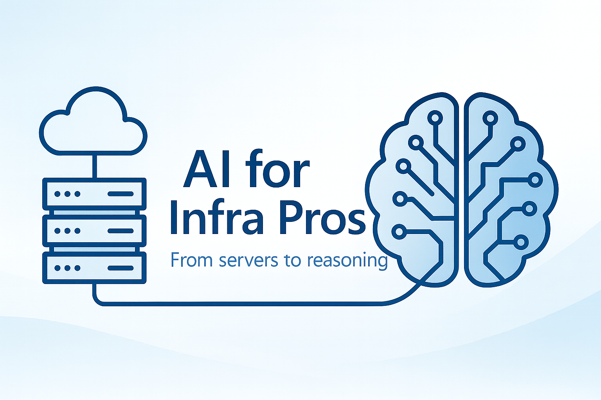

# Chapter 1 — Artificial Intelligence: What it is and why it matters for infrastructure

> “It’s no longer a question of *if* Artificial Intelligence will impact infrastructure - it’s a question of **when, where, and how you’ll adapt**.”



## The reality of the infrastructure professional

If you work in infrastructure, your journey probably included:

- Physical servers, Windows, and Linux  
- Network management, DNS, firewall, and backups  
- Virtualization (VMware, Hyper-V), then cloud and containers  
- High availability, clusters, and those “ugly but functional” scripts  

You’ve always been the backbone of operations. But now there’s a new type of workload changing the game: **Artificial Intelligence**.

## What is Artificial Intelligence (AI)?

Artificial Intelligence (AI) is the field of computer science that aims to create systems capable of performing tasks that normally require human intelligence — such as recognizing patterns, making decisions, interpreting natural language, generating images, or predicting behaviors.

| Concept | What it is | Common example |
|----------|-------------|----------------|
| **AI** | General term for intelligent systems | ChatGPT, autonomous cars, Alexa |
| **ML (Machine Learning)** | Subset of AI that learns from data | Movie recommendations |
| **DL (Deep Learning)** | Type of ML using deep neural networks | Facial recognition, automatic translation |

## The AI Formula: Data + Model + Infrastructure

AI doesn’t work in isolation. It depends on three main building blocks:

- **Data — the fuel.**  
  The model needs examples to learn. Structured data (tables), unstructured data (text, images, videos), logs, and metrics all play a role.

- **Model — the brain.**  
  It learns patterns from data. It can predict disk failures, generate text responses, or suggest commands in a terminal.

- **Infrastructure — the ground.**  
  This is where you come in:  
  - How do you store and move data efficiently?  
  - Where do you train and run models?  
  - How do you ensure availability, security, and scalability?

👉 This involves clusters with GPUs, large-scale storage, low-latency networks, CUDA-enabled containers, GPU monitoring, and horizontal scaling.

## Traditional Infrastructure vs. AI Infrastructure

| Characteristic | Traditional Infrastructure | AI Infrastructure |
|----------------|-----------------------------|-------------------|
| **Compute** | CPUs, VMs | GPUs, vGPUs, TPUs |
| **Scalability** | Horizontal/vertical via VMs | Clusters with orchestrators (AKS, K8s) |
| **Storage** | HDD/SSD, NAS | Blob Storage, Data Lakes, local NVMe |
| **Network** | Standard Ethernet | InfiniBand, RDMA, high bandwidth |
| **Deployment** | App servers, VMs | Containers and inference APIs |
| **Observability** | Logs, metrics | GPU telemetry, inference throughput and latency |

## Infra x Dev x Data: Breaking down silos

Traditionally:

| Role | Focus |
|------|--------|
| Devs | Build the application logic |
| Data Eng / Data Sci | Transform, train, and analyze data |
| Infra | Keep everything running securely and at scale |

In the world of AI, these worlds collide. You now see:

- Heavy models running in **AKS clusters with GPUs**  
- **Real-time inference** through APIs  
- Pipelines flowing through **Databricks**, **Azure ML**, and **Synapse**  
- Demands for **low latency** and **high throughput**

You don’t need to be a data scientist — but you do need to understand what’s happening in the stack.

## The risk of falling behind

Ignoring AI means:

- Losing relevance in projects  
- Developers using GPUs without governance  
- Lack of visibility into cost and performance  
- Reduced influence of the infra team on architecture decisions  

But understanding AI and its resource demands allows you to:

✅ Become a **strategic technical partner**  
✅ Ensure **security, cost, and performance**  
✅ Help **bring AI workloads into production**  
✅ Become a **technical leader in AI architecture**

## The Opportunity: The AI-Ready Infra Professional

Imagine the value of someone who:

- Can build **AKS clusters with GPUs**  
- Understands **Tokens Per Minute (TPM)** and **Requests Per Minute (RPM)**  
- Configures **Private Link, VNets, and firewalls** to serve models securely  
- Understands what a **PTU (Provisioned Throughput Unit)** is in **Azure OpenAI**  
- Integrates **observability** with inference logs and GPU metrics  

That’s the **AI-ready infrastructure professional** — and this eBook will turn you into one.

## Key terms you’ll hear often

- **Inference** → Running the trained model with new data  
- **Training** → Teaching the model using large datasets  
- **Fine-tuning** → Adjusting an existing model with specific data  
- **GPU / TPU** → Hardware specialized in matrix operations  
- **LLM** → Large Language Model (like GPT, Claude, Mistral)  
- **MLOps** → DevOps applied to the ML lifecycle  
- **CUDA** → NVIDIA framework for GPU programming  
- **ONNX** → Open standard for exporting models across platforms  

## Suggested mini-lab (No Code Yet)

**Mission:** Discover which GPU VMs are available in your Azure subscription.

```bash
az vm list-skus --location eastus --size Standard_N --output table
```

💡 Use `az vm list-skus -h` to explore other options.

### Questions

- Which VM uses the **T4 GPU** (great for inference)?  
- Which one uses the **A100 GPU** (ideal for training)?

## Conclusion

You’re already halfway there.  
All your experience in computing, networking, and distributed systems is **highly transferable to AI**.

The next step is understanding **data and models**, and adapting your **infrastructure mindset** to support this new workload type.

In the coming chapters, we’ll explore:

- How data powers AI  
- How models work under the hood  
- How to provision, monitor, and optimize robust AI environments  

> “AI needs infrastructure — but infrastructure also needs to understand AI.”

### Next chapter

Next, explore how compute and clusters bring AI workloads to life in [**Chapter 2 — Data: The fuel of Artificial Intelligence**](02-data.md).
