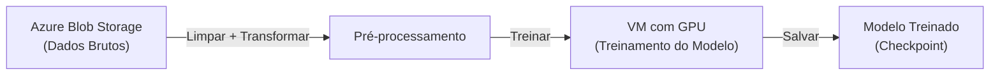
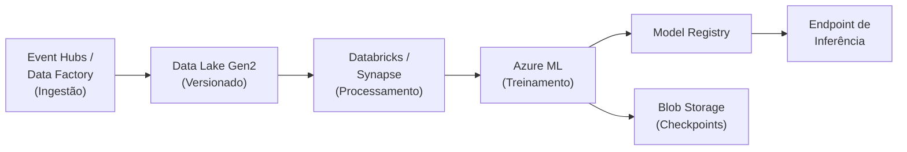

# Capítulo 2 — Dados: O Combustível Que Alimenta Tudo

## A ligação da meia-noite que mudou tudo

Você fez tudo certo. O time de ML pediu um cluster de GPUs e você entregou — oito NVIDIA A100 GPUs distribuídas em dois nós, conectadas com rede de alta largura de banda, rodando os drivers CUDA mais recentes. O deploy foi perfeito. O time iniciou o primeiro job de treinamento às 18h de uma sexta-feira, e você foi para casa satisfeito com uma semana bem aproveitada.

Seu telefone toca à meia-noite. O cientista de dados líder parece frustrado: "As GPUs não estão funcionando. O treinamento que deveria levar quatro horas nem terminou a primeira epoch." Você acessa remotamente e abre as métricas. Utilização de GPU: 12%. Uso de memória da GPU: mal chega a um terço. Mas aí você vê — o I/O de disco está cravado em 100%, com throughput de leitura rastejando a 60 MB/s. O time armazenou 2 TB de imagens de treinamento em uma conta de Blob Storage com disco Standard HDD, montada via um compartilhamento SMB básico. Sua arquitetura de armazenamento está matando de fome o hardware mais caro do rack.

Essa história se repete em organizações toda semana. Times investem fortunas em GPUs, apenas para descobrir que o pipeline de dados — a parte que os engenheiros de infraestrutura gerenciam — é o verdadeiro gargalo. Dados são para a IA o que o combustível é para um motor, mas a tubulação importa tanto quanto o próprio combustível. Este capítulo vai ensinar você a construir tubulações que mantêm essas GPUs alimentadas.

---

## Por que tudo começa com dados

Todo sistema de IA, de um simples classificador de imagens até um modelo de linguagem com trilhões de parâmetros, depende de três componentes fundamentais funcionando juntos. Você pode pensar nisso como uma fórmula:

**Dados + Modelo + Compute = IA**

Remova qualquer um deles e você não tem nada. Mas aqui está o insight que a maioria dos engenheiros de infraestrutura não percebe no início: desses três componentes, dados são o que toca a infraestrutura em *absolutamente todos os estágios*. O modelo é código. Compute é provisionado e (na maioria das vezes) fica rodando. Mas dados precisam ser ingeridos, armazenados, preparados, servidos para treinamento e entregues na inferência — e cada um desses estágios é um problema de infraestrutura.

**Tradução Infra ↔ IA**

| Conceito de Infraestrutura | Equivalente em IA | Por Que Importa |
|----------------------------|-------------------|-----------------|
| Storage account / volume | Repositório de dataset de treinamento | Onde os dados brutos ficam antes do modelo acessá-los |
| Throughput de leitura (MB/s) | Velocidade do data loader | Determina quão rápido as GPUs recebem batches de treinamento |
| IOPS | Amostras por segundo | Workloads com arquivos pequenos (imagens) precisam de alto IOPS |
| Camadas de armazenamento (Hot/Cool/Archive) | Estágios do ciclo de vida dos dados | Hot para treinamento ativo, Cool para datasets concluídos, Archive para compliance |
| Blob container | Partição de dataset | Agrupamento lógico de dados de treinamento, validação e teste |
| Montagem NFS/SMB | Acesso POSIX para frameworks | PyTorch e TensorFlow esperam semântica de sistema de arquivos |
| Criptografia em repouso | Conformidade de proteção de dados | Obrigatória para datasets com PII, dados médicos e financeiros |

Se você já gerencia armazenamento, rede e controle de acesso, você entende 70% do stack de dados para IA. O que muda é a *intensidade* — workloads de IA exigem throughput de leitura, IOPS e I/O sequencial muito mais do que praticamente qualquer coisa que você já tenha provisionado.

---

## Tipos de dados em workloads de IA

Nem todos os dados são iguais, e o tipo de dado determina diretamente qual backend de armazenamento e arquitetura de pipeline você precisa.

| Tipo de Dado | Exemplos | Casos de Uso Comuns em IA | Implicações de Armazenamento |
|--------------|----------|---------------------------|------------------------------|
| **Estruturado** | Tabelas SQL, CSVs, planilhas | Modelos preditivos, classificação, feature stores | SQL Database, Cosmos DB, Parquet no Data Lake |
| **Semiestruturado** | JSON, XML, arquivos de log, YAML | Chatbots, análise comportamental, pré-processamento de NLP | Blob Storage, Data Lake Gen2 |
| **Não estruturado** | Imagens, vídeo, áudio, texto livre, PDFs | Visão computacional, LLMs, reconhecimento de fala | Blob Storage, NVMe scratch |
| **Temporal** | Séries temporais, telemetria, dados de sensores IoT | Previsão de demanda, detecção de anomalias | Azure Data Explorer, Cosmos DB, Data Lake |

A IA moderna é dominada por dados não estruturados. Um único modelo de linguagem pode treinar com terabytes de texto coletados da web. Um modelo de visão computacional precisa de milhões de imagens. Um sistema de speech-to-text ingere milhares de horas de áudio. Tudo isso é não estruturado, tudo isso é massivo, e tudo precisa ser lido sequencialmente com alto throughput durante o treinamento.

💡 **Dica**: Quando um time de data science diz "temos cerca de 500 GB de dados de treinamento", assuma que vai crescer para 5 TB em seis meses. A experimentação com modelos multiplica o tamanho do dataset por meio de augmentation, versionamento e variantes de pré-processamento. Dimensione sua conta de armazenamento e limites de throughput de acordo.

---

## O ciclo de vida dos dados — Infraestrutura em cada estágio

Dados não ficam parados. Eles fluem por um pipeline com estágios distintos, e você é responsável pela infraestrutura em cada um deles.

### Ingestão

É aqui que os dados entram no seu ambiente. Eles podem chegar por REST APIs, event streams, uploads de arquivos em lote ou replicação de banco de dados. Seu trabalho é garantir que a ingestão seja confiável, escalável e segura.

**Ferramentas principais:**
- **Azure Event Hubs** — Ingestão de streaming em tempo real com milhões de eventos por segundo
- **Azure Data Factory** — Pipelines batch orquestrados a partir de mais de 90 fontes de dados
- **AzCopy** — Transferências de linha de comando de alta performance para movimentação de dados em massa

⚠️ **Armadilha em Produção**: Pipelines de ingestão que funcionam perfeitamente com 10 GB falham de forma espetacular com 10 TB. Sempre teste seu pipeline de ingestão com 10× o volume de dados esperado. O AzCopy com `--cap-mbps` permite limitar transferências durante o horário comercial e rodar em velocidade máxima durante a madrugada.

### Armazenamento

Após a ingestão, os dados precisam de um lar. Sua escolha de backend de armazenamento afeta tudo que vem depois — velocidade de treinamento, custo, segurança e complexidade operacional. Vamos cobrir arquitetura de armazenamento em profundidade na próxima seção.

**Considerações principais:**
- **Hot tier** para datasets em treinamento ativo
- **Cool tier** para dados de experimentos concluídos que você pode revisitar
- **Archive tier** para retenção de compliance e auditoria
- **Data Lake Gen2** para armazenamento hierárquico pronto para analytics

### Preparação e transformação

Dados brutos raramente estão prontos para o modelo. Eles precisam de limpeza, normalização, deduplicação e feature engineering. Este estágio é intensivo em compute e frequentemente usa frameworks de processamento distribuído.

**Ferramentas principais:**
- **Azure Databricks** — Processamento baseado em Spark para preparação de dados em larga escala
- **Azure Synapse Analytics** — Analytics integrado com SQL serverless e pools Spark
- **Azure Data Factory** — Orquestração de pipelines ETL/ELT

**Tradução Infra ↔ IA**: A preparação de dados em IA é equivalente ao ETL em data warehousing tradicional — mas os volumes são maiores e o formato de saída é diferente. Em vez de carregar em um SQL warehouse, você está produzindo arquivos Parquet, arquivos TFRecord ou diretórios de imagens pré-processadas.

### Treinamento

Durante o treinamento, o modelo lê o dataset inteiro múltiplas vezes (cada passagem é chamada de *epoch*). Um treinamento típico lê os mesmos dados de 50 a 100 vezes, embaralhados de forma diferente a cada vez. Isso significa que seu armazenamento precisa entregar leituras sequenciais sustentadas e de alto throughput por horas ou até dias.

**O que torna o I/O de treinamento único:**
- **Leituras sequenciais** a velocidades de múltiplos GB/s
- **Embaralhamento aleatório** requer embaralhamento em memória ou acesso aleatório rápido
- **Data loaders** no PyTorch e TensorFlow fazem prefetch de batches na CPU enquanto a GPU processa o batch atual — mas apenas se o armazenamento acompanhar
- **Escrita de checkpoints** — modelos salvam snapshots periódicos (geralmente de 1 a 10 GB cada) para recuperação em caso de falhas

### Inferência

No momento da inferência, os dados fluem na direção oposta — requisições individuais chegam, o modelo as processa e os resultados retornam. O padrão muda de throughput para latência: cada requisição precisa ser atendida em milissegundos, não em horas.

**Padrões de infraestrutura:**
- Feature stores de baixa latência (Cosmos DB, Redis) para consulta de features em tempo real
- Blob Storage para entrada/saída de inferência em lote
- API gateways (Azure API Management) para roteamento e throttling de requisições

---

## Arquitetura de armazenamento para IA — A matriz de decisão

É aqui que sua expertise em infraestrutura se torna crítica. Escolher o backend de armazenamento correto é a decisão de maior impacto que você vai tomar para a performance de workloads de IA.

**Matriz de Decisão: Armazenamento para Workloads de IA**

| Tipo de Armazenamento | Melhor Para | Throughput | Latência | Custo | Recurso Principal |
|---|---|---|---|---|---|
| **Blob Storage** | Datasets não estruturados, artefatos de modelo, checkpoints | Até 60 Gbps por conta | Moderada (ms) | Baixo (Hot: ~$0,018/GB/mês) | Escala massiva, armazenamento em camadas |
| **Data Lake Gen2** | Pipelines orientados a analytics, datasets estruturados | Até 60 Gbps por conta | Moderada (ms) | Baixo | Namespace hierárquico, ACLs granulares |
| **NVMe Local** | Espaço scratch para treinamento, cache do data loader | 3-7 GB/s por disco | Ultra-baixa (μs) | Incluso na VM | Efêmero — dados perdidos ao desalocar |
| **Azure Files (NFS)** | Datasets compartilhados entre múltiplos nós | Até 10 Gbps (premium) | Baixa-moderada (ms) | Moderado | Compatível com POSIX, montagem multi-nó |
| **Azure Files (SMB)** | Compatibilidade legada, workloads Windows | Até 4 Gbps (premium) | Moderada (ms) | Moderado | Nativo do Windows, integração com AD |
| **Cosmos DB** | Feature stores, features de inferência em tempo real | N/A (baseado em requisições) | Milissegundos de um dígito | Mais alto | Busca vetorial, distribuição global |
| **SQL Database** | Feature stores estruturadas, metadados | N/A (baseado em queries) | Baixa (ms) | Moderado | Conformidade ACID, queries relacionais |

💡 **Dica**: O padrão de produção mais comum é uma abordagem de duas camadas: armazene datasets brutos no Blob Storage ou Data Lake Gen2 para durabilidade e custo, depois transfira os dados de treinamento ativos para o NVMe local para performance. Pense no Blob como seu armazém e no NVMe como sua bancada de trabalho.

⚠️ **Armadilha em Produção**: Nunca use armazenamento com Standard HDD para workloads de treinamento. Os limites de IOPS e throughput estão em ordens de magnitude abaixo do que as GPUs exigem. Uma única GPU A100 consegue consumir dados mais rápido do que uma conta com Standard HDD consegue servir. Sempre use contas Premium ou, no mínimo, com Standard SSD para dados de treinamento ativos.

---

## Performance de I/O: O gargalo oculto

Aqui está a verdade contraintuitiva sobre infraestrutura de IA: a razão mais comum para baixa utilização de GPU não é um problema de GPU — é um problema de armazenamento. Quando o data loader não consegue alimentar batches para a GPU rápido o suficiente, a GPU fica ociosa esperando dados. Isso é chamado de *data starvation* (inanição de dados), e transforma seu cluster de GPUs de $30.000 por mês em um aquecedor de ambiente caro.

### Diagnosticando data starvation

Fique de olho nestas métricas:
- **Utilização de GPU abaixo de 80%** durante o treinamento — quase sempre é um problema no pipeline de dados
- **I/O de disco a 100%** enquanto a utilização de GPU está baixa — gargalo de armazenamento clássico
- **Workers do data loader no limite** — seu pré-processamento na CPU ou o I/O é o limitante

### BlobFuse2: Montando Blob Storage como sistema de arquivos

A maioria dos frameworks de ML (PyTorch, TensorFlow) espera que os dados de treinamento estejam acessíveis por um caminho no sistema de arquivos. O BlobFuse2 é um driver de sistema de arquivos virtual open-source que monta containers do Azure Blob Storage como um diretório local no Linux. Ele traduz operações POSIX de arquivo em chamadas à API REST do Azure Blob.

O BlobFuse2 oferece dois modos de cache, e escolher o correto faz diferença:

- **File cache (modo de cache)**: Baixa os arquivos inteiros para um diretório de cache local antes de servir as leituras. Ideal para datasets que são lidos repetidamente, como dados de treinamento ao longo de múltiplas epochs.
- **Block cache (modo streaming)**: Transmite os dados em blocos sem baixar o arquivo completo. Ideal para arquivos grandes onde você precisa começar a ler imediatamente, como pré-processamento ou inferência em arquivos de mídia grandes.

**Montagem com file cache para workloads de treinamento:**

```bash
# Cria diretório de cache no armazenamento local rápido (disco temp NVMe)
sudo mkdir -p /mnt/resource/blobfuse2cache
sudo chown $(whoami) /mnt/resource/blobfuse2cache

# Cria o ponto de montagem
sudo mkdir -p /mnt/training-data

# Monta com file cache — usa config.yaml para autenticação e configurações do container
sudo blobfuse2 mount /mnt/training-data \
  --config-file=./config.yaml \
  --tmp-path=/mnt/resource/blobfuse2cache
```

**Pré-carregar dados antes do treinamento iniciar:**

O BlobFuse2 pode baixar containers inteiros ou subdiretórios para o cache local no momento da montagem, para que os dados estejam prontos antes do treinamento começar:

```bash
# Monta com preload — baixa os dados para o cache no momento da montagem
sudo blobfuse2 mount /mnt/training-data \
  --config-file=./config.yaml \
  --tmp-path=/mnt/resource/blobfuse2cache \
  --preload
```

💡 **Dica**: Sempre aponte `--tmp-path` para o disco temporário NVMe local da VM (`/mnt/resource` em VMs Azure) em vez do disco do sistema operacional. Isso dá ao cache do BlobFuse2 a menor latência possível. Em VMs com GPU como a série ND, o disco temporário local pode entregar de 3 a 7 GB/s de throughput de leitura.

> Para opções completas de configuração, incluindo autenticação com managed identity e modo streaming, consulte a [documentação do BlobFuse2](https://learn.microsoft.com/azure/storage/blobs/blobfuse2-what-is).

### AzCopy para transferência de dados em massa

Quando você precisa mover grandes datasets para o Azure (ou entre contas de armazenamento), o AzCopy é a opção mais rápida. Ele suporta transferências paralelas, retentativas automáticas e pode retomar uploads interrompidos.

```bash
# Login com Microsoft Entra ID
azcopy login

# Copia um diretório local de dataset para o Blob Storage
azcopy copy '/data/training-images' \
  'https://<storage-account>.blob.core.windows.net/<container>/training-images' \
  --recursive

# Copia entre contas de armazenamento (server-side, sem download local)
azcopy copy \
  'https://<source-account>.blob.core.windows.net/<container>' \
  'https://<dest-account>.blob.core.windows.net/<container>' \
  --recursive
```

### Espaço scratch NVMe em VMs com GPU

As VMs com GPU do Azure (séries ND, NC) incluem discos temporários NVMe locais que oferecem performance de I/O extremamente alta. Eles são ideais para preparar dados de treinamento vindos do Blob Storage antes de uma rodada de treinamento.

**Fatos importantes sobre o NVMe local:**
- Throughput: 3-7 GB/s por disco (algumas VMs possuem múltiplos discos NVMe)
- Latência: microssegundos, não milissegundos
- **Efêmero**: Todos os dados são perdidos quando a VM é parada ou desalocada
- Sem custo adicional — incluso na VM

O padrão recomendado: use o AzCopy ou o preload do BlobFuse2 para transferir dados do Blob Storage para o NVMe local no início do job, treine a partir do NVMe e depois escreva os checkpoints de volta no Blob Storage para durabilidade.

⚠️ **Armadilha em Produção: "O Mistério dos 12% de Utilização de GPU"** — Se um cientista de dados reportar que a utilização da GPU está suspeitamente baixa, verifique o backend de armazenamento antes de investigar qualquer outra coisa. Nove em cada dez vezes, o problema é um destes: (1) dados de treinamento em Standard HDD, (2) montagem remota sem cache ou (3) o diretório de cache do BlobFuse2 apontando para o disco do SO em vez do disco temporário NVMe. Uma correção de cinco minutos no armazenamento pode transformar um job de treinamento de vários dias em um que roda durante a noite.

---

## Segurança e governança de dados

Workloads de IA lidam com alguns dos dados mais sensíveis da sua organização — registros de clientes, imagens médicas, transações financeiras, corpora de texto proprietários. Governança de dados para IA não é opcional; é uma responsabilidade de infraestrutura que pertence a você.

### Classificação de dados

Antes que qualquer dado entre em um pipeline de treinamento, classifique-o:
- **Público** — Datasets abertos, benchmarks publicados, textos de domínio público
- **Interno** — Dados proprietários do negócio, documentos internos
- **Confidencial** — PII de clientes, registros médicos (HIPAA), dados financeiros (PCI-DSS)
- **Restrito** — Segurança nacional, dados de pesquisa com controle de exportação

Sua arquitetura de armazenamento deve impor essas classificações por meio de isolamento de rede, criptografia e controles de acesso.

### Criptografia

- **Em repouso**: O Azure Storage criptografa todos os dados em repouso com AES de 256 bits por padrão. Para workloads sensíveis, use chaves gerenciadas pelo cliente armazenadas no Azure Key Vault.
- **Em trânsito**: Todas as chamadas à API do Azure Storage usam TLS 1.2+. Imponha versões mínimas de TLS no nível da conta de armazenamento.

### Controle de acesso

💡 **Dica**: Sempre use **managed identities + Azure RBAC** em vez de chaves de conta de armazenamento. Chaves são estáticas, compartilháveis e difíceis de rotacionar. Managed identities são vinculadas a recursos específicos, rotacionadas automaticamente e auditáveis. Atribua a role `Storage Blob Data Reader` para workloads de treinamento e `Storage Blob Data Contributor` para pipelines que escrevem checkpoints.

```bash
# Atribui Storage Blob Data Reader à managed identity de uma VM
az role assignment create \
  --role "Storage Blob Data Reader" \
  --assignee <managed-identity-principal-id> \
  --scope "/subscriptions/<sub-id>/resourceGroups/<rg>/providers/Microsoft.Storage/storageAccounts/<account>"
```

### Ferramentas de governança

- **Microsoft Purview** — Governança de dados unificada com descoberta automatizada de dados, classificação e rastreamento de linhagem em toda a sua infraestrutura
- **Azure Key Vault** — Gerenciamento centralizado de segredos para chaves de armazenamento, strings de conexão e chaves de API que os pipelines precisam
- **Azure Policy** — Imponha padrões de armazenamento (versão mínima de TLS, criptografia obrigatória, SKUs permitidos) em todas as assinaturas

⚠️ **Armadilha em Produção**: Cientistas de dados frequentemente copiam dados de treinamento para máquinas locais, drives compartilhados ou contas de armazenamento não gerenciadas para "experimentos rápidos". Isso cria uma proliferação de dados sombra que viola requisitos de compliance. Use o Azure Policy para restringir a criação de contas de armazenamento e o Microsoft Purview para escanear cópias de dados fora dos locais aprovados.

---

## Arquiteturas de dados comuns em IA

Entender como esses componentes se encaixam fica mais fácil com referências visuais. Aqui estão dois padrões de arquitetura comuns.

### Pipeline de treinamento simples

Na forma mais simples, os dados fluem linearmente do armazenamento, passando pelo pré-processamento, até o treinamento:



Esse padrão funciona para equipes pequenas rodando experimentos com datasets menores que 1 TB. Os dados ficam no Blob Storage, um script de pré-processamento limpa e transforma, e o framework de treinamento lê diretamente da saída processada.

### Pipeline completo de produção

Sistemas de IA em produção adicionam orquestração de ingestão, versionamento de dados, registries de modelos e endpoints de inferência:



Nessa arquitetura, os dados são ingeridos via Event Hubs ou Data Factory, armazenados no Data Lake Gen2 com namespaces hierárquicos para organização, processados por pipelines do Databricks ou Synapse e versionados para reprodutibilidade. O treinamento lê do dataset versionado, escreve checkpoints no Blob Storage e registra os modelos concluídos para deploy em endpoints de inferência.

**Tradução Infra ↔ IA**: Se você já construiu pipelines de CI/CD antes, um pipeline de ML em produção é o mesmo conceito — mas em vez de artefatos de código, você está movendo artefatos de dados pelos estágios de build. O "código-fonte" é o dataset, o "build" é o treinamento, e o "deploy" é o model serving.

---

## Mão na massa: Trabalhando com Blob Storage para dados de IA

Vamos percorrer juntos a criação de uma conta de armazenamento otimizada para workloads de IA usando o Azure CLI. Todos os comandos usam `--auth-mode login` para autenticação via Microsoft Entra ID — sem necessidade de chaves de armazenamento.

### Passo 1: Criar um grupo de recursos

```bash
# Define variáveis — substitua pelos seus valores
RESOURCE_GROUP="rg-ai-training"
LOCATION="eastus2"
STORAGE_ACCOUNT="staitraining$(openssl rand -hex 4)"

# Cria o grupo de recursos
az group create \
  --name $RESOURCE_GROUP \
  --location $LOCATION
```

### Passo 2: Criar uma conta de armazenamento com Data Lake Gen2

Habilitar o namespace hierárquico dá a você as capacidades do Data Lake Gen2 — ACLs granulares, operações no nível de diretório e performance otimizada para analytics.

```bash
# Cria conta de armazenamento com namespace hierárquico (Data Lake Gen2)
az storage account create \
  --name $STORAGE_ACCOUNT \
  --resource-group $RESOURCE_GROUP \
  --location $LOCATION \
  --sku Standard_LRS \
  --kind StorageV2 \
  --enable-hierarchical-namespace true \
  --min-tls-version TLS1_2 \
  --allow-blob-public-access false

# Verifica a criação
az storage account show \
  --name $STORAGE_ACCOUNT \
  --resource-group $RESOURCE_GROUP \
  --query "{name:name, kind:kind, hns:isHnsEnabled, location:primaryLocation}" \
  --output table
```

### Passo 3: Atribuir permissões RBAC

```bash
# Obtém o object ID do usuário logado e atribui a role Blob Data Contributor
az ad signed-in-user show --query id -o tsv | az role assignment create \
  --role "Storage Blob Data Contributor" \
  --assignee @- \
  --scope "/subscriptions/$(az account show --query id -o tsv)/resourceGroups/$RESOURCE_GROUP/providers/Microsoft.Storage/storageAccounts/$STORAGE_ACCOUNT"
```

> **Nota**: Atribuições de role podem levar de 1 a 2 minutos para propagar. Aguarde um pouco antes de prosseguir.

### Passo 4: Criar um container e fazer upload de dados

```bash
# Cria um container para dados de treinamento
az storage container create \
  --account-name $STORAGE_ACCOUNT \
  --name training-data \
  --auth-mode login

# Faz upload de um arquivo de exemplo
echo '{"sample": "training data", "label": 1}' > sample.json

az storage blob upload \
  --account-name $STORAGE_ACCOUNT \
  --container-name training-data \
  --name datasets/sample.json \
  --file sample.json \
  --auth-mode login
```

### Passo 5: Listar e baixar dados

```bash
# Lista blobs no container
az storage blob list \
  --account-name $STORAGE_ACCOUNT \
  --container-name training-data \
  --auth-mode login \
  --output table

# Baixa um blob
az storage blob download \
  --account-name $STORAGE_ACCOUNT \
  --container-name training-data \
  --name datasets/sample.json \
  --file downloaded-sample.json \
  --auth-mode login

# Verifica o download
cat downloaded-sample.json
```

### Passo 6: Upload em massa com AzCopy (para datasets maiores)

```bash
# Login no AzCopy com Entra ID
azcopy login

# Faz upload de um diretório inteiro recursivamente
azcopy copy './local-dataset/' \
  "https://${STORAGE_ACCOUNT}.blob.core.windows.net/training-data/v1/" \
  --recursive
```

> Para a referência completa do CLI de Blob Storage, consulte o [quickstart do Azure Storage CLI](https://learn.microsoft.com/azure/storage/blobs/storage-quickstart-blobs-cli).

---

## Checklist do capítulo

**I/O é o gargalo oculto** — Baixa utilização de GPU durante o treinamento é quase sempre um problema de armazenamento, não de GPU.

**Combine o armazenamento com o workload** — Use Blob/Data Lake Gen2 para armazenamento durável, NVMe local para espaço scratch de treinamento e Cosmos DB para features de inferência de baixa latência.

**Use o BlobFuse2 com sabedoria** — Monte o Blob Storage como sistema de arquivos com modo file cache para treinamento. Sempre aponte o cache para o disco temporário NVMe local da VM.

**Prepare os dados para o treinamento** — Copie datasets do Blob Storage para o NVMe local antes de iniciar o treinamento. Escreva checkpoints de volta no Blob para durabilidade.

**Nunca use Standard HDD para treinamento** — A diferença de throughput entre Standard HDD e NVMe é de 100× ou mais. Armazenamento Premium ou NVMe local é obrigatório para workloads com GPU.

**Seguro por padrão** — Use managed identities e RBAC em vez de chaves de armazenamento. Classifique os dados antes de entrarem em qualquer pipeline.

**Planeje para crescimento** — Datasets de treinamento se multiplicam por meio de augmentation, versionamento e experimentação. Dimensione seu armazenamento para 10× as necessidades atuais.

**Use o AzCopy para transferências em massa** — É a maneira mais rápida de mover dados para dentro, para fora e entre contas de Azure Storage.

---

## O que vem a seguir

Agora que você entende como os dados fluem por sistemas de IA e por que suas decisões de arquitetura de armazenamento determinam diretamente a performance de treinamento dos modelos, é hora de olhar para a camada de compute que consome todos esses dados. No **Capítulo 3 — Compute: Onde a Inteligência Ganha Vida**, você vai aprender sobre arquiteturas de GPU, famílias de VMs, design de clusters e a rede que conecta tudo — e por que uma camada de armazenamento bem ajustada é apenas metade da equação.
