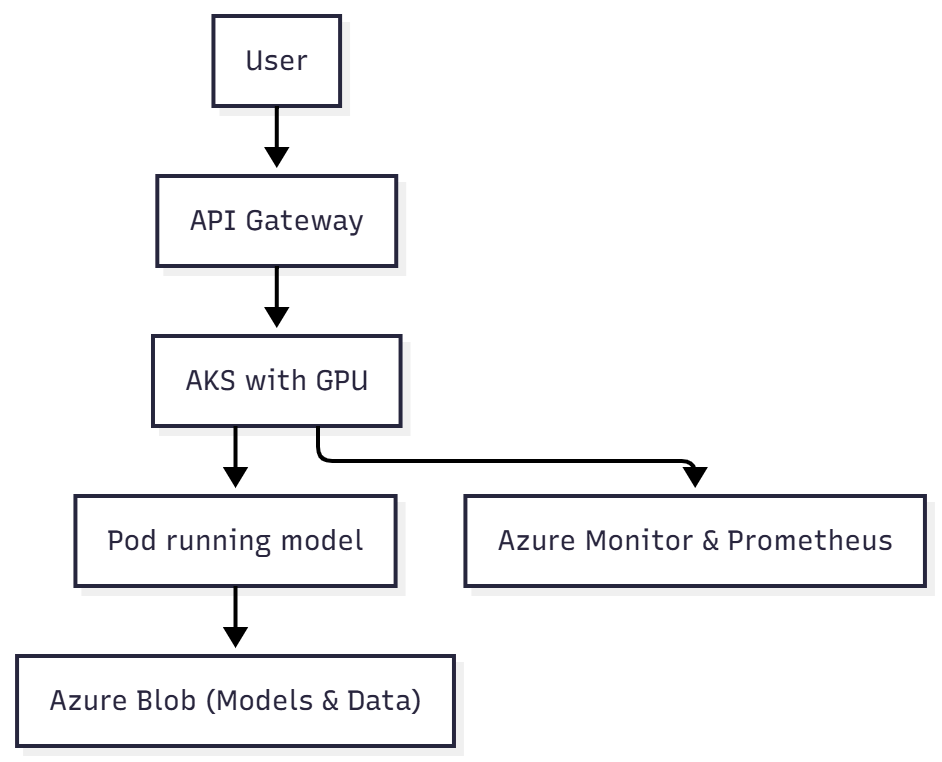

# Chapter 3 — Infrastructure and compute for AI

> “There is no AI without infrastructure. Behind every model, there is a network, a disk, a GPU — and an infrastructure engineer ensuring it all stays up.”

## Why AI requires a new way of thinking about infrastructure

Artificial Intelligence is **resource-intensive**.  
It demands **massive parallelism**, **minimal latency**, **fast storage**, and **high availability** — both for training and inference.

AI workloads are not simple web applications.  
They move terabytes of data, use GPU clusters, and require distributed pipelines.

The good news? Much of what you already master — compute, networking, storage, security — remains essential.  
The difference lies in the **level of demand**.

## Training vs. Inference

| Phase | What happens | Technical characteristics |
|--------|----------------|----------------------------|
| **Training** | The model learns from historical data | Extremely high GPU demand, long runtime, massive datasets |
| **Inference** | The model responds to new data | Low latency, may use GPU or CPU depending on workload |

💡 **Example:**  
Training an LLM can take days or weeks across thousands of GPUs.  
Running inference with that same model takes milliseconds but requires fine-tuned scalability and performance.

## Compute: CPU, GPU, and TPU

| Type | Best For | Characteristics |
|-------|-----------|-----------------|
| **CPU** | Traditional workloads and light inference | Flexible but limited in parallelism |
| **GPU** | Training and heavy inference | Massive parallelism (CUDA, Tensor Cores) |
| **TPU** | TensorFlow and Deep Learning workloads | Specialized ASICs (Google Cloud) |

**Infra Tip:**  
Smaller or batch models can run efficiently on CPU.  
LLMs and computer vision workloads **require GPUs**, even for inference.

## PU VM types in Azure

| Family | Main use case | Example workload |
|---------|----------------|------------------|
| **NCas_T4_v3** | Cost-efficient inference | Chatbots, lightweight vision models |
| **ND_A100_v4/v5** | Heavy training and inference | LLMs, video, speech processing |
| **NVv4 / NVads** | Visualization and lightweight AI | Development and testing |
| **Standard_D/E/F** | CPU workloads | Preprocessing, data ingestion |

### Quick checklist

- Check GPU quotas using `az vm list-skus`  
- Prefer regions with **NDv5** or **NCas_T4_v3** availability  
- Consider **VMSS (Virtual Machine Scale Sets)** for automatic scaling  

## Clustering: When a single VM isn’t enough

Training or serving AI in production almost always requires distribution:

- **Distributed Training:** Split dataset/model across multiple nodes  
- **Horizontal Scalability:** Multiple instances serving many requests  
- **High Availability:** Load balancers, health probes, and failover mechanisms  

| Platform | Function |
|-----------|-----------|
| **AKS (Azure Kubernetes Service)** | Orchestration of GPU-enabled containers |
| **Azure Machine Learning** | Automation of experiments and deployment |
| **Ray / Horovod** | Large-scale distributed training |
| **VMSS (Scale Sets)** | Automatic scaling of GPU VMs |

💡 Use **AKS + nvidia-device-plugin** for GPU-ready containers.  
Configure **taints/tolerations** and **node selectors** to isolate workloads.

## Networking: The new AI bottleneck

If your dataset is on a slow network, GPUs will sit idle waiting for data.  
Network performance is just as critical as GPU performance.

| Network feature | Why it matters |
|------------------|----------------|
| **InfiniBand/RDMA** | Enables direct VM-to-VM communication with ultra-low latency |
| **Accelerated networking** | Reduces jitter and improves throughput |
| **Efficient VNet peering** | High-performance inter-region communication |
| **NFS vs. Blob storage** | Choice depends on access and read patterns |

**Tip:** Use **BlobFuse2** with local NVMe caching to balance performance and cost.

## Example Azure architecture



This architecture is used by companies serving **LLMs** and **real-time inference**, combining **AKS**, **Blob Storage**, and continuous **monitoring**.

## Hands-On: Create your first GPU VM

```bash
az vm create \
  --name vm-gpu \
  --resource-group rg-ai-lab \
  --image Ubuntu2204 \
  --size Standard_NC6s_v3 \
  --admin-username ricardo \
  --generate-ssh-keys
```

After creation:

```bash
wget https://developer.download.nvidia.com/compute/cuda/repos/ubuntu2204/x86_64/cuda-ubuntu2204.pin
sudo apt update && sudo apt install -y cuda
```

💡 Also install **NVIDIA DCGM** to collect GPU metrics with **Azure Monitor**.

##  Monitoring and observability

| Metric | Tool | What to evaluate |
|---------|------|------------------|
| **GPU Usage (memory, time)** | `nvidia-smi`, DCGM, Azure Monitor | Saturation, idleness |
| **Inference Latency** | Application Insights, OpenTelemetry | SLA and response time |
| **Node Availability** | AKS, VMSS Autoscaler | Failures and scaling behavior |
| **Token Consumption (TPM)** | Azure OpenAI / Log Analytics | Limit adherence |

Use **Azure Managed Prometheus + Grafana** for GPU and inference dashboards.

## Security and control

- Access control for models and data via **RBAC**  
- Workload isolation with **namespaces** and **node pools**  
- **Key Vault** for secrets and encryption keys  
- **Private Link / NSG / Firewall** for private endpoints  
- GPU quotas per project for **financial control**  

Configure **Managed Identity** for secure, automated resource access.

## 💡 Pro insight

> “You can have the best model in the world, but if your infrastructure chokes, the experience will be poor. Architecture matters — a lot.”


## Conclusion

AI has changed the game — but the game is still yours.  
You, the one who understands **latency**, **throughput**, **disks**, and **networks**, are the bridge between theory and production.

Knowing which VM to use, how to scale clusters, and how to ensure availability is **not the data scientist’s job** — it’s the **infrastructure professional’s** responsibility.

In the next chapters, we’ll dive into **Infrastructure as Code (IaC)** and **Automation for AI** — turning this entire foundation into **consistent, versionable, and reproducible deployments**.

> “Infrastructure is the stage. AI is the show. And you’re the one making sure the lights never go out.”

<!-- ### Next chapter

Continue your journey by learning how to automate and version your environments in [**Chapter 4 — Infrastructure as Code (IaC) and automation for AI**](04-iac.md). -->
