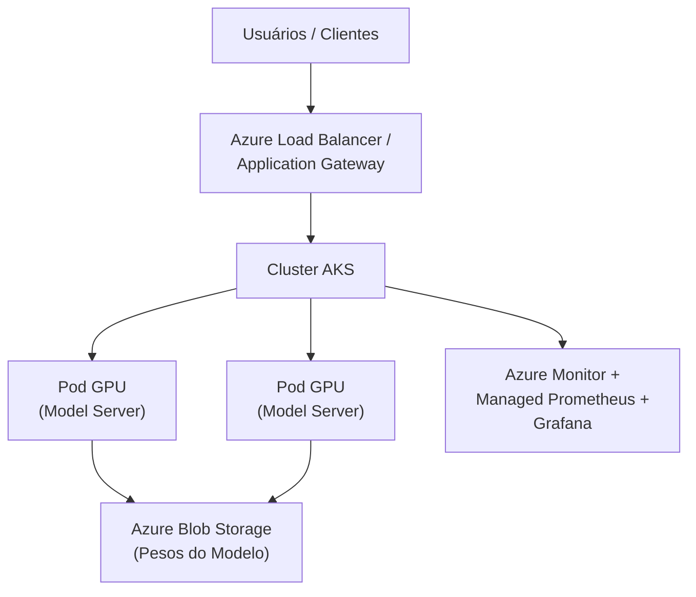

# Capítulo 3 — Compute: Onde a Inteligência Ganha Vida

> "A diferença entre um job de treinamento que leva dois dias e um que termina em noventa minutos não é uma GPU mais rápida — é saber qual GPU escolher e como conectá-las."

---

## A história que você não quer viver

Imagine a cena: seu time de ML pede para você provisionar "um cluster de GPU para treinamento." Você faz o que qualquer engenheiro de infraestrutura experiente faria — sobe oito máquinas virtuais `Standard_D16s_v5`. Sessenta e quatro vCPUs cada, 128 GiB de RAM, armazenamento SSD premium. No papel, uma máquina de guerra.

O time lança o script de treinamento. Barra de progresso: tempo estimado de conclusão **47 horas**. Você observa as métricas de utilização chegarem aos poucos — CPUs a 100 %, rede mal aparece, e ninguém está feliz.

Então um colega sugere dois nodes `Standard_ND96asr_v4` — cada um com oito GPUs A100 conectadas por InfiniBand de 200 Gb/s. Mesmo job de treinamento, mesmo dataset, mesmo código. O job termina em **90 minutos**. A diferença não são apenas as GPUs. É como essas GPUs se comunicam entre os nodes, como os dados fluem pelo NVLink dentro do node, e como o InfiniBand impede que a sincronização de gradientes se torne o gargalo. Compute para IA não é sobre força bruta. É sobre o *tipo certo* de força, conectada da *forma certa*.

Este capítulo oferece o mapa para você fazer essa escolha com confiança — sempre.

---

## Treinamento vs. Inferência: Dois Mundos Diferentes

Antes de selecionar um único SKU de VM, você precisa saber qual workload vai atender. Treinamento e inferência parecem superficialmente similares — ambos usam modelos e dados — mas seus perfis de infraestrutura são diametralmente opostos.

| Dimensão | Treinamento | Inferência |
|----------|-------------|------------|
| **Padrão de workload** | Batch — roda por horas, dias ou semanas | Tempo real — tempos de resposta em milissegundos |
| **Demanda de GPU** | Satura todos os cores de GPU disponíveis | Frequentemente roda em uma única GPU ou mesmo CPU |
| **Pressão de memória** | Limitado pela memória da GPU (pesos do modelo + gradientes + estados do otimizador) | Limitado por compute (apenas forward pass) |
| **Eixo de escalabilidade** | Scale *up* (GPUs maiores, mais nodes) | Scale *out* (mais réplicas atrás de um load balancer) |
| **Modelo de custo** | Custo total do job (horas × quantidade de GPUs × preço/hr) | Custo por requisição (latência × throughput × preço) |
| **Impacto de falha** | Reiniciar do último checkpoint — horas de trabalho perdido | Requisição descartada — retry em milissegundos |
| **Sensibilidade à rede** | Extremamente alta — sincronização de gradientes a cada poucos segundos | Moderada — payloads de request/response são pequenos |

**Tradução Infra ↔ IA**
Pense no **treinamento** como um job batch massivo — como reindexar um data warehouse de petabytes durante a madrugada. Pense na **inferência** como um endpoint de API com alto tráfego — como o serviço de autenticação da sua organização atendendo milhares de logins por segundo. Os padrões de infraestrutura que você já conhece se aplicam diretamente.

### Quando CPU é suficiente

Nem todo workload de IA precisa de GPU. Cenários leves de inferência — modelos pequenos de classificação, geração de embeddings para busca, ou deployments em edge — rodam perfeitamente bem em VMs da série `Standard_D` ou `Standard_F`. Se o seu modelo cabe confortavelmente na RAM do sistema e os requisitos de latência estão acima de 50 ms, faça benchmark em CPU primeiro. GPUs são caras; não use quando não for necessário.

💡 **Dica**: Faça duas perguntas ao time de ML antes de provisionar qualquer coisa: (1) "Estamos treinando ou servindo?" e (2) "Qual o tamanho do modelo em parâmetros?" Um modelo de 350 milhões de parâmetros frequentemente consegue rodar inferência em CPU. Um modelo de 70 bilhões de parâmetros, não.

---

## O Espectro de Compute: CPU, GPU e Além

### Por que GPUs dominam a IA

Uma CPU de servidor moderna tem 32–128 cores otimizados para lógica complexa e com ramificações — ótima para servidores web, bancos de dados e computação de propósito geral. Uma GPU moderna de data center como a NVIDIA H100 tem **16.896 CUDA cores** e **528 Tensor Cores**, todos projetados para fazer uma coisa extremamente bem: multiplicar matrizes em paralelo.

Workloads de IA — tanto treinamento quanto inferência — são fundamentalmente multiplicação de matrizes. Cada camada de uma rede neural multiplica uma matriz de entrada por uma matriz de pesos, soma um viés e aplica uma função de ativação. Uma CPU processa essas operações sequencialmente em algumas dezenas de cores. Uma GPU processa milhares delas simultaneamente. O resultado: operações que levam minutos em CPU terminam em segundos em GPU.

**Tradução Infra ↔ IA**
Pense na GPU como uma placa de rede que descarrega o processamento de pacotes da CPU. Assim como uma SmartNIC processa milhões de pacotes por segundo sem sobrecarregar o processador host, uma GPU descarrega milhões de operações matriciais. A CPU orquestra; a GPU executa a matemática pesada.

### CUDA Cores vs. Tensor Cores

Nem todos os cores de GPU são iguais. **CUDA cores** são processadores paralelos de propósito geral — eles lidam com qualquer operação de ponto flutuante. **Tensor Cores** são unidades especializadas que realizam operações de multiplicação e acumulação de matrizes em precisão mista em um único ciclo de clock. Para workloads de IA usando precisão FP16 ou BF16 (que é a maioria dos treinamentos hoje), Tensor Cores entregam até **8× o throughput** dos CUDA cores sozinhos.

Quando você vir especificações de GPU, preste atenção na contagem de Tensor Cores. Esse número determina o desempenho real de IA mais do que a contagem de CUDA cores.

### Além das GPUs: TPUs, Trainium e silício customizado

As **Tensor Processing Units (TPUs)** do Google e os chips **Trainium** da AWS são aceleradores de IA construídos especificamente, disponíveis apenas em suas respectivas clouds. Eles oferecem bom desempenho para frameworks específicos, mas prendem você a um único provedor de cloud. **FPGAs** aparecem em cenários especializados de inferência onde latência determinística importa. Para a maioria dos trabalhos de IA baseados em Azure, GPUs NVIDIA continuam sendo o padrão — o ecossistema de ferramentas (CUDA, cuDNN, NCCL, TensorRT) é imbatível, e o código do seu time de ML quase certamente espera hardware NVIDIA.

---

## Famílias de VMs com GPU no Azure — A Matriz de Decisão

Escolher a família certa de VM com GPU é a decisão de maior impacto que você vai tomar para um workload de IA. Acerte e o treinamento termina no prazo, dentro do orçamento. Erre e você vai queimar dinheiro em hardware ocioso ou esperar dias por resultados que deveriam levar horas.

**Matriz de Decisão: Famílias de VMs com GPU no Azure**

| Família | Exemplo de SKU | GPUs | Memória de GPU | Interconexão | Melhor Para | Custo Aprox./hr |
|---------|----------------|------|----------------|--------------|-------------|-----------------|
| **NC T4 v3** | `Standard_NC4as_T4_v3` | 1× T4 | 16 GiB | Ethernet | Inferência custo-eficiente, treinamento leve, dev/test | $0,53 |
| **NC T4 v3** | `Standard_NC64as_T4_v3` | 4× T4 | 64 GiB | Ethernet | Inferência multi-modelo, scoring em batch | $4,25 |
| **ND A100 v4** | `Standard_ND96asr_v4` | 8× A100 40 GB | 320 GiB | InfiniBand 200 Gb/s | Treinamento distribuído, fine-tuning de modelos grandes | $27,20 |
| **ND H100 v5** | `Standard_ND96isr_H100_v5` | 8× H100 80 GB | 640 GiB | InfiniBand 400 Gb/s | Treinamento flagship, LLMs, otimizado para NCCL | $98,32 |
| **NV A10 v5** | `Standard_NV36ads_A10_v5` | 1× A10 (completa) | 24 GiB | Ethernet | Visualização, IA leve, dev/test | $1,80 |
| **NV A10 v5** | `Standard_NV6ads_A10_v5` | 1/6× A10 | 4 GiB | Ethernet | GPU fracionária para workloads pequenos | $0,45 |
| **Séries D/E/F** | `Standard_D16s_v5` | Nenhuma | — | Accelerated Networking | Pré-processamento, pipelines de dados, inferência em CPU | $0,77 |

*Preços aproximados no modelo pay-as-you-go para East US. Sempre consulte a [Calculadora de Preços do Azure](https://azure.microsoft.com/pricing/calculator/) para valores atualizados.*

⚠️ **Pegadinha de Produção**: A **série ND original** (ND6s, ND12s, ND24s, ND24rs) foi **descontinuada em setembro de 2023**. Se você encontrar templates Terraform, scripts ARM ou posts de blog referenciando esses SKUs, o deploy vai falhar. Sempre verifique na [página de descontinuação de VMs do Azure](https://learn.microsoft.com/azure/virtual-machines/sizes/overview) antes de provisionar. As VMs ND-series atuais são `Standard_ND96asr_v4` (A100) e `Standard_ND96isr_H100_v5` (H100) — hardware completamente diferente.

### Escolhendo a família certa

**Para inferência** — comece com `Standard_NC4as_T4_v3`. A GPU T4 é o cavalo de batalha da NVIDIA para inferência: suporta precisão INT8 e FP16, tem Tensor Cores dedicados e custa uma fração do A100. Se o seu modelo cabe em 16 GiB de memória de GPU, a T4 é sua primeira parada. Precisa servir múltiplos modelos? A `Standard_NC64as_T4_v3` oferece quatro T4s em uma única VM.

**Para treinamento** — a escolha depende do tamanho do modelo. Fazendo fine-tuning de um modelo com menos de 10 bilhões de parâmetros? Um único node `Standard_ND96asr_v4` com oito A100s e NVLink pode ser suficiente. Treinando um modelo de 70B+ parâmetros do zero? Você precisa de múltiplos nodes `Standard_ND96isr_H100_v5` conectados por InfiniBand, rodando DeepSpeed ou PyTorch FSDP para treinamento distribuído.

**Para dev/test** — use `Standard_NV6ads_A10_v5` (GPU A10 fracionária) ou mesmo VMs somente com CPU. Não queime cota de ND-series em Jupyter notebooks.

**Dica**: SKUs de GPU têm disponibilidade regional limitada. Sempre verifique antes que seu pipeline de deploy execute:

```bash
az vm list-skus \
  --location eastus2 \
  --resource-type virtualMachines \
  --query "[?contains(name,'Standard_N')].{Name:name, Zones:locationInfo[0].zones, Restrictions:restrictions[0].reasonCode}" \
  -o table
```

Se a coluna `Restrictions` mostrar `NotAvailableForSubscription`, você precisa solicitar um aumento de cota pelo portal do Azure.

---

## Clustering: Quando Uma VM Não é Suficiente

Existem três razões para distribuir um workload de IA: o modelo é grande demais para a memória de uma única GPU, o treinamento é lento demais em um único node, ou você precisa atender mais requisições de inferência do que uma VM consegue. Cada razão aponta para uma estratégia de clustering diferente.

**Matriz de Decisão: Plataformas de Clustering**

| Plataforma | Melhor Para | Suporte a GPU | Escalabilidade | Complexidade |
|------------|-------------|---------------|----------------|--------------|
| **AKS** | Inferência em escala, microsserviços | GPU node pools, device plugin, taints | Horizontal Pod Autoscaler, Cluster Autoscaler | Média |
| **Azure Machine Learning** | Rastreamento de experimentos, treinamento gerenciado | Clusters de compute gerenciados, auto-provisionamento | Integrado, baseado em jobs | Baixa |
| **VMSS** | Workloads homogêneos de GPU, batch | Imagens customizadas com drivers pré-instalados | Autoscaling baseado em instâncias | Baixa–Média |
| **Ray / DeepSpeed / Horovod** | Frameworks de treinamento distribuído | Rodam sobre AKS ou VMs | Gerenciado pelo framework | Alta |

### AKS para workloads com GPU

O Azure Kubernetes Service é a plataforma mais comum para servir modelos de IA em escala. Quando você adiciona VMs com GPU a um cluster AKS, precisa de três coisas configuradas corretamente: o **taint do node pool**, o **NVIDIA device plugin** e as **tolerations dos pods**.

O AKS aplica automaticamente um taint nos node pools de GPU para que workloads sem GPU não caiam acidentalmente em nodes de GPU caros:

```
sku=gpu:NoSchedule
```

Seus pods de GPU devem incluir uma toleration correspondente e solicitar explicitamente recursos de GPU:

```yaml
apiVersion: v1
kind: Pod
metadata:
  name: gpu-inference
spec:
  tolerations:
  - key: "sku"
    operator: "Equal"
    value: "gpu"
    effect: "NoSchedule"
  containers:
  - name: model-server
    image: myregistry.azurecr.io/model-server:latest
    resources:
      limits:
        nvidia.com/gpu: 1
```

O NVIDIA device plugin (`k8s-device-plugin`, versão atual v0.18.0) roda como DaemonSet nos nodes de GPU. Ele expõe `nvidia.com/gpu` como um recurso agendável para o scheduler do Kubernetes. Sem ele, o Kubernetes não tem ideia de que GPUs existem no node.

⚠️ **Pegadinha de Produção**: O taint de GPU no AKS é `sku=gpu:NoSchedule` — **não** `nvidia.com/gpu`. Muitos tutoriais online usam a chave de taint errada, o que significa que suas tolerations não vão bater e os pods vão ficar em `Pending` para sempre. Consulte a [documentação de GPU do AKS](https://learn.microsoft.com/azure/aks/gpu-cluster) para a especificação atual.

💡 **Dica**: O Azure agora oferece **node pools de GPU totalmente gerenciados** (em preview) que instalam automaticamente os drivers de GPU, o NVIDIA device plugin e um exportador de métricas. Isso elimina a dor de cabeça mais comum de GPU no Kubernetes — incompatibilidade de versão de drivers. Consulte as [notas de versão do AKS](https://learn.microsoft.com/azure/aks/release-notes) para disponibilidade na sua região.

### Clusters de compute do Azure Machine Learning

Se seu time de ML usa o Azure Machine Learning para rastreamento de experimentos e gerenciamento de modelos, os **clusters de compute gerenciados** cuidam do provisionamento, escalabilidade e teardown automaticamente. Você define o tamanho da VM, contagem mínima e máxima de nodes, e timeout de ociosidade. O AML sobe nodes de GPU quando um job de treinamento é submetido e escala para zero quando ocioso — sem desperdício.

### Frameworks de treinamento distribuído

Quando um único node não é suficiente, você precisa de um framework de treinamento distribuído. As principais opções:

- **Data Parallelism**: A abordagem mais comum. O mesmo modelo é replicado em todas as GPUs. Cada GPU processa um batch diferente de dados, calcula gradientes localmente, e então todas as GPUs sincronizam gradientes (all-reduce). Os frameworks lidam com isso de forma transparente.

- **Model Parallelism**: Quando o próprio modelo não cabe na memória de uma única GPU (comum com modelos de 70B+ parâmetros), você divide as camadas do modelo entre múltiplas GPUs. Isso requer planejamento cuidadoso e significativamente mais comunicação entre GPUs.

- **Pipeline Parallelism**: Uma abordagem híbrida onde camadas diferentes do modelo ficam em GPUs diferentes, e os dados fluem por elas em um pipeline. Isso reduz o problema de memória do model parallelism enquanto melhora a utilização das GPUs.

| Framework | Desenvolvedor | Pontos Fortes |
|-----------|---------------|---------------|
| **DeepSpeed** | Microsoft | Otimizador ZeRO, gerenciamento eficiente de memória, paralelismo 3D |
| **PyTorch FSDP** | Meta | Integração nativa com PyTorch, Fully Sharded Data Parallel |
| **Horovod** | Uber/LF AI | Agnóstico a framework, API simples, baseado em MPI |
| **Ray Train** | Anyscale | Nativo em Python, escalabilidade elástica, multi-framework |

**Tradução Infra ↔ IA**
Treinamento distribuído é conceitualmente similar a um **cluster de banco de dados distribuído**. Data parallelism é como sharding de banco de dados — cada node possui toda a lógica (o modelo) mas processa um subconjunto diferente dos dados. Model parallelism é como particionar uma aplicação monolítica em microsserviços — cada node cuida de uma parte diferente da lógica. Em ambos os mundos, a rede entre os nodes determina o desempenho total do sistema.

---

## Rede: O Multiplicador Oculto

Aqui vai um fato que surpreende a maioria dos engenheiros de infraestrutura quando encontram workloads de IA pela primeira vez: **a rede frequentemente é o gargalo, não a GPU**. No treinamento distribuído, as GPUs precisam sincronizar gradientes após cada passada forward-backward. Com oito GPUs por node e múltiplos nodes, essa sincronização gera dezenas de gigabytes de tráfego de rede a cada poucos segundos. Se sua rede não consegue acompanhar, as GPUs ficam ociosas esperando por dados — e você está pagando por silício caro que não está fazendo nada.

### InfiniBand e RDMA

**InfiniBand** é uma tecnologia de rede de alto desempenho que possibilita **RDMA (Remote Direct Memory Access)** — a capacidade de uma máquina ler ou escrever na memória de GPU de outra máquina *sem envolver nenhuma das CPUs*. Isso é crítico para treinamento distribuído porque a sincronização de gradientes acontece diretamente entre GPUs em diferentes nodes, ignorando completamente a pilha de rede do sistema operacional.

No Azure, InfiniBand está disponível em:

- **`Standard_ND96asr_v4`** — InfiniBand 200 Gb/s (HDR)
- **`Standard_ND96isr_H100_v5`** — InfiniBand 400 Gb/s (NDR)

Esses não são recursos opcionais "legais de ter". Para treinamento distribuído com NCCL (NVIDIA Collective Communications Library), InfiniBand pode entregar **10× ou mais throughput** comparado a Ethernet baseada em TCP/IP. O NCCL detecta e usa InfiniBand automaticamente quando disponível, recorrendo a TCP quando não está. A diferença de desempenho é dramática.

### Accelerated Networking

Para VMs que não suportam InfiniBand (séries NC, NV, D/E/F), **Accelerated Networking** é a melhor otimização disponível. Ela usa **SR-IOV (Single Root I/O Virtualization)** para contornar o virtual switch do sistema operacional host, dando à VM desempenho de rede próximo ao bare-metal.

O impacto é significativo: a latência de rede cai de aproximadamente **500 μs para ~25 μs**, e o throughput atinge a largura de banda máxima da VM. Accelerated Networking vem habilitada por padrão na maioria das VMs mais recentes do Azure e é suportada nas séries D, E, F e N. Não há custo extra — apenas verifique se está habilitada na sua NIC.

### Comparação de rede

| Recurso | Throughput | Latência | Disponível Em | Caso de Uso |
|---------|-----------|----------|---------------|-------------|
| **InfiniBand NDR** | 400 Gb/s | < 2 μs | ND H100 v5 | Treinamento de LLM multi-node |
| **InfiniBand HDR** | 200 Gb/s | < 2 μs | ND A100 v4 | Treinamento distribuído |
| **Accelerated Networking** | Até 100 Gbps | ~25 μs | Maioria das séries D/E/F/N | Inferência, pipelines de dados |
| **Ethernet Padrão** | Até 100 Gbps | ~500 μs | Todas as VMs | Workloads gerais |
| **VNet Peering** | Backbone do Azure | < 2 ms (mesma região) | Todas as VNets | Comunicação entre VNets |

### Grupos de posicionamento por proximidade

⚠️ **Pegadinha de Produção**: Fazer deploy de nodes de treinamento distribuído em diferentes **zonas de disponibilidade** adiciona latência de rede entre zonas que pode reduzir o throughput de treinamento em **30–50 %**. Para jobs de treinamento multi-node, sempre use um **[grupo de posicionamento por proximidade](https://learn.microsoft.com/azure/virtual-machines/co-location)** para colocar suas VMs no mesmo data center. Isso se aplica tanto a VMs standalone quanto a node pools do AKS.

```bash
# Criar um grupo de posicionamento por proximidade
az ppg create \
  --resource-group rg-ai-training \
  --name ppg-training-cluster \
  --location eastus2 \
  --intent-vm-sizes Standard_ND96asr_v4

# Criar um VMSS dentro do grupo de posicionamento por proximidade
az vmss create \
  --resource-group rg-ai-training \
  --name vmss-training \
  --image Ubuntu2204 \
  --vm-sku Standard_ND96asr_v4 \
  --instance-count 4 \
  --ppg ppg-training-cluster \
  --accelerated-networking true
```

💡 **Dica**: Ao investigar treinamento distribuído lento, verifique o throughput da rede *antes* de culpar as GPUs. Execute `ib_write_bw` (teste de largura de banda InfiniBand) entre os nodes. Se você observar significativamente menos do que os 200 ou 400 Gb/s esperados, o problema provavelmente é configuração de rede — não o código do modelo.

---

## Arquitetura de Exemplo: Inferência de LLM no AKS


```mermaid
 graph TD
     A["Usuários / Clientes"] --> B["Azure Load Balancer /<br/>Application Gateway"]
     B --> C["Cluster AKS"]
     C --> D["Pod GPU<br/>(Model Server)"]
     C --> E["Pod GPU<br/>(Model Server)"]
     D --> F["Azure Blob Storage<br/>(Pesos do Modelo)"]
     E --> F
     C --> G["Azure Monitor +<br/>Managed Prometheus +<br/>Grafana"]                              
```

Esta arquitetura de referência mostra um deploy de inferência de LLM em produção combinando vários componentes que você aprendeu neste capítulo:

- **Cluster AKS** com node pools de GPU (`Standard_NC4as_T4_v3`) rodando containers de servir modelos. O Horizontal Pod Autoscaler ajusta a contagem de réplicas com base na profundidade da fila de requisições. O Cluster Autoscaler adiciona ou remove nodes de GPU com base em pods pendentes.

- **Azure Blob Storage** armazena os pesos e arquivos de configuração do modelo. Na inicialização do pod, o model server baixa os pesos do Blob Storage (ou os monta via BlobFuse2 com cache local em NVMe para acesso mais rápido).

- **Azure Monitor + Managed Prometheus** coleta métricas de utilização de GPU via DCGM Exporter, métricas no nível do node via kube-state-metrics, e métricas no nível da aplicação via OpenTelemetry. Dashboards do Grafana visualizam uso de memória da GPU, percentis de latência de inferência e throughput de requisições.

- **Azure Load Balancer / Application Gateway** distribui requisições de inferência entre os pods de servir modelos, com health probes garantindo que o tráfego alcance apenas réplicas saudáveis.

Esse padrão escala de uma prova de conceito com dois nodes de GPU até um deploy em produção atendendo milhares de requisições por segundo — os primitivos de infraestrutura são os mesmos, apenas a contagem de nodes muda.

---

## Mão na Massa: Crie Sua Primeira VM com GPU

Hora de colocar a mão na massa. Este lab guia você pelo provisionamento de uma VM com GPU, instalação de drivers NVIDIA e validação de que a GPU está operacional. Vamos usar `Standard_NC4as_T4_v3` — a opção de GPU menor e mais custo-eficiente, perfeita para aprender.

### Passo 0: Defina suas variáveis

```bash
RESOURCE_GROUP="rg-ai-lab"
LOCATION="eastus2"
VM_NAME="vm-gpu-lab"
VM_SIZE="Standard_NC4as_T4_v3"
ADMIN_USER="azureuser"
```

### Passo 1: Verifique a disponibilidade de cota de GPU

Antes de criar qualquer coisa, verifique se o SKU de GPU está disponível na sua região alvo e se você tem cota suficiente:

```bash
az vm list-skus \
  --location $LOCATION \
  --size $VM_SIZE \
  --resource-type virtualMachines \
  --query "[].{Name:name, Restrictions:restrictions[0].reasonCode}" \
  -o table
```

Se a saída mostrar `NotAvailableForSubscription`, solicite um aumento de cota no portal do Azure em **Assinaturas → Uso + cotas**.

### Passo 2: Crie o grupo de recursos

```bash
az group create \
  --name $RESOURCE_GROUP \
  --location $LOCATION
```

### Passo 3: Crie a VM com GPU

```bash
az vm create \
  --resource-group $RESOURCE_GROUP \
  --name $VM_NAME \
  --image Ubuntu2204 \
  --size $VM_SIZE \
  --admin-username $ADMIN_USER \
  --generate-ssh-keys \
  --accelerated-networking true \
  --public-ip-sku Standard
```

Isso provisiona uma VM Ubuntu 22.04 com uma GPU NVIDIA T4, 4 vCPUs e 28 GiB de RAM. Accelerated Networking está habilitada para desempenho de rede ideal.

### Passo 4: Instale os drivers NVIDIA (recomendado — VM Extension)

A Azure VM Extension é a abordagem recomendada. Ela instala a versão correta do driver NVIDIA para a GPU da sua VM, cuida da assinatura do módulo do kernel para Secure Boot e se integra ao gerenciamento de atualizações do Azure:

```bash
az vm extension set \
  --resource-group $RESOURCE_GROUP \
  --vm-name $VM_NAME \
  --name NvidiaGpuDriverLinux \
  --publisher Microsoft.HpcCompute \
  --version 1.6
```

A extensão leva 5–10 minutos para instalar. Monitore o progresso:

```bash
az vm extension show \
  --resource-group $RESOURCE_GROUP \
  --vm-name $VM_NAME \
  --name NvidiaGpuDriverLinux \
  --query "{Status:provisioningState, Message:instanceView.statuses[0].message}" \
  -o table
```

### Passo 5: Valide a GPU

Conecte via SSH na VM e confirme que a GPU é reconhecida:

```bash
ssh $ADMIN_USER@$(az vm show \
  --resource-group $RESOURCE_GROUP \
  --name $VM_NAME \
  --show-details \
  --query publicIps -o tsv)
```

Uma vez conectado:

```bash
nvidia-smi
```

Você deve ver uma saída mostrando uma GPU Tesla T4 com 15 GiB de memória disponível, versão do driver e versão do CUDA. Se `nvidia-smi` retornar "command not found", a extensão do driver ainda não terminou de instalar — aguarde alguns minutos e tente novamente.

### Alternativa: Instalação manual do CUDA

Se você precisa de uma versão específica do CUDA ou a VM Extension não cobre seu cenário, instale diretamente do repositório da NVIDIA:

```bash
# Adicionar repositório NVIDIA CUDA
wget https://developer.download.nvidia.com/compute/cuda/repos/ubuntu2204/x86_64/cuda-ubuntu2204.pin
sudo mv cuda-ubuntu2204.pin /etc/apt/preferences.d/cuda-repository-pin-600
sudo apt-key adv --fetch-keys https://developer.download.nvidia.com/compute/cuda/repos/ubuntu2204/x86_64/3bf863cc.pub
sudo add-apt-repository "deb https://developer.download.nvidia.com/compute/cuda/repos/ubuntu2204/x86_64/ /"

# Instalar CUDA toolkit
sudo apt-get update && sudo apt-get install -y cuda

# Verificar
nvidia-smi
```

### Passo 6: Limpeza

VMs com GPU são caras mesmo quando ociosas. Delete o grupo de recursos quando terminar:

```bash
az group delete --name $RESOURCE_GROUP --yes --no-wait
```

⚠️ **Pegadinha de Produção**: Uma única `Standard_NC4as_T4_v3` custa aproximadamente $0,53/hora. Isso é administrável para um lab. Mas uma `Standard_ND96isr_H100_v5` custa cerca de $98/hora — deixar uma rodando durante um fim de semana custa mais de **$4.700**. Sempre configure [alertas de custo do Azure](https://learn.microsoft.com/azure/cost-management-billing/costs/cost-mgt-alerts-monitor-usage-spending) e políticas de desligamento automático para VMs com GPU.

---

## Monitoramento de Workloads com GPU

Infraestrutura de GPU requer observabilidade construída especificamente para esse propósito. Métricas tradicionais de CPU (load average, uso de memória) não dizem nada sobre se sua GPU está sendo utilizada ou passando fome por dados.

| Métrica | Ferramenta | O Que Ela Revela |
|---------|------------|------------------|
| Utilização da GPU (%) | `nvidia-smi`, DCGM Exporter | Se a GPU está realmente computando ou ociosa |
| Memória de GPU usada (GiB) | `nvidia-smi`, DCGM Exporter | Se você está próximo de erros OOM (out-of-memory) |
| Temperatura da GPU (°C) | `nvidia-smi`, DCGM Exporter | Thermal throttling — GPUs desaceleram acima de 83 °C |
| Latência de inferência (P50/P95/P99) | Application Insights, OpenTelemetry | Experiência do usuário final e conformidade com SLA |
| Throughput de tokens (tokens/seg) | Logs da aplicação, métricas do Azure OpenAI | Eficiência no servir do modelo |
| Disponibilidade de nodes | AKS Cluster Autoscaler, VMSS | Eventos de escalabilidade e recuperação de falhas |

💡 **Dica**: Faça deploy do **NVIDIA DCGM Exporter** como DaemonSet nos node pools de GPU do seu AKS. Ele expõe métricas de GPU no formato Prometheus, que o **Azure Managed Prometheus** coleta automaticamente. Combine com **dashboards pré-construídos do Grafana** para utilização de GPU, memória, temperatura e taxas de erro. Isso oferece a mesma visibilidade sobre a saúde das GPUs que você está acostumado a ter para CPU e memória com monitoramento de infraestrutura padrão.

---

## Considerações de Segurança

Infraestrutura de GPU herda todos os requisitos de segurança dos seus ambientes existentes — mais algumas preocupações específicas de IA:

- **RBAC**: Controle quem pode provisionar VMs com GPU e acessar artefatos de modelo. Cota de GPU é cara; trate-a como um recurso premium.
- **Isolamento de workloads**: Use node pools dedicados no AKS e namespaces do Kubernetes para workloads de GPU. Previna que pods sem GPU caiam em nodes de GPU via taints.
- **Gerenciamento de segredos**: Armazene chaves de API de modelos, credenciais de storage accounts e tokens de registry no **Azure Key Vault**. Use **Managed Identity** para autenticação a partir de VMs e pods sem credenciais embutidas.
- **Isolamento de rede**: Use **Private Link** para workspaces do Azure ML, registros de container e storage accounts. Aplique **regras de NSG** para restringir acesso SSH a VMs com GPU. Coloque clusters de treinamento atrás do **Azure Firewall** quando compliance exigir.
- **Governança de cota de GPU**: Defina cotas de GPU por time ou por projeto para evitar estouros de custo. Monitore uso de cotas com alertas do Azure Cost Management.
- **Segurança de drivers**: Use a Azure VM Extension para instalação de drivers para garantir drivers assinados e validados. Instalações manuais de CUDA ignoram essa cadeia de validação.

---

## Checklist do Capítulo

Antes de seguir em frente, certifique-se de que consegue responder com confiança a estas questões:

- **Sei distinguir treinamento de inferência** e sei qual perfil de compute cada um requer.
- **Entendo por que GPUs dominam a IA** — paralelismo massivo para operações matriciais — e quando CPUs são suficientes.
- **Consigo selecionar a família certa de VM com GPU no Azure**: NC T4 v3 para inferência, ND A100/H100 para treinamento, NV A10 para dev/test.
- **Sei que a série ND original foi descontinuada** (setembro de 2023) e não vou usar esses SKUs.
- **Consigo verificar a disponibilidade de SKUs de GPU** na minha região alvo usando `az vm list-skus`.
- **Entendo as opções de clustering**: AKS para inferência em escala, Azure ML para treinamento gerenciado, VMSS para workloads batch de GPU.
- **Conheço os taints de GPU do AKS** (`sku=gpu:NoSchedule`) e como configurar tolerations e o NVIDIA device plugin.
- **Entendo por que a rede é o multiplicador oculto**: InfiniBand (200–400 Gb/s), RDMA e NCCL são o que torna o treinamento distribuído viável.
- **Consigo provisionar uma VM com GPU**, instalar drivers pela Azure VM Extension e validar com `nvidia-smi`.
- **Tenho monitoramento de GPU coberto**: DCGM Exporter, Managed Prometheus e dashboards do Grafana para utilização, memória e temperatura da GPU.
- **Sempre vou limpar recursos de GPU** e configurar alertas de custo para evitar surpresas na fatura.

---

## Próximos Passos

Agora que você entende quais VMs provisionar e como conectá-las, é hora de olhar para dentro da GPU. O **Capítulo 4** te leva ao fundo da arquitetura de GPU — CUDA, hierarquia de memória, estratégias multi-GPU e o ecossistema de drivers. Você não precisa escrever CUDA kernels, mas entender o que acontece dentro do silício vai fazer de você um troubleshooter melhor, um planejador de capacidade melhor e um parceiro mais eficiente para seus times de ML.

---

*Leitura complementar:*
- [Tamanhos de VMs otimizadas para GPU no Azure](https://learn.microsoft.com/azure/virtual-machines/sizes/gpu-accelerated/overview)
- [Extensão de driver de GPU NVIDIA para Linux](https://learn.microsoft.com/azure/virtual-machines/extensions/hpccompute-gpu-linux)
- [Usar GPUs no AKS](https://learn.microsoft.com/azure/aks/gpu-cluster)
- [Tamanhos de VMs habilitadas para InfiniBand](https://learn.microsoft.com/azure/virtual-machines/sizes/high-performance-compute/overview)
- [Visão geral do Accelerated Networking](https://learn.microsoft.com/azure/virtual-network/accelerated-networking-overview)
- [Grupos de posicionamento por proximidade do Azure](https://learn.microsoft.com/azure/virtual-machines/co-location)
