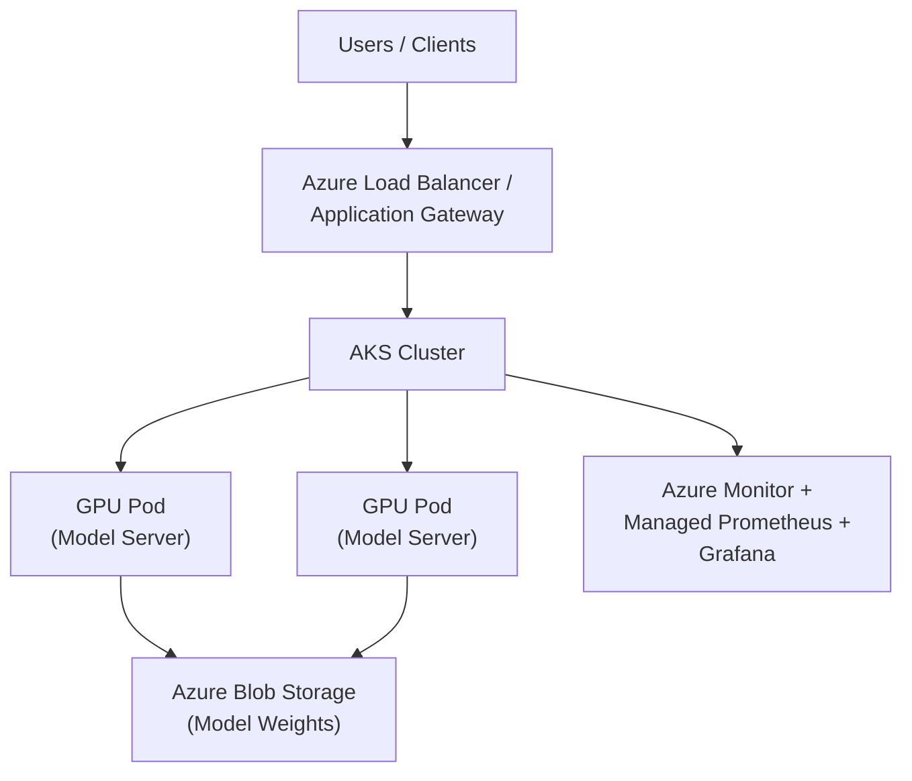

# Chapter 3 — Compute: Where Intelligence Comes to Life

> "The difference between a training job that takes two days and one that takes ninety minutes isn't a faster GPU — it's knowing which GPU to pick and how to connect them."

---

## The story you don't want to live

Picture this: your ML team asks you to provision "a GPU cluster for training." You do what any seasoned infrastructure engineer would do — spin up eight `Standard_D16s_v5` virtual machines. Sixty-four vCPUs each, 128 GiB of RAM, premium SSD storage. On paper, serious horsepower.

The team launches their training script. Progress bar: estimated completion in **47 hours**. You watch utilization metrics trickle in — CPUs are at 100 %, network barely registers, and nobody looks happy.

Then a colleague suggests two `Standard_ND96asr_v4` nodes — each packing eight A100 GPUs connected by 200 Gb/s InfiniBand. Same training job, same dataset, same code. The job finishes in **90 minutes**. The difference isn't just the GPUs. It's how those GPUs talk to each other across nodes, how data flows through NVLink inside the node, and how InfiniBand keeps gradient synchronization from becoming the bottleneck. Compute for AI isn't about raw horsepower. It's about the *right kind* of horsepower, connected in the *right way*.

This chapter gives you the map to make that call confidently — every time.

---

## Training vs. Inference: Two Different Worlds

Before you select a single VM SKU, you need to know which workload you're serving. Training and inference look superficially similar — both use models and data — but their infrastructure profiles are polar opposites.

| Dimension | Training | Inference |
|-----------|----------|-----------|
| **Workload pattern** | Batch — runs for hours, days, or weeks | Real-time — millisecond response times |
| **GPU demand** | Saturates every available GPU core | Often runs on a single GPU or even CPU |
| **Memory pressure** | GPU memory–bound (model weights + gradients + optimizer states) | Compute-bound (forward pass only) |
| **Scaling axis** | Scale *up* (bigger GPUs, more nodes) | Scale *out* (more replicas behind a load balancer) |
| **Cost model** | Total job cost (hours × GPU count × price/hr) | Cost per request (latency × throughput × price) |
| **Failure impact** | Restart from last checkpoint — hours of lost work | Dropped request — retry in milliseconds |
| **Network sensitivity** | Extremely high — gradient sync every few seconds | Moderate — request/response payloads are small |

**Infra ↔ AI Translation**
Think of **training** as a massive batch job — like re-indexing a petabyte data warehouse overnight. Think of **inference** as a high-traffic API endpoint — like your organization's authentication service handling thousands of logins per second. The infrastructure patterns you already know map directly.

### When CPU is enough

Not every AI workload needs a GPU. Lightweight inference scenarios — small classification models, embedding generation for search, or edge deployments — run perfectly well on `Standard_D` or `Standard_F` series VMs. If your model fits comfortably in system RAM and latency requirements are above 50 ms, benchmark on CPU first. GPUs are expensive; don't use them when you don't have to.

💡 **Pro Tip**: Ask the ML team two questions before provisioning anything: (1) "Are we training or serving?" and (2) "What's the model size in parameters?" A 350-million-parameter model can often run inference on CPU. A 70-billion-parameter model cannot.

---

## The Compute Spectrum: CPU, GPU, and Beyond

### Why GPUs dominate AI

A modern server CPU has 32–128 cores optimized for complex, branching logic — great for web servers, databases, and general-purpose computing. A modern data-center GPU like the NVIDIA H100 has **16,896 CUDA cores** and **528 Tensor Cores**, all designed to do one thing extremely well: multiply matrices in parallel.

AI workloads — training and inference alike — are fundamentally matrix multiplication. Every layer of a neural network multiplies an input matrix by a weight matrix, adds a bias, and applies an activation function. A CPU processes these operations sequentially across a few dozen cores. A GPU processes thousands of them simultaneously. The result: operations that take minutes on a CPU finish in seconds on a GPU.

**Infra ↔ AI Translation**
Think of a GPU like a network interface card that offloads packet processing from the CPU. Just as a SmartNIC handles millions of packets per second without burdening the host processor, a GPU offloads millions of matrix operations. The CPU orchestrates; the GPU executes the heavy math.

### CUDA Cores vs. Tensor Cores

Not all GPU cores are equal. **CUDA cores** are general-purpose parallel processors — they handle any floating-point math. **Tensor Cores** are specialized units that perform mixed-precision matrix multiply-and-accumulate operations in a single clock cycle. For AI workloads using FP16 or BF16 precision (which is most training today), Tensor Cores deliver up to **8× the throughput** of CUDA cores alone.

When you see GPU specs, pay attention to the Tensor Core count. That number determines your real-world AI performance more than the CUDA core count.

### Beyond GPUs: TPUs, Trainium, and custom silicon

Google's **Tensor Processing Units (TPUs)** and AWS's **Trainium** chips are purpose-built AI accelerators available only on their respective clouds. They offer strong performance for specific frameworks but lock you into a single cloud provider. **FPGAs** appear in specialized inference scenarios where deterministic latency matters. For most Azure-based AI work, NVIDIA GPUs remain the standard — the tooling ecosystem (CUDA, cuDNN, NCCL, TensorRT) is unmatched, and your ML team's code almost certainly expects NVIDIA hardware.

---

## Azure GPU VM Families — The Decision Matrix

Choosing the right GPU VM family is the single highest-impact decision you'll make for an AI workload. Get it right and training finishes on time, within budget. Get it wrong and you'll burn money on idle hardware or wait days for results that should take hours.

**Decision Matrix: Azure GPU VM Families**

| Family | SKU Example | GPUs | GPU Memory | Interconnect | Best For | Approx. Cost/hr |
|--------|-------------|------|------------|--------------|----------|-----------------|
| **NC T4 v3** | `Standard_NC4as_T4_v3` | 1× T4 | 16 GiB | Ethernet | Cost-efficient inference, light training, dev/test | $0.53 |
| **NC T4 v3** | `Standard_NC64as_T4_v3` | 4× T4 | 64 GiB | Ethernet | Multi-model inference, batch scoring | $4.25 |
| **ND A100 v4** | `Standard_ND96asr_v4` | 8× A100 40 GB | 320 GiB | InfiniBand 200 Gb/s | Distributed training, large model fine-tuning | $27.20 |
| **ND H100 v5** | `Standard_ND96isr_H100_v5` | 8× H100 80 GB | 640 GiB | InfiniBand 400 Gb/s | Flagship training, LLMs, NCCL-optimized | $98.32 |
| **NV A10 v5** | `Standard_NV36ads_A10_v5` | 1× A10 (full) | 24 GiB | Ethernet | Visualization, lightweight AI, dev/test | $1.80 |
| **NV A10 v5** | `Standard_NV6ads_A10_v5` | 1/6× A10 | 4 GiB | Ethernet | Fractional GPU for small workloads | $0.45 |
| **D/E/F series** | `Standard_D16s_v5` | None | — | Accelerated Networking | Preprocessing, data pipelines, CPU inference | $0.77 |

*Prices are approximate pay-as-you-go rates for East US. Always check [Azure Pricing Calculator](https://azure.microsoft.com/pricing/calculator/) for current rates.*

⚠️ **Production Gotcha**: The **original ND-series** (ND6s, ND12s, ND24s, ND24rs) was **retired in September 2023**. If you find Terraform templates, ARM scripts, or blog posts referencing these SKUs, they will fail to deploy. Always verify against the [Azure VM retirement page](https://learn.microsoft.com/azure/virtual-machines/sizes/overview) before provisioning. The current ND-series VMs are `Standard_ND96asr_v4` (A100) and `Standard_ND96isr_H100_v5` (H100) — completely different hardware.

### Choosing the right family

**For inference** — start with `Standard_NC4as_T4_v3`. The T4 GPU is NVIDIA's workhorse for inference: it supports INT8 and FP16 precision, has dedicated Tensor Cores, and costs a fraction of the A100. If your model fits in 16 GiB of GPU memory, the T4 is your first stop. Need to serve multiple models? The `Standard_NC64as_T4_v3` gives you four T4s in a single VM.

**For training** — the choice depends on model size. Fine-tuning a model under 10 billion parameters? A single `Standard_ND96asr_v4` node with eight A100s and NVLink may be sufficient. Training a 70B+ parameter model from scratch? You need multiple `Standard_ND96isr_H100_v5` nodes connected by InfiniBand, running DeepSpeed or PyTorch FSDP for distributed training.

**For dev/test** — use `Standard_NV6ads_A10_v5` (fractional A10 GPU) or even CPU-only VMs. Don't burn ND-series quota on Jupyter notebooks.

**Pro Tip**: GPU SKUs have limited regional availability. Always check before your deployment pipeline runs:

```bash
az vm list-skus \
  --location eastus2 \
  --resource-type virtualMachines \
  --query "[?contains(name,'Standard_N')].{Name:name, Zones:locationInfo[0].zones, Restrictions:restrictions[0].reasonCode}" \
  -o table
```

If the `Restrictions` column shows `NotAvailableForSubscription`, you need to request a quota increase through the Azure portal.

---

## Clustering: When One VM Isn't Enough

There are three reasons you distribute an AI workload: the model is too large for a single GPU's memory, training is too slow on a single node, or you need to serve more inference requests than one VM can handle. Each reason points to a different clustering strategy.

**Decision Matrix: Clustering Platforms**

| Platform | Best For | GPU Support | Scaling | Complexity |
|----------|----------|-------------|---------|------------|
| **AKS** | Inference at scale, microservices | GPU node pools, device plugin, taints | Horizontal Pod Autoscaler, Cluster Autoscaler | Medium |
| **Azure Machine Learning** | Experiment tracking, managed training | Managed compute clusters, auto-provisioning | Built-in, job-based | Low |
| **VMSS** | Homogeneous GPU workloads, batch | Custom images with pre-installed drivers | Instance-based autoscaling | Low–Medium |
| **Ray / DeepSpeed / Horovod** | Distributed training frameworks | Run on top of AKS or VMs | Framework-managed | High |

### AKS for GPU workloads

Azure Kubernetes Service is the most common platform for serving AI models at scale. When you add GPU VMs to an AKS cluster, you need three things configured correctly: the **node pool taint**, the **NVIDIA device plugin**, and the **pod tolerations**.

AKS automatically applies a taint to GPU node pools so that non-GPU workloads don't accidentally land on expensive GPU nodes:

```
sku=gpu:NoSchedule
```

Your GPU pods must include a matching toleration and explicitly request GPU resources:

```yaml
apiVersion: v1
kind: Pod
metadata:
  name: gpu-inference
spec:
  tolerations:
  - key: "sku"
    operator: "Equal"
    value: "gpu"
    effect: "NoSchedule"
  containers:
  - name: model-server
    image: myregistry.azurecr.io/model-server:latest
    resources:
      limits:
        nvidia.com/gpu: 1
```

The NVIDIA device plugin (`k8s-device-plugin`, current version v0.18.0) runs as a DaemonSet on GPU nodes. It exposes `nvidia.com/gpu` as a schedulable resource to the Kubernetes scheduler. Without it, Kubernetes has no idea GPUs exist on the node.

⚠️ **Production Gotcha**: The GPU taint in AKS is `sku=gpu:NoSchedule` — **not** `nvidia.com/gpu`. Many online tutorials use the wrong taint key, which means your tolerations won't match and pods will stay in `Pending` forever. Check the [AKS GPU documentation](https://learn.microsoft.com/azure/aks/gpu-cluster) for the current specification.

💡 **Pro Tip**: Azure now offers **fully managed GPU node pools** (in preview) that automatically install GPU drivers, the NVIDIA device plugin, and a metrics exporter. This eliminates the most common GPU-on-Kubernetes headache — driver version mismatches. Check the [AKS release notes](https://learn.microsoft.com/azure/aks/release-notes) for availability in your region.

### Azure Machine Learning compute clusters

If your ML team uses Azure Machine Learning for experiment tracking and model management, its **managed compute clusters** handle provisioning, scaling, and teardown automatically. You define the VM size, minimum and maximum node count, and idle timeout. AML spins up GPU nodes when a training job is submitted and scales to zero when idle — no wasted spend.

### Distributed training frameworks

When a single node isn't enough, you need a distributed training framework. The major options:

- **Data Parallelism**: The most common approach. The same model is replicated across every GPU. Each GPU processes a different batch of data, computes gradients locally, and then all GPUs synchronize gradients (all-reduce). Frameworks handle this transparently.

- **Model Parallelism**: When the model itself doesn't fit in a single GPU's memory (common with 70B+ parameter models), you split the model layers across multiple GPUs. This requires careful planning and significantly more inter-GPU communication.

- **Pipeline Parallelism**: A hybrid approach where different model layers live on different GPUs, and data flows through them in a pipeline. This reduces the memory problem of model parallelism while improving GPU utilization.

| Framework | Developer | Strengths |
|-----------|-----------|-----------|
| **DeepSpeed** | Microsoft | ZeRO optimizer, efficient memory management, 3D parallelism |
| **PyTorch FSDP** | Meta | Native PyTorch integration, Fully Sharded Data Parallel |
| **Horovod** | Uber/LF AI | Framework-agnostic, simple API, MPI-based |
| **Ray Train** | Anyscale | Python-native, elastic scaling, multi-framework |

**Infra ↔ AI Translation**
Distributed training is conceptually similar to a **distributed database cluster**. Data parallelism is like database sharding — each node holds all the logic (the model) but processes a different subset of data. Model parallelism is like partitioning a monolithic application into microservices — each node handles a different piece of the logic. In both worlds, the network between nodes determines total system performance.

---

## Networking: The Hidden Multiplier

Here's a fact that surprises most infrastructure engineers when they first encounter AI workloads: **networking is often the bottleneck, not the GPU**. In distributed training, GPUs must synchronize gradients after every forward-backward pass. With eight GPUs per node and multiple nodes, that synchronization generates tens of gigabytes of network traffic every few seconds. If your network can't keep up, GPUs sit idle waiting for data — and you're paying for expensive silicon that's doing nothing.

### InfiniBand and RDMA

**InfiniBand** is a high-performance networking technology that enables **RDMA (Remote Direct Memory Access)** — the ability for one machine to read from or write to another machine's GPU memory *without involving either CPU*. This is critical for distributed training because gradient synchronization happens directly between GPUs across nodes, bypassing the operating system's network stack entirely.

In Azure, InfiniBand is available on:

- **`Standard_ND96asr_v4`** — 200 Gb/s InfiniBand (HDR)
- **`Standard_ND96isr_H100_v5`** — 400 Gb/s InfiniBand (NDR)

These are not optional "nice to have" features. For distributed training with NCCL (NVIDIA Collective Communications Library), InfiniBand can deliver **10× or more throughput** compared to TCP/IP-based Ethernet. NCCL automatically detects and uses InfiniBand when available, falling back to TCP when it isn't. The performance gap is dramatic.

### Accelerated Networking

For VMs that don't support InfiniBand (NC-series, NV-series, D/E/F-series), **Accelerated Networking** is the next best optimization. It uses **SR-IOV (Single Root I/O Virtualization)** to bypass the host operating system's virtual switch, giving the VM near-bare-metal network performance.

The impact is significant: network latency drops from approximately **500 μs to ~25 μs**, and throughput reaches the VM's maximum bandwidth. Accelerated Networking is enabled by default on most newer Azure VMs and supported across D, E, F, and N series. There's no extra cost — just verify it's enabled on your NIC.

### Networking comparison

| Feature | Throughput | Latency | Available On | Use Case |
|---------|-----------|---------|--------------|----------|
| **InfiniBand NDR** | 400 Gb/s | < 2 μs | ND H100 v5 | Multi-node LLM training |
| **InfiniBand HDR** | 200 Gb/s | < 2 μs | ND A100 v4 | Distributed training |
| **Accelerated Networking** | Up to 100 Gbps | ~25 μs | Most D/E/F/N series | Inference, data pipelines |
| **Standard Ethernet** | Up to 100 Gbps | ~500 μs | All VMs | General workloads |
| **VNet Peering** | Azure backbone | < 2 ms (same region) | All VNets | Cross-VNet communication |

### Proximity placement groups

⚠️ **Production Gotcha**: Deploying distributed training nodes across different **availability zones** adds cross-zone network latency that can reduce training throughput by **30–50 %**. For multi-node training jobs, always use a **[proximity placement group](https://learn.microsoft.com/azure/virtual-machines/co-location)** to co-locate your VMs in the same data center. This applies to both standalone VMs and AKS node pools.

```bash
# Create a proximity placement group
az ppg create \
  --resource-group rg-ai-training \
  --name ppg-training-cluster \
  --location eastus2 \
  --intent-vm-sizes Standard_ND96asr_v4

# Create a VMSS within the proximity placement group
az vmss create \
  --resource-group rg-ai-training \
  --name vmss-training \
  --image Ubuntu2204 \
  --vm-sku Standard_ND96asr_v4 \
  --instance-count 4 \
  --ppg ppg-training-cluster \
  --accelerated-networking true
```

💡 **Pro Tip**: When troubleshooting slow distributed training, check network throughput *before* blaming the GPUs. Run `ib_write_bw` (InfiniBand bandwidth test) between nodes. If you see significantly less than the expected 200 or 400 Gb/s, the problem is likely network configuration — not the model code.

---

## Example Architecture: LLM Inference on AKS


```mermaid
 graph TD
     A["Users / Clients"] --> B["Azure Load Balancer /<br/>Application Gateway"]
     B --> C["AKS Cluster"]
     C --> D["GPU Pod<br/>(Model Server)"]
     C --> E["GPU Pod<br/>(Model Server)"]
     D --> F["Azure Blob Storage<br/>(Model Weights)"]
     E --> F
     C --> G["Azure Monitor +<br/>Managed Prometheus +<br/>Grafana"]                              
```

This reference architecture shows a production LLM inference deployment combining several components you've learned about in this chapter:

- **AKS cluster** with GPU node pools (`Standard_NC4as_T4_v3`) running model-serving containers. The Horizontal Pod Autoscaler adjusts replica count based on request queue depth. The Cluster Autoscaler adds or removes GPU nodes based on pending pods.

- **Azure Blob Storage** holds model weights and configuration files. On pod startup, the model server downloads weights from Blob Storage (or mounts them via BlobFuse2 with local NVMe caching for faster access).

- **Azure Monitor + Managed Prometheus** collects GPU utilization metrics via DCGM Exporter, node-level metrics via kube-state-metrics, and application-level metrics via OpenTelemetry. Grafana dashboards visualize GPU memory usage, inference latency percentiles, and request throughput.

- **Azure Load Balancer / Application Gateway** distributes incoming inference requests across model-serving pods, with health probes ensuring traffic only reaches healthy replicas.

This pattern scales from a proof-of-concept with two GPU nodes to a production deployment serving thousands of requests per second — the infrastructure primitives are the same, only the node count changes.

---

## Hands-On: Create Your First GPU VM

Time to get your hands dirty. This lab walks you through provisioning a GPU VM, installing NVIDIA drivers, and validating that the GPU is operational. We'll use `Standard_NC4as_T4_v3` — the smallest and most cost-effective GPU option, perfect for learning.

### Step 0: Set your variables

```bash
RESOURCE_GROUP="rg-ai-lab"
LOCATION="eastus2"
VM_NAME="vm-gpu-lab"
VM_SIZE="Standard_NC4as_T4_v3"
ADMIN_USER="azureuser"
```

### Step 1: Check GPU quota availability

Before creating anything, verify that the GPU SKU is available in your target region and that you have sufficient quota:

```bash
az vm list-skus \
  --location $LOCATION \
  --size $VM_SIZE \
  --resource-type virtualMachines \
  --query "[].{Name:name, Restrictions:restrictions[0].reasonCode}" \
  -o table
```

If the output shows `NotAvailableForSubscription`, request a quota increase in the Azure portal under **Subscriptions → Usage + quotas**.

### Step 2: Create the resource group

```bash
az group create \
  --name $RESOURCE_GROUP \
  --location $LOCATION
```

### Step 3: Create the GPU VM

```bash
az vm create \
  --resource-group $RESOURCE_GROUP \
  --name $VM_NAME \
  --image Ubuntu2204 \
  --size $VM_SIZE \
  --admin-username $ADMIN_USER \
  --generate-ssh-keys \
  --accelerated-networking true \
  --public-ip-sku Standard
```

This provisions an Ubuntu 22.04 VM with one NVIDIA T4 GPU, 4 vCPUs, and 28 GiB of RAM. Accelerated Networking is enabled for optimal network performance.

### Step 4: Install NVIDIA drivers (recommended — VM Extension)

The Azure VM Extension is the recommended approach. It installs the correct NVIDIA driver version for your VM's GPU, handles kernel module signing for Secure Boot, and integrates with Azure's update management:

```bash
az vm extension set \
  --resource-group $RESOURCE_GROUP \
  --vm-name $VM_NAME \
  --name NvidiaGpuDriverLinux \
  --publisher Microsoft.HpcCompute \
  --version 1.6
```

The extension takes 5–10 minutes to install. Monitor progress:

```bash
az vm extension show \
  --resource-group $RESOURCE_GROUP \
  --vm-name $VM_NAME \
  --name NvidiaGpuDriverLinux \
  --query "{Status:provisioningState, Message:instanceView.statuses[0].message}" \
  -o table
```

### Step 5: Validate the GPU

SSH into the VM and confirm the GPU is recognized:

```bash
ssh $ADMIN_USER@$(az vm show \
  --resource-group $RESOURCE_GROUP \
  --name $VM_NAME \
  --show-details \
  --query publicIps -o tsv)
```

Once connected:

```bash
nvidia-smi
```

You should see output showing one Tesla T4 GPU with 15 GiB of available memory, driver version, and CUDA version. If `nvidia-smi` returns "command not found," the driver extension hasn't finished installing — wait a few minutes and try again.

### Alternative: Manual CUDA installation

If you need a specific CUDA version or the VM Extension doesn't cover your scenario, install directly from NVIDIA's repository:

```bash
# Add NVIDIA CUDA repository
wget https://developer.download.nvidia.com/compute/cuda/repos/ubuntu2204/x86_64/cuda-ubuntu2204.pin
sudo mv cuda-ubuntu2204.pin /etc/apt/preferences.d/cuda-repository-pin-600
sudo apt-key adv --fetch-keys https://developer.download.nvidia.com/compute/cuda/repos/ubuntu2204/x86_64/3bf863cc.pub
sudo add-apt-repository "deb https://developer.download.nvidia.com/compute/cuda/repos/ubuntu2204/x86_64/ /"

# Install CUDA toolkit
sudo apt-get update && sudo apt-get install -y cuda

# Verify
nvidia-smi
```

### Step 6: Clean up

GPU VMs are expensive even when idle. Delete the resource group when you're done:

```bash
az group delete --name $RESOURCE_GROUP --yes --no-wait
```

⚠️ **Production Gotcha**: A single `Standard_NC4as_T4_v3` costs approximately $0.53/hour. That's manageable for a lab. But an `Standard_ND96isr_H100_v5` costs roughly $98/hour — leaving one running over a weekend costs over **$4,700**. Always set up [Azure cost alerts](https://learn.microsoft.com/azure/cost-management-billing/costs/cost-mgt-alerts-monitor-usage-spending) and auto-shutdown policies for GPU VMs.

---

## Monitoring GPU Workloads

GPU infrastructure requires purpose-built observability. Traditional CPU metrics (load average, memory usage) tell you nothing about whether your GPU is being utilized or starving for data.

| Metric | Tool | What It Tells You |
|--------|------|-------------------|
| GPU utilization (%) | `nvidia-smi`, DCGM Exporter | Whether the GPU is actually computing or sitting idle |
| GPU memory used (GiB) | `nvidia-smi`, DCGM Exporter | Whether you're close to OOM (out-of-memory) errors |
| GPU temperature (°C) | `nvidia-smi`, DCGM Exporter | Thermal throttling — GPUs slow down above 83 °C |
| Inference latency (P50/P95/P99) | Application Insights, OpenTelemetry | End-user experience and SLA compliance |
| Token throughput (tokens/sec) | Application logs, Azure OpenAI metrics | Model serving efficiency |
| Node availability | AKS Cluster Autoscaler, VMSS | Scaling events and failure recovery |

💡 **Pro Tip**: Deploy **NVIDIA DCGM Exporter** as a DaemonSet in your AKS GPU node pools. It exposes GPU metrics in Prometheus format, which **Azure Managed Prometheus** scrapes automatically. Pair it with pre-built **Grafana dashboards** for GPU utilization, memory, temperature, and error rates. This gives you the same visibility into GPU health that you're used to having for CPU and memory with standard infrastructure monitoring.

---

## Security Considerations

GPU infrastructure inherits all the security requirements of your existing environments — plus a few AI-specific concerns:

- **RBAC**: Control who can provision GPU VMs and access model artifacts. GPU quota is expensive; treat it like a premium resource.
- **Workload isolation**: Use dedicated AKS node pools and Kubernetes namespaces for GPU workloads. Prevent non-GPU pods from landing on GPU nodes via taints.
- **Secrets management**: Store model API keys, storage account credentials, and registry tokens in **Azure Key Vault**. Use **Managed Identity** to authenticate from VMs and pods without embedded credentials.
- **Network isolation**: Use **Private Link** for Azure ML workspaces, container registries, and storage accounts. Apply **NSG rules** to restrict SSH access to GPU VMs. Place training clusters behind **Azure Firewall** when compliance requires it.
- **GPU quota governance**: Set per-team or per-project GPU quotas to prevent cost overruns. Monitor quota usage with Azure Cost Management alerts.
- **Driver security**: Use the Azure VM Extension for driver installation to ensure signed, validated drivers. Manual CUDA installs bypass this validation chain.

---

## Chapter Checklist

Before you move on, make sure you can confidently answer these questions:

- **I can distinguish training from inference** and know which compute profile each requires.
- **I understand why GPUs dominate AI** — massive parallelism for matrix math — and when CPUs are sufficient.
- **I can select the right Azure GPU VM family**: NC T4 v3 for inference, ND A100/H100 for training, NV A10 for dev/test.
- **I know the original ND-series is retired** (September 2023) and will not use those SKUs.
- **I can check GPU SKU availability** in my target region using `az vm list-skus`.
- **I understand clustering options**: AKS for inference at scale, Azure ML for managed training, VMSS for batch GPU workloads.
- **I know AKS GPU taints** (`sku=gpu:NoSchedule`) and how to configure tolerations and the NVIDIA device plugin.
- **I understand why networking is the hidden multiplier**: InfiniBand (200–400 Gb/s), RDMA, and NCCL are what make distributed training feasible.
- **I can provision a GPU VM**, install drivers via the Azure VM Extension, and validate with `nvidia-smi`.
- **I have GPU monitoring covered**: DCGM Exporter, Managed Prometheus, and Grafana dashboards for GPU utilization, memory, and temperature.
- **I will always clean up GPU resources** and set cost alerts to avoid surprise bills.

---

## What's Next

Now that you understand which VMs to provision and how to connect them, it's time to look inside the GPU itself. **Chapter 4** takes you deep into GPU architecture — CUDA, memory hierarchy, multi-GPU strategies, and the driver ecosystem. You don't need to write CUDA kernels, but understanding what happens inside the silicon will make you a better troubleshooter, a better capacity planner, and a more effective partner to your ML teams.

---

*Further reading:*
- [Azure GPU-optimized VM sizes](https://learn.microsoft.com/azure/virtual-machines/sizes/gpu-accelerated/overview)
- [NVIDIA GPU driver extension for Linux](https://learn.microsoft.com/azure/virtual-machines/extensions/hpccompute-gpu-linux)
- [Use GPUs on AKS](https://learn.microsoft.com/azure/aks/gpu-cluster)
- [InfiniBand-enabled VM sizes](https://learn.microsoft.com/azure/virtual-machines/sizes/high-performance-compute/overview)
- [Accelerated Networking overview](https://learn.microsoft.com/azure/virtual-network/accelerated-networking-overview)
- [Azure proximity placement groups](https://learn.microsoft.com/azure/virtual-machines/co-location)
