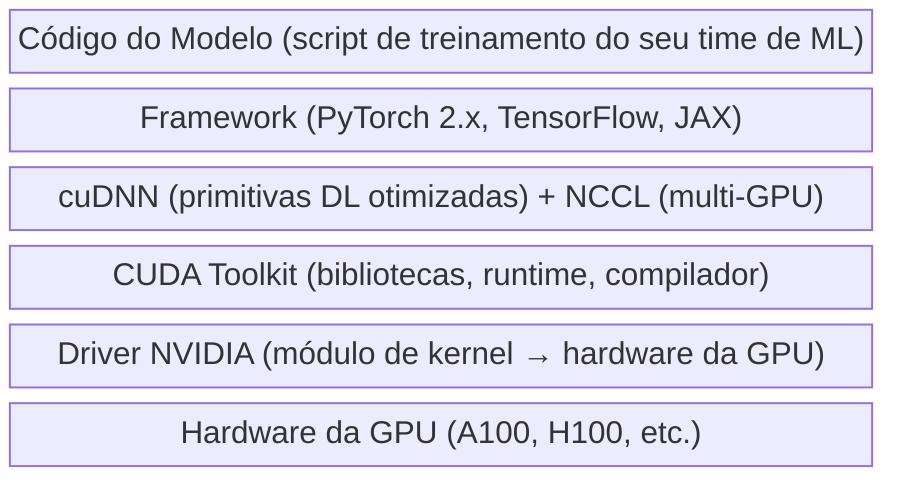

# Capítulo 4 — Mergulho Profundo nas GPUs

*"A GPU tem 40 giga de memória — por que ela não consegue carregar um modelo de 14 GB?"*

---

## O Chamado Que Muda Tudo

São 2 da manhã e uma mensagem no Slack acende a tela do seu celular. O job de treinamento do time de ML acabou de crashar — de novo. O erro tem uma linha de comprimento e é supremamente inútil: `CUDA out of memory. Tried to allocate 2.00 GiB`. O líder do time está frustrado. "Estamos rodando um modelo de 7 bilhões de parâmetros em FP16. São apenas 14 GB. A A100 tem 40 GB de memória. Deveria ter 26 GB de folga. O que está acontecendo?"

Você entra via SSH na VM, roda `nvidia-smi` e vê o uso de memória cravado em 100%. Mas a conta não fecha — 14 GB de pesos do modelo não conseguem encher 40 GB de memória da GPU. A não ser que outra coisa esteja consumindo o restante. Você investiga mais a fundo e descobre a verdade: os parâmetros do modelo são apenas uma peça do quebra-cabeça de memória. Gradientes, estados do otimizador e ativações, cada um reivindica sua própria fatia. Um "modelo de 14 GB" na verdade precisa de 90+ GB para treinar com Adam em precisão total.

Este capítulo dá a você o conhecimento para responder essa pergunta — e dezenas de outras parecidas. Não para você escrever CUDA kernels, mas para você depurar falhas de GPU, dimensionar alocações corretamente e ter conversas embasadas com seus times de ML. Este é o capítulo que separa "eu provisiono VMs com GPU" de "eu entendo infraestrutura de GPU."

---

## Por Dentro da GPU: Arquitetura para Engenheiros de Infraestrutura

Você não precisa projetar circuitos de GPU. Mas precisa de um modelo mental do que existe dentro da caixa, porque esse modelo mental vai te dizer por que as cargas de trabalho se comportam do jeito que se comportam, por que certos erros aparecem, e por que alguns SKUs de VM têm desempenho drasticamente melhor que outros para um determinado job.

### Streaming Multiprocessors: Os Blocos Fundamentais

Uma GPU é construída a partir de unidades repetidas chamadas **Streaming Multiprocessors (SMs)**. Cada SM é um processador independente que contém seus próprios núcleos, cache e hardware de escalonamento. Uma GPU NVIDIA A100 tem 108 SMs. Uma H100 tem 132.

Pense em cada SM como um pequeno chão de fábrica autossuficiente. Ele tem seus próprios trabalhadores (núcleos), seu próprio armazenamento local (memória compartilhada e registradores) e seu próprio escalonador de tarefas. O trabalho da GPU é manter todos os 100+ chãos de fábrica ocupados ao mesmo tempo.

### CUDA Cores e Tensor Cores

Dentro de cada SM, você encontrará dois tipos de unidades de processamento:

**CUDA Cores** são processadores paralelos de uso geral. Eles lidam com operações padrão de ponto flutuante e inteiros — o tipo de operação que compõe a computação GPU tradicional. Uma A100 tem 6.912 CUDA Cores. Uma H100 tem 16.896. Esses núcleos entregam throughput bruto por meio do paralelismo: milhares de operações simples executadas simultaneamente.

**Tensor Cores** são a razão pela qual as GPUs modernas dominam as cargas de trabalho de IA. Essas unidades especializadas realizam operações de multiplicação-e-acumulação de matrizes em um único ciclo de clock — exatamente a operação no coração do treinamento e da inferência de redes neurais. Uma A100 tem 432 Tensor Cores (3ª geração). Uma H100 tem 528 (4ª geração). Quando alguém diz "a H100 é 3× mais rápida que a A100 para treinamento", os Tensor Cores são o principal motivo.

**Infra ↔ IA — Tradução**: Uma GPU é como uma rodovia de 100 faixas onde cada faixa transporta operações matemáticas simultaneamente. Uma CPU é uma rodovia de 4 faixas onde cada faixa pode lidar com curvas complexas, saídas e tomadas de decisão. Para operações com matrizes — a espinha dorsal da IA — você quer a rodovia. Para lógica com ramificações complexas, você ainda quer a CPU.

### NVLink: A Supervia de GPU para GPU

Quando você tem múltiplas GPUs em uma única VM, elas precisam se comunicar. O PCIe fornece uma conexão básica, mas para treinamento multi-GPU sério, você precisa do **NVLink** — a interconexão de alta velocidade de GPU para GPU da NVIDIA.

- **A100 NVLink**: 600 GB/s de largura de banda bidirecional
- **H100 NVLink**: 900 GB/s de largura de banda bidirecional
- **B200 NVLink 5.0**: 1,8 TB/s de largura de banda bidirecional

O NVLink importa porque as estratégias de treinamento multi-GPU (abordadas mais adiante neste capítulo) trocam quantidades massivas de dados entre GPUs a cada poucos milissegundos. Se essa troca faz gargalo no PCIe (64 GB/s), suas GPUs caras ficam ociosas esperando por dados. No Azure, o NVLink está disponível nas VMs da série ND — e você pode verificar sua presença com `nvidia-smi topo -m`.

💡 **Dica**: Se `nvidia-smi topo -m` mostrar `PIX` ou `PHB` entre as GPUs em vez de `NV#`, você está usando PCIe, não NVLink. Para treinamento multi-GPU, isso faz uma diferença dramática no throughput. Verifique se você está no SKU de VM correto antes de depurar problemas de desempenho.

---

## Memória da GPU: O Recurso Que Você Mais Vai Gerenciar

Se você lembrar de apenas uma seção deste capítulo, que seja esta. A memória da GPU — especificamente, ficar sem ela — é o problema isolado mais comum que você vai depurar em infraestrutura de IA. Entender o que preenche a memória da GPU e por que é conhecimento essencial.

### A Hierarquia de Memória

A memória da GPU é organizada em camadas, assim como a memória da CPU. Cada camada troca capacidade por velocidade:

| Camada | Especificação A100 | Especificação H100 | Analogia |
|---|---|---|---|
| **HBM (High Bandwidth Memory)** | 40 ou 80 GB, 2 TB/s | 80 GB, 3,35 TB/s | RAM do sistema |
| **Cache L2** | 40 MB | 50 MB | Cache L3 da CPU |
| **Memória Compartilhada / Cache L1** | Até 164 KB por SM | Até 256 KB por SM | Cache L1/L2 da CPU |
| **Registradores** | 256 KB por SM | 256 KB por SM | Registradores da CPU |

A **HBM** é o que o `nvidia-smi` reporta e o que você vai monitorar diariamente. É a "memória principal" da GPU — onde os pesos do modelo, os dados de treinamento e os resultados intermediários residem. Quando alguém diz "a A100 tem 80 GB", está falando da HBM.

O **Cache L2** é compartilhado entre todos os SMs e gerencia automaticamente a reutilização de dados. Você não consegue controlá-lo diretamente, mas ele explica por que alguns padrões de acesso são mais rápidos do que outros.

A **Memória Compartilhada** é por SM e configurável pela aplicação. CUDA kernels a utilizam para compartilhamento rápido de dados dentro de um bloco de computação. Os desenvolvedores de frameworks (PyTorch, TensorFlow) otimizam para ela — você geralmente não precisa se preocupar com isso.

Os **Registradores** são o armazenamento mais rápido, porém limitado. Quando um kernel precisa de mais registradores do que os disponíveis, ele faz "spill" para memória mais lenta, reduzindo o desempenho.

**Infra ↔ IA — Tradução**: Se você já diagnosticou desempenho de CPU olhando taxas de acerto de cache L1/L2/L3, o mesmo modelo mental se aplica a GPUs. A HBM é a sua RAM — ela determina se um modelo cabe. As camadas de cache determinam o quão rápido ele roda.

### O Que Preenche a Memória da GPU Durante o Treinamento

Aqui é onde o chamado das 2 da manhã começa a fazer sentido. Quando você treina um modelo, a memória da GPU abriga quatro grandes consumidores:

**1. Parâmetros do Modelo (os pesos)**
Esses são os valores aprendidos que fazem o modelo funcionar. O tamanho é direto: contagem de parâmetros × bytes por parâmetro. Um modelo de 7B parâmetros em FP16 (2 bytes cada) requer ~14 GB.

**2. Gradientes**
Durante a backpropagation, o processo de treinamento calcula um gradiente para cada parâmetro — um valor que indica o quanto aquele parâmetro deve mudar. O armazenamento de gradientes é igual ao armazenamento de parâmetros: 7B parâmetros × 2 bytes = mais ~14 GB.

**3. Estados do Otimizador**
Este é o assassino oculto de memória. O otimizador Adam — usado por praticamente todo job de treinamento moderno — mantém dois valores adicionais por parâmetro: momentum (a média corrente dos gradientes) e variância (a média corrente dos gradientes ao quadrado). Esses valores são tipicamente armazenados em FP32, independentemente da precisão do modelo. Para um modelo de 7B parâmetros: 7B × 4 bytes × 2 estados = **~56 GB** só para o otimizador.

**4. Ativações**
Cada camada da rede neural produz resultados intermediários (ativações) que são salvos durante o forward pass e consumidos durante a backpropagation. A memória de ativações depende da arquitetura do modelo e do **batch size** — e é por isso que "reduza o batch size" é frequentemente a primeira correção para erros de OOM.

### A Conta da Memória

Aqui está a fórmula que vai te poupar incontáveis sessões de debugging:

```
Memória Total da GPU ≈ Parâmetros + Gradientes + Estados do Otimizador + Ativações
```

Vamos fazer a conta para aquele modelo de 7B parâmetros do chamado de abertura:

| Componente | Cálculo | Memória |
|---|---|---|
| Parâmetros (FP16) | 7B × 2 bytes | ~14 GB |
| Gradientes (FP16) | 7B × 2 bytes | ~14 GB |
| Estados do Otimizador (FP32, Adam) | 7B × 4 bytes × 2 | ~56 GB |
| Ativações (varia) | Depende do batch size | ~8-20 GB |
| **Total** | | **~92-104 GB** |

Agora o chamado das 2 da manhã faz todo sentido. Um "modelo de 14 GB" precisa de 90+ GB para treinar. Uma única A100-40GB nunca teve chance. Até uma A100-80GB fica apertada. É exatamente por isso que técnicas como ZeRO, LoRA e gradient checkpointing existem — elas atacam diferentes partes desta equação.

⚠️ **Cuidado em Produção**: Quando um engenheiro de ML diz "o modelo tem X gigabytes", quase sempre está se referindo ao tamanho dos parâmetros — o tamanho do arquivo de checkpoint salvo. A memória para treinamento é 4-8× maior. Sempre multiplique por pelo menos 4× para uma estimativa grosseira de treinamento com Adam, e 6-8× para uma margem confortável.

💡 **Dica**: O **gradient checkpointing** (também chamado de recomputação de ativações) troca computação por memória. Em vez de salvar todas as ativações durante o forward pass, ele salva apenas algumas e recomputa o restante durante a backpropagation. Ele desacelera o treinamento em ~20-30%, mas pode reduzir a memória de ativações em 60-80%. Se você vir `gradient_checkpointing=True` em uma configuração de treinamento, é isso que está acontecendo.

---

## Precisão: Trocando Acurácia por Velocidade e Memória

A escolha da precisão numérica — quantos bits representam cada número — tem um impacto direto e mensurável no consumo de memória da GPU, na velocidade de treinamento e na qualidade do modelo. Como engenheiro de infraestrutura, você precisa entender esses tradeoffs porque a precisão determina se um modelo cabe no seu hardware.

### O Espectro de Precisão

| Formato | Bits | Bytes por Parâmetro | Intervalo | Caso de Uso |
|---|---|---|---|---|
| **FP32** | 32 | 4 | ±3,4 × 10³⁸ | Treinamento em precisão total, pesos master |
| **TF32** | 19* | 4 (armazenado) | Igual ao FP32 | Padrão da A100+ para matmul, transparente |
| **BF16** | 16 | 2 | ±3,4 × 10³⁸ | Preferido para treinamento (mesmo intervalo que FP32) |
| **FP16** | 16 | 2 | ±65.504 | Treinamento com loss scaling, inferência |
| **INT8** | 8 | 1 | -128 a 127 | Inferência quantizada |
| **INT4** | 4 | 0,5 | -8 a 7 | Inferência agressivamente quantizada |

*O TF32 usa 19 bits internamente, mas é armazenado como 32 bits. É um formato de hardware na A100+ que oferece o intervalo do FP32 com precisão reduzida — e é habilitado por padrão.*

O **FP32** é o padrão seguro. Cada número recebe precisão total, mas usa 4 bytes por parâmetro — a opção que mais consome memória.

O **BF16 (bfloat16)** é o ponto ideal atual para treinamento. Ele mantém o mesmo intervalo de expoente que o FP32 (então lida com números muito grandes e muito pequenos igualmente bem) enquanto usa apenas 2 bytes. A maioria dos pipelines de treinamento modernos usa BF16 como padrão.

O **FP16** foi o padrão anterior para treinamento em mixed precision. Ele tem um intervalo mais estreito que o BF16, o que significa que alguns valores podem sofrer overflow ou underflow. Isso exige "loss scaling" — multiplicar a loss por um número grande para manter os gradientes em um intervalo representável. Funciona, mas o BF16 é mais simples e mais estável.

**INT8 e INT4** são formatos de quantização usados principalmente para inferência. Um modelo treinado em BF16 pode ser quantizado para INT8 ou INT4 após o treinamento, reduzindo drasticamente os requisitos de memória e aumentando o throughput — ao custo de uma leve degradação na qualidade.

**Matriz de Decisão: Escolhendo a Precisão**

| Cenário | Precisão Recomendada | Por Quê |
|---|---|---|
| Treinamento do zero | BF16 mixed precision | Melhor equilíbrio entre velocidade, memória e estabilidade |
| Fine-tuning de modelo pré-treinado | BF16 mixed precision | Consistente com a maioria dos modelos pré-treinados |
| Inferência (sensível a latência) | INT8 ou FP16 | 2-4× de throughput vs FP32 |
| Inferência (sensível a custo) | INT4 (GPTQ/AWQ) | 4-8× de redução de memória, leve perda de qualidade |
| Compatibilidade com workloads legados | FP32 | Quando precisão importa mais que desempenho |

**Infra ↔ IA — Tradução**: Pense em precisão como configurações de qualidade JPEG. FP32 é a imagem RAW sem compressão — maior qualidade, maior arquivo. BF16 é como um JPEG de alta qualidade — imperceptivelmente diferente para a maioria dos propósitos, metade do tamanho. INT4 é como uma miniatura — visivelmente com perda, mas carrega instantaneamente e cabe em qualquer lugar.

---

## Estratégias Multi-GPU em Profundidade

Quando um modelo não cabe em uma única GPU — ou quando treinar em uma GPU leva dias em vez de horas — você precisa distribuir o trabalho entre múltiplas GPUs. Como você distribui esse trabalho tem implicações profundas para consumo de memória, utilização de rede e eficiência geral de treinamento.

### Data Parallelism (DP)

A abordagem mais simples. Você coloca uma cópia completa do modelo em cada GPU, e cada GPU processa um batch diferente de dados. Após cada passo, as GPUs sincronizam seus gradientes via uma operação de **all-reduce**, para que todas as cópias do modelo permaneçam idênticas.

O Data Parallelism escala a velocidade de treinamento quase linearmente com a quantidade de GPUs: 8 GPUs ≈ 8× o throughput. O porém? Cada GPU precisa manter o modelo inteiro, todos os seus gradientes e todos os estados do otimizador. Se uma GPU não consegue manter o modelo, o DP sozinho não vai ajudar.

**Impacto na infraestrutura**: O DP é intensivo em rede. Cada passo de treinamento exige um all-reduce entre todas as GPUs. Dentro de um nó, o NVLink lida com isso lindamente. Entre nós, você precisa de rede com alta largura de banda e baixa latência — e é aí que o InfiniBand (abordado no Capítulo 3) mostra seu valor.

### DeepSpeed ZeRO: O Quebra-Barreiras de Memória

O **ZeRO (Zero Redundancy Optimizer)** da Microsoft é a técnica isolada mais impactante para fazer modelos grandes caberem em clusters de GPUs. Ele vem em três estágios, cada um particionando mais estado entre as GPUs:

| Estágio | O Que É Particionado | Economia de Memória por GPU | Overhead de Comunicação |
|---|---|---|---|
| **ZeRO-1** | Estados do otimizador | ~4× de redução na memória do otimizador | Mínimo |
| **ZeRO-2** | Estados do otimizador + Gradientes | Economia adicional nos gradientes | Moderado |
| **ZeRO-3** | Otimizador + Gradientes + Parâmetros | Tudo fragmentado, economia máxima | Mais alto |

Vamos revisitar nosso exemplo de 7B parâmetros. Treinar com Adam em uma única GPU precisa de ~92 GB. Com 8 GPUs e ZeRO-3, cada GPU mantém apenas 1/8 dos parâmetros, gradientes e estados do otimizador — aproximadamente 11-13 GB por GPU, mais ativações. Um modelo de 7B que não conseguia treinar em uma A100-80GB agora treina confortavelmente em oito GPUs A100-40GB.

O **ZeRO-3** é o que torna o treinamento de modelos de 70B+ parâmetros nas VMs da série ND do Azure viável. Ele fragmenta tudo — parâmetros, gradientes e estados do otimizador — entre todas as GPUs, reunindo-os apenas quando necessário para a computação.

### Fully Sharded Data Parallel (FSDP)

O **FSDP** é a resposta nativa do PyTorch ao ZeRO-3. Ele oferece a mesma capacidade central — sharding completo de parâmetros, gradientes e estados do otimizador — mas integrado diretamente à API de treinamento distribuído do PyTorch. Se o time de ML usa PyTorch (a maioria usa), provavelmente vai escolher entre DeepSpeed ZeRO e FSDP.

Do ponto de vista de infraestrutura, o FSDP e o ZeRO-3 têm requisitos de recursos semelhantes: alta largura de banda de memória da GPU, comunicação rápida entre GPUs e bom throughput de armazenamento para carga de dados.

### Pipeline Parallelism (PP)

O Pipeline Parallelism divide as camadas do modelo entre as GPUs sequencialmente. A GPU 0 mantém as camadas 1-10, a GPU 1 mantém as camadas 11-20, e assim por diante. Os dados fluem pelo pipeline como uma linha de montagem.

A vantagem: cada GPU mantém apenas uma fração dos parâmetros do modelo, reduzindo drasticamente a memória por GPU. A desvantagem: **pipeline bubbles**. Enquanto a GPU 0 processa o forward pass do próximo micro-batch, a GPU 3 pode estar ociosa esperando por dados. Escalonamento sofisticado (como 1F1B intercalado) minimiza, mas não consegue eliminar essas bolhas.

**Impacto na infraestrutura**: O PP é menos intensivo em rede que o DP porque a comunicação acontece apenas entre estágios adjacentes do pipeline. Mas é sensível à latência — uma interconexão com alta latência vai amplificar as pipeline bubbles.

### Tensor Parallelism (TP)

O Tensor Parallelism é a abordagem mais granular. Ele divide camadas individuais entre as GPUs, de modo que uma única multiplicação de matrizes é distribuída entre múltiplos dispositivos. Isso requer largura de banda extremamente alta entre as GPUs porque resultados parciais precisam ser trocados durante a computação.

**Impacto na infraestrutura**: O TP requer absolutamente NVLink. Rodar TP sobre PCIe ou Ethernet é tecnicamente possível, mas praticamente inútil — o overhead de comunicação anularia os benefícios do paralelismo. O TP é usado dentro de um nó (sobre NVLink), enquanto o DP ou PP é usado entre nós (sobre InfiniBand).

### Paralelismo 3D: Combinando Tudo

Para os maiores modelos (100B+ parâmetros), os pipelines de treinamento em produção combinam todas as três estratégias:

- **Tensor Parallelism** dentro de um nó (sobre NVLink) — divide camadas entre as GPUs
- **Pipeline Parallelism** entre poucos nós — distribui grupos de camadas
- **Data Parallelism** (com ZeRO) entre muitos nós — replica o pipeline para throughput

Isso é chamado de **paralelismo 3D**, e é assim que modelos como GPT-4 e LLaMA 3 são treinados. Como engenheiro de infraestrutura, você precisa entender que esse nível de treinamento sobrecarrega todos os recursos simultaneamente: memória da GPU, largura de banda do NVLink, throughput do InfiniBand e I/O de armazenamento.

**Matriz de Decisão: Escolhendo uma Estratégia de Paralelismo**

| Tamanho do Modelo | Estratégia | Requisito de GPUs | Requisito de Rede |
|---|---|---|---|
| < 1B parâmetros | GPU única ou DP | 1-8 GPUs | PCIe é suficiente |
| 1-10B parâmetros | DP + ZeRO-2 | 4-16 GPUs | NVLink recomendado |
| 10-70B parâmetros | ZeRO-3 / FSDP | 8-64 GPUs | NVLink + InfiniBand |
| 70-200B+ parâmetros | Paralelismo 3D | 64-512+ GPUs | NVLink + InfiniBand obrigatório |

---

## A Stack de Software da NVIDIA

Toda sessão de debugging de GPU eventualmente se resume a compatibilidade de software. A stack da NVIDIA é um sistema em camadas onde cada camada depende da camada abaixo, e uma incompatibilidade em qualquer nível pode causar falhas que vão de mensagens de erro enigmáticas a resultados incorretos silenciosos.

### A Cadeia de Compatibilidade



**Driver**: O módulo de nível de kernel que se comunica diretamente com o hardware da GPU. Ele precisa suportar a arquitetura da sua GPU (um driver antigo não vai reconhecer uma H100). Cada versão de driver tem uma versão máxima de CUDA que suporta.

**CUDA Toolkit**: Uma coleção de bibliotecas, uma API de runtime e um compilador (`nvcc`). A versão do CUDA no `nvidia-smi` mostra a versão máxima de CUDA suportada pelo driver instalado — não necessariamente a versão que sua aplicação está usando.

**cuDNN**: A biblioteca da NVIDIA de primitivas otimizadas para deep learning — convoluções, normalizações, operações recorrentes. O PyTorch e o TensorFlow chamam o cuDNN internamente. As versões do cuDNN devem corresponder à versão do CUDA Toolkit.

**NCCL (NVIDIA Collective Communications Library)**: Lida com a comunicação multi-GPU — all-reduce, broadcast, all-gather. O NCCL detecta automaticamente o melhor transporte disponível (NVLink, InfiniBand, PCIe) e otimiza de acordo. É o motor por trás do `DistributedDataParallel` do PyTorch e da camada de comunicação do DeepSpeed.

**TensorRT**: O motor de otimização de inferência da NVIDIA. Ele analisa um modelo treinado e aplica otimizações: fusão de camadas (combinando múltiplas operações em um único kernel), calibração de precisão (conversão automática de FP32→INT8) e planejamento de memória. O TensorRT pode entregar speedup de 2-5× na inferência comparado a rodar um modelo diretamente no PyTorch.

⚠️ **Cuidado em Produção: A Saída de Emergência via Container**

O problema de software de GPU mais comum é incompatibilidade de versão: o PyTorch foi compilado com CUDA 12.1, mas sua VM tem drivers CUDA 11.8. Ou o cuDNN 8.6 está instalado, mas o framework espera 8.9. Essas incompatibilidades produzem erros como `CUDA error: no kernel image is available for execution on the device` ou, pior, crashes silenciosos.

A solução? **Use as imagens de container pré-construídas da NVIDIA do NGC (NVIDIA GPU Cloud)**. Disponíveis em `nvcr.io/nvidia/pytorch` e `nvcr.io/nvidia/tensorflow`, essas imagens empacotam uma combinação específica e testada de compatibilidade de API de Driver, CUDA Toolkit, cuDNN, NCCL e framework. Cada camada é verificada para funcionar em conjunto.

```bash
# Pull the official NVIDIA PyTorch container (monthly releases)
docker pull nvcr.io/nvidia/pytorch:24.05-py3

# Run with GPU access
docker run --gpus all -it nvcr.io/nvidia/pytorch:24.05-py3
```

No Azure, a **NVIDIA GPU Driver Extension** cuida da instalação do driver em VMs com GPU. Para workloads containerizados no AKS, o **NVIDIA Device Plugin** (implantado como DaemonSet) expõe as GPUs aos pods do Kubernetes. A combinação de containers NVIDIA + extensões de GPU do Azure elimina a maioria das dores de cabeça com a stack de software.

💡 **Dica**: Ao depurar problemas de software de GPU, sempre colete três números de versão primeiro: `nvidia-smi` (driver + versão máxima de CUDA), `nvcc --version` (CUDA Toolkit instalado) e `python -c "import torch; print(torch.version.cuda)"` (versão do CUDA com a qual o PyTorch foi compilado). Incompatibilidades entre qualquer um desses são a causa raiz mais provável.

---

## Lendo o nvidia-smi Como um Profissional

O `nvidia-smi` é a primeira ferramenta que você executa ao depurar qualquer problema de GPU. É o comando `top` do mundo das GPUs — um snapshot rápido do que está acontecendo em cada GPU do sistema. Aprender a lê-lo fluentemente vai te poupar horas de debugging.

### Anatomia da Saída do nvidia-smi

```
+-----------------------------------------------------------------------------------------+
| NVIDIA-SMI 535.161.08    Driver Version: 535.161.08    CUDA Version: 12.2               |
|-----------------------------------------+------------------------+----------------------+
| GPU  Name                 Persistence-M | Bus-Id          Disp.A | Volatile Uncorr. ECC |
| Fan  Temp   Perf          Pwr:Usage/Cap |          Memory-Usage  | GPU-Util  Compute M. |
|=========================================+========================+======================|
|   0  NVIDIA A100-SXM4-80GB         On   | 00000001:00:00.0  Off  |                    0 |
| N/A   42C    P0              72W / 400W |  71458MiB / 81920MiB   |     94%      Default |
|-----------------------------------------+------------------------+----------------------|
|   1  NVIDIA A100-SXM4-80GB         On   | 00000002:00:00.0  Off  |                    0 |
| N/A   39C    P0              68W / 400W |  71210MiB / 81920MiB   |     91%      Default |
|-----------------------------------------+------------------------+----------------------|
```

### Detalhamento Campo a Campo

**Driver Version / CUDA Version** (linha superior): `535.161.08` é o driver instalado. `CUDA Version: 12.2` é a versão *máxima* de CUDA que este driver suporta — não necessariamente o que sua aplicação está usando.

**Persistence-M** (Persistence Mode): Deve estar `On` para servidores. Quando `Off`, o driver é descarregado entre jobs, adicionando segundos de latência a cada operação de GPU. As VMs com GPU do Azure tipicamente têm isso habilitado por padrão.

**Temp**: Temperatura da GPU em Celsius. Temperaturas saudáveis durante treinamento variam de 35-75°C. Acima de **83°C**: o thermal throttling começa — a GPU reduz as frequências de clock para resfriar. Acima de **90°C**: zona de perigo — risco de crashes ou danos ao hardware.

**Perf**: Estado de desempenho. **P0** = desempenho máximo. **P8** = ocioso. Se você vir P2 ou inferior durante um job de treinamento, a GPU está sendo limitada (térmica ou energia). Isso deve permanecer em P0 durante treinamento ativo.

**Pwr:Usage/Cap**: Consumo de energia vs. limite. `72W / 400W` = 18% de consumo de energia — esta GPU não está trabalhando pesado. Durante treinamento, você deveria ver 250-350W em uma A100. Próximo do limite significa que a GPU está totalmente carregada.

**Memory-Usage**: `71458MiB / 81920MiB` = 87% de utilização de memória. Este é o número que indica o quão perto você está de um erro de OOM. Acima de 95% é arriscado. Em 100%, a próxima alocação dispara `CUDA out of memory`.

**GPU-Util**: Percentual de utilização de computação. **94%** = excelente — a GPU está ocupada processando. **Abaixo de 50%** durante treinamento sinaliza um problema: suas GPUs estão famintas por dados, esperando pré-processamento da CPU ou esperando comunicação de rede.

**Volatile Uncorr. ECC**: Erros de ECC (Error-Correcting Code) não corrigíveis desde o último reboot. **0** é o esperado. **Qualquer valor diferente de zero** significa que células de memória da GPU estão falhando. Isso é um problema de hardware — solicite substituição da VM ao Azure.

### Comandos Essenciais do nvidia-smi

```bash
# Basic snapshot (what you'll use 90% of the time)
nvidia-smi

# Continuous monitoring — refreshes every 5 seconds
nvidia-smi -l 5

# CSV output for scripting and dashboards
nvidia-smi --query-gpu=name,temperature.gpu,utilization.gpu,utilization.memory,memory.total,memory.used --format=csv

# GPU utilization monitoring (compact, real-time)
nvidia-smi dmon -s u

# GPU topology — verify NVLink connectivity
nvidia-smi topo -m

# Check for ECC errors (hardware health)
nvidia-smi --query-gpu=ecc.errors.uncorrected.volatile.total --format=csv

# List all running GPU processes
nvidia-smi pmon -s u -c 1
```

### Como é Saudável vs. Não Saudável

| Métrica | Saudável (Treinamento) | Não Saudável / Investigar |
|---|---|---|
| GPU-Util | 85-100% | Abaixo de 50% |
| Memory-Usage | 70-95% do total | 100% (OOM iminente) ou < 30% (subutilizado) |
| Temperatura | 35-75°C | Acima de 83°C (throttling) |
| Energia | 60-90% do limite | Abaixo de 30% (GPU ociosa) ou 100% sustentado (throttling) |
| Estado de Desempenho | P0 | P2 ou superior durante job ativo |
| Erros ECC | 0 | Qualquer valor não-corrigível diferente de zero |

💡 **Dica**: Para monitoramento contínuo de GPU em produção, o `nvidia-smi dmon` é mais útil do que chamadas repetidas ao `nvidia-smi`. Ele produz um fluxo compacto e com timestamp de métricas de GPU que é fácil de redirecionar para sistemas de agregação de logs. Combine-o com as métricas de GPU do Azure Monitor para dashboards históricos.

---

## Debugging de GPU: O Guia de Troubleshooting

Estes são os sete problemas de GPU que você encontrará com mais frequência em infraestrutura de IA em produção. Para cada um: o que você vê, por que acontece e o que fazer.

### 1. CUDA Out of Memory (OOM)

**O que você vê:**
```
RuntimeError: CUDA out of memory. Tried to allocate 2.00 GiB
(GPU 0; 79.35 GiB total capacity; 77.42 GiB already allocated)
```

**Por que acontece:** As necessidades combinadas de memória do job de treinamento (parâmetros + gradientes + estados do otimizador + ativações) excedem a memória disponível da GPU. O gatilho mais comum é o batch size — muitas amostras processadas simultaneamente inflam a memória de ativações.

**O que fazer:**
1. **Reduza o batch size** — a correção mais rápida. Corte pela metade e tente de novo.
2. **Habilite gradient checkpointing** — troca ~20-30% de computação por 60-80% de economia na memória de ativações.
3. **Habilite ZeRO-2 ou ZeRO-3** — fragmenta estados do otimizador e gradientes entre as GPUs.
4. **Use mixed precision** (BF16) — reduz pela metade a memória de parâmetros e gradientes.
5. **Migre para uma GPU maior** — A100-80GB em vez de A100-40GB, ou mude para H100.

### 2. Incompatibilidade de Versão CUDA

**O que você vê:**
```
RuntimeError: The current PyTorch install supports CUDA capabilities sm_80 sm_86 sm_90.
If you want to use the NVIDIA H100 GPU with PyTorch, please check the instructions at
https://pytorch.org/get-started/locally/
```

Ou mais enigmaticamente:
```
CUDA error: no kernel image is available for execution on the device
```

**Por que acontece:** O PyTorch (ou TensorFlow) foi compilado com uma versão específica de CUDA, e o driver instalado não a suporta — ou a arquitetura da GPU não foi incluída no build.

**O que fazer:**
1. Verifique os três números de versão: `nvidia-smi` (driver), `nvcc --version` (toolkit), `python -c "import torch; print(torch.version.cuda)"` (CUDA do PyTorch).
2. Atualize o driver NVIDIA para suportar a versão de CUDA necessária.
3. Ou — o caminho mais fácil — use um container NVIDIA NGC que empacota versões testadas e compatíveis.

### 3. GPU Não Encontrada / Falhas de Driver

**O que você vê:**
```
NVIDIA-SMI has failed because it couldn't communicate with the NVIDIA driver.
```
Ou: `nvidia-smi` retorna "No devices were found."

**Por que acontece:** O driver NVIDIA não está instalado, falhou ao carregar, ou o SKU da VM não inclui uma GPU de fato. No Azure, isso também pode acontecer quando a GPU Driver VM Extension falha silenciosamente.

**O que fazer:**
1. Verifique se o SKU da VM inclui GPUs (séries NC, ND, NV).
2. Verifique o status da Azure GPU Driver Extension: `az vm extension list --resource-group <rg> --vm-name <vm> -o table`.
3. Reinicie a VM — a instalação do driver às vezes requer um restart.
4. Reinstale a extensão ou instale manualmente o driver a partir do repositório da NVIDIA.

### 4. Erros de ECC (Falha de Hardware)

**O que você vê:**
```bash
$ nvidia-smi --query-gpu=ecc.errors.uncorrected.volatile.total --format=csv
ecc.errors.uncorrected.volatile.total
3
```

Ou processos de GPU crasham intermitentemente com `CUDA error: uncorrectable ECC error encountered`.

**Por que acontece:** Células físicas de memória da GPU falharam. Erros de ECC corrigíveis são automaticamente corrigidos pelo hardware (e são normais em pequenas quantidades). Erros não corrigíveis significam corrupção de dados — e não há correção via software.

**O que fazer:**
1. Confirme com `nvidia-smi -q -d ECC` para status detalhado de ECC.
2. Pare todas as cargas de trabalho na GPU afetada.
3. No Azure, abra uma solicitação de suporte para substituição de hardware. O Azure vai reimplantar sua VM em hardware saudável (nota: VMs com GPU não suportam migração ao vivo — espere indisponibilidade durante a movimentação).
4. Se estiver usando AKS, faça cordon no nó para impedir que novas cargas de trabalho de GPU sejam agendadas.

### 5. Thermal Throttling

**O que você vê:** Temperatura da GPU acima de 83°C no `nvidia-smi`. O estado de desempenho cai de P0 para P2 ou P3. O throughput de treinamento cai 20-40% em relação ao baseline.

**Por que acontece:** Refrigeração insuficiente, densidade de carga de trabalho muito alta (muitas VMs no mesmo host físico gerando calor) ou problemas de temperatura ambiente no datacenter.

**O que fazer:**
1. Monitore com `nvidia-smi dmon -s p` (métricas de energia e temperatura).
2. Em ambientes cloud, o thermal throttling é problema do Azure — mas documente o problema e abra um ticket de suporte com os números de série das GPUs e timestamps.
3. Reduza as cargas de trabalho concorrentes se estiver rodando múltiplos jobs por GPU (via MIG ou time-slicing).
4. Considere VMs com melhores perfis térmicos (GPUs no form factor SXM têm melhor refrigeração do que PCIe).

### 6. Baixa Utilização de GPU Durante Treinamento

**O que você vê:** `GPU-Util` consistentemente abaixo de 50% durante treinamento ativo. O treinamento está rodando, mas as GPUs passam a maior parte do tempo ociosas.

**Por que acontece:** A GPU é mais rápida do que o pipeline de dados consegue alimentá-la. Isso é **data starvation** — a CPU não consegue pré-processar e entregar dados de treinamento rápido o suficiente. Comum ao ler de armazenamento remoto sem cache, ou quando o `num_workers` no data loader é muito baixo.

**O que fazer:**
1. Aumente o `num_workers` do DataLoader (tipicamente 4-8 por GPU).
2. Habilite `pin_memory=True` no DataLoader para transferências CPU→GPU mais rápidas.
3. Faça cache dos dados em NVMe local (use BlobFuse2 com caching em NVMe — veja o Capítulo 2).
4. Pré-processe os dados em formatos otimizados (WebDataset, TFRecord, Mosaic StreamingDataset).
5. Faça profiling com `torch.profiler` para confirmar que o gargalo é o carregamento de dados, não a comunicação.

⚠️ **Cuidado em Produção**: Baixa utilização de GPU nem sempre significa data starvation. Também pode indicar overhead excessivo de sincronização de gradientes (GPUs demais para um modelo pequeno), pipeline bubbles (pipeline parallelism mal configurado) ou uma operação de salvamento de checkpoint bloqueando o treinamento. Verifique o que as GPUs estão esperando antes de prescrever correções no pipeline de dados.

### 7. NVLink Não Detectado

**O que você vê:**
```bash
$ nvidia-smi topo -m
        GPU0    GPU1    GPU2    GPU3
GPU0     X      PHB     PHB     PHB
GPU1    PHB      X      PHB     PHB
GPU2    PHB     PHB      X      PHB
GPU3    PHB     PHB     PHB      X
```

Todas as conexões mostram `PHB` (PCIe Host Bridge) ou `PIX` (switch PCIe) em vez de `NV#` (NVLink).

**Por que acontece:** O SKU da VM não suporta NVLink (apenas VMs da série ND têm NVLink no Azure), a versão do driver não suporta a topologia NVLink, ou o hardware do NVLink tem uma falha.

**O que fazer:**
1. Verifique o SKU da VM: NVLink está disponível na série ND (ND96asr_v4, ND96amsr_A100_v4, ND_H100_v5, etc.). As séries NC e NV usam PCIe.
2. Atualize o driver NVIDIA para a versão mais recente suportada pela sua GPU.
3. Se estiver no SKU correto com os drivers corretos e o NVLink ainda não aparecer, abra um ticket de suporte ao Azure — isso indica um problema de hardware.

---

## Gerações de GPUs em um Relance

Como engenheiro de infraestrutura, você precisa saber o que cada geração de GPU traz à mesa — não por curiosidade, mas porque a geração determina quais formatos de precisão são suportados, qual largura de banda está disponível e quais recursos de software são desbloqueados.

| Geração | Arquitetura | GPU Principal | Capacidade HBM | Largura de Banda HBM | Geração Tensor Core | Inovação Principal |
|---|---|---|---|---|---|---|
| **Volta** (2017) | GV100 | V100 | 16 / 32 GB (HBM2) | 900 GB/s | 1ª geração | Primeiros Tensor Cores |
| **Ampere** (2020) | GA100 | A100 | 40 / 80 GB (HBM2e) | 2 TB/s | 3ª geração | TF32, Sparsity, MIG |
| **Hopper** (2022) | GH100 | H100 | 80 GB (HBM3) | 3,35 TB/s | 4ª geração | FP8, Transformer Engine |
| **Blackwell** (2024) | GB200/GB300 | B200 | 192 GB (HBM3e) | 8 TB/s | 5ª geração | FP4, NVLink 5.0 |

### Mapeamento de VMs no Azure

| GPU | Série de VM no Azure | GPUs por VM | NVLink | InfiniBand |
|---|---|---|---|---|
| V100 | NC v3 | 1-4 | Não | Não |
| A100 40GB | ND A100 v4 | 8 | Sim (600 GB/s) | Sim (200 Gb/s) |
| A100 80GB | ND A100 v4 (80GB) | 8 | Sim (600 GB/s) | Sim (200 Gb/s) |
| H100 | ND H100 v5 | 8 | Sim (900 GB/s) | Sim (400 Gb/s) |
| B200 | ND GB200 v6 / ND GB300 v6 | 4 | Sim (1,8 TB/s) | Sim (400 Gb/s) |

💡 **Dica**: Cada geração aproximadamente dobra a largura de banda da HBM e introduz um novo formato de precisão reduzida. A Ampere trouxe TF32 e structured sparsity. A Hopper trouxe FP8 e o Transformer Engine (que gerencia automaticamente a precisão durante o treinamento). A Blackwell traz FP4, 192 GB de HBM por GPU e NVLink 5.0 com 1,8 TB/s por VM. Quando o time de ML diz "precisamos de H100s, não A100s", geralmente estão buscando a maior largura de banda de memória e o Transformer Engine — não apenas mais FLOPS.

---

## Checklist do Capítulo

Antes de passar para o próximo capítulo, certifique-se de que você consegue responder com confiança a estas perguntas e realizar estas tarefas:

- **Explicar a arquitetura da GPU** — Você consegue descrever SMs, CUDA Cores e Tensor Cores e explicar por que GPUs dominam cargas de trabalho com operações de matrizes.
- **Diagnosticar problemas de memória** — Você consegue calcular a pegada de memória de um job de treinamento (parâmetros + gradientes + estados do otimizador + ativações) e explicar por que um "modelo de 7B" precisa de 90+ GB para treinar.
- **Entender os tradeoffs de precisão** — Você conhece a diferença entre FP32, BF16, FP16 e INT8/INT4, e quando cada um é apropriado.
- **Escolher uma estratégia de paralelismo** — Dado um tamanho de modelo e uma quantidade de GPUs, você consegue recomendar DP, ZeRO-2, ZeRO-3/FSDP ou paralelismo 3D.
- **Navegar pela stack de software da NVIDIA** — Você consegue explicar a cadeia Driver → CUDA → cuDNN → NCCL → Framework e diagnosticar incompatibilidades de versão.
- **Ler o nvidia-smi fluentemente** — Você consegue interpretar cada campo, identificar estados saudáveis vs. não saudáveis e usar comandos avançados de monitoramento.
- **Solucionar problemas de GPU** — Você consegue diagnosticar e resolver erros de OOM, incompatibilidades de versão, falhas de driver, erros de ECC, thermal throttling, baixa utilização e problemas de NVLink.
- **Comparar gerações de GPU** — Você conhece as capacidades da V100, A100, H100 e B200, e quais SKUs de VM do Azure correspondem a cada uma.

---

## O Que Vem a Seguir

Agora que você entende o que acontece dentro da GPU — a arquitetura, a hierarquia de memória, a stack de software e o guia de debugging — é hora de automatizar tudo ao redor. O Capítulo 5 aborda **Infraestrutura como Código para IA**: como criar templates para clusters de GPU, endpoints de inferência e pipelines de treinamento para que sejam reproduzíveis, versionados e prontos para auditoria. Porque entender GPUs é apenas metade da batalha — provisioná-las de forma consistente em escala é onde a engenharia de infraestrutura realmente encontra a IA.