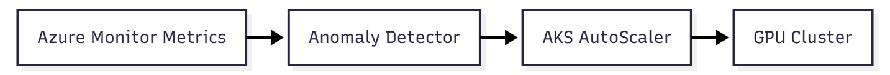

# Chapter 5 — Monitoring and observability for AI environments

> “You only control what you can measure — and with AI, that’s even more critical.”

## Why monitoring AI is different

AI environments behave differently from traditional workloads.  
A model may be *running* and still deliver incorrect results, high latency, or unexpected costs.

**Common scenarios:**

- The model looks fine but predictions are degraded.  
- The GPU is active but underutilized.  
- Inference responds, but with high latency noticeable to users.  
- Costs spike suddenly due to the volume of processed tokens.  

**Conclusion:** Observability isn’t optional. It’s a **core part of AI reliability**.

---

## What to monitor in AI workloads

| Layer/Category | Key Metrics | Tools/Sources |
|----------------|------------|---------------|
| **Compute (GPU/CPU)** | Utilization, memory, temperature, failures | DCGM, nvidia-smi, Azure Managed Prometheus, Azure Monitor |
| **Model (ML/LLM)** | Accuracy, inference latency, TPM/RPM | Application Insights, Azure ML, Azure OpenAI Logs |
| **Network** | Throughput, jitter, slow connections | Azure Monitor for Network |
| **Data** | Integrity, freshness, ingestion failures | Data Factory, Synapse, Log Analytics |
| **Cost** | GPU usage, token volume, inference time | Cost Management + Log Analytics |
| **Security / Compliance** | Secret access, Key Vault logs | Azure Policy, Defender for Cloud |

💡 **Tip:** Monitor both the **model behavior** and the **infrastructure** that supports it.  
Inference without GPU visibility is an **incomplete diagnosis**.

---

## Observability tools in Azure

| Tool | Main function |
|------|---------------|
| **Azure Monitor** | Collect and visualize resource metrics and logs |
| **Log Analytics Workspace** | Store logs and enable advanced KQL queries |
| **Azure Managed Prometheus** | Kubernetes and custom metrics, including GPU and application metrics |
| **Grafana** | Real-time dashboard visualization |
| **Application Insights** | Telemetry, response time, tracing |
| **Azure ML Studio** | Model and endpoint monitoring |
| **OpenTelemetry Collector** | Standardized metrics, logs, and traces |

---

## Practical example — Monitoring GPUs in AKS

### Install NVIDIA’s DCGM Exporter

```bash
helm repo add nvidia https://nvidia.github.io/gpu-monitoring-tools
helm install dcgm-exporter nvidia/dcgm-exporter
```

### Prometheus integration model

You can integrate DCGM metrics using **one** of the following approaches:

- **Azure Managed Prometheus** (recommended for production AKS clusters)  
- **Self-managed Prometheus**, such as `kube-prometheus-stack`  

> Azure Managed Prometheus does **not** require deploying `kube-prometheus-stack`.  
> The Helm-based stack is only needed if you operate Prometheus yourself.

```bash
helm repo add prometheus-community https://prometheus-community.github.io/helm-charts
helm install prom prometheus-community/kube-prometheus-stack
```

---

### Visualize in Grafana

Add panels with GPU-focused metrics such as:

- `DCGM_FI_DEV_GPU_UTIL` — GPU utilization  
- `DCGM_FI_DEV_FB_USED` — GPU memory usage  
- `DCGM_FI_DEV_MEM_COPY_UTIL` — memory copy pressure  

---

## Sample Grafana dashboards for AI workloads

### GPU efficiency dashboard

Recommended panels:

- GPU Utilization (%) vs Pod Count  
- GPU Memory Used (MB) vs Inference Latency  
- GPU Temperature over time  
- GPU Utilization vs Requests per Second  

### Inference performance dashboard

- p95 / p99 latency per endpoint  
- Requests per second  
- Error rate by HTTP status  
- Dependency latency  

---

## Inference latency and performance

Use **Application Insights** to track:

- `duration` — average and tail response time  
- `successRate` — success percentage  
- `dependency calls` — external API latency  

```python
import os
from azure.monitor.opentelemetry import configure_azure_monitor

# Requires APPLICATIONINSIGHTS_CONNECTION_STRING environment variable to be set.
# Example: export APPLICATIONINSIGHTS_CONNECTION_STRING="InstrumentationKey=...;IngestionEndpoint=..."
configure_azure_monitor()
```

🔧 **Recommendations:**

- Track **p95 and p99 latency per endpoint**  
- Alert on **HTTP 429 and 503**  
- Correlate **latency**, **token usage**, and **GPU utilization**  

---

## Azure OpenAI–specific monitoring

### Key metrics and signals

| Signal | Why it matters |
|------|----------------|
| **TPM (Tokens per Minute)** | Throughput and rate limiting |
| **RPM (Requests per Minute)** | Burst control |
| **HTTP 429** | Throttling events |
| **Retry-After** | Backoff guidance |
| **TTFT (Time to First Token)** | Perceived latency |
| **PTU usage** | Capacity planning and stability |

### Monitoring throttling

```kusto
AppRequests
| where ResultCode == "429"
| summarize count() by bin(TimeGenerated, 5m), AppRoleName
```

---

## Cost observability

GPUs and tokens are **expensive — and scale fast**.

| Item | How to monitor |
|------|----------------|
| **GPU usage per hour** | Azure Monitor + Metrics Explorer |
| **Token consumption (TPM/RPM)** | Azure OpenAI Metrics and Logs |
| **Cost per project/team** | Cost Management with tags |
| **Future cost forecasting** | Azure Anomaly Detector or Machine Learning |

---

## Predictive analysis and intelligent autoscaling

- Predict GPU usage peaks based on historical data  
- Detect latency anomalies using **Azure Anomaly Detector**  
- Trigger intelligent autoscaling (**AKS / VMSS**)  



---

## Alerts and automated responses

| Event | Recommended action |
|------|--------------------|
| GPU > 90% for 30min | Investigate data bottlenecks or scale replicas |
| Latency > SLO | Validate model, network, or rate limits |
| Ingestion failure | Trigger fallback pipeline |
| Accuracy drop | Retrain or activate previous model |

---

## Hands-On — Correlating metrics and logs with KQL

GPU metrics live in **Prometheus / Grafana**.  
Log Analytics is used for correlation.

```kusto
AppRequests
| summarize avg(DurationMs) by bin(TimeGenerated, 5m), cloud_RoleName
```

---

## Best practices for security and observability

- Never log sensitive data (prompts, PII, responses)  
- Enable automatic diagnostics with Azure Policy  
- Centralize logs in a single workspace  
- Retain logs for at least 30 days  
- Use Managed Identity and Key Vault  

---

## AI observability checklist

- [x] GPU metrics  
- [x] Inference latency monitoring  
- [x] Centralized and correlated logs  
- [x] Alerts for throttling and failures  
- [x] Dashboards with TPM, QPS, tokens, and cost  

---

## References

- https://learn.microsoft.com/en-us/azure/aks/monitor-gpu-metrics  
- https://learn.microsoft.com/azure/azure-monitor/  
- https://learn.microsoft.com/azure/azure-monitor/app/opentelemetry-enable  

> “Good infrastructure is invisible when it works — but poorly monitored AI shows up quickly, either in your monthly bill or in the user experience.”
