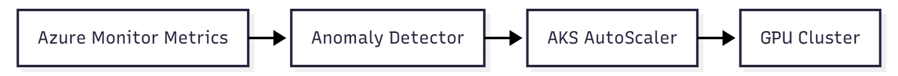

# Chapter 5 — Monitoring and observability for AI environments

> “You only control what you can measure — and with AI, that’s even more critical.”

## Why monitoring AI is different

AI environments behave differently from traditional workloads.  
A model may be *running* and still deliver incorrect results, high latency, or unexpected costs.

**Common scenarios:**

- The model looks fine but predictions are degraded.  
- The GPU is active but underutilized.  
- Inference responds, but with high latency noticeable to users.  
- Costs spike suddenly due to the volume of processed tokens.  

**Conclusion:** Observability isn’t optional — it’s a **core part of AI reliability**.

## What to monitor in AI workloads

| Layer/Category | Key Metrics | Tools/Sources |
|------------------|-------------|----------------|
| **Compute (GPU/CPU)** | Utilization, memory, temperature, failures | DCGM, nvidia-smi, Azure Monitor |
| **Model (ML/LLM)** | Accuracy, inference latency, TPM/RPM | Application Insights, Azure ML, AOAI Logs |
| **Network** | Throughput, jitter, slow connections | Azure Monitor for Network |
| **Data** | Integrity, freshness, ingestion failures | Data Factory, Synapse, Log Analytics |
| **Cost** | GPU usage, token volume, inference time | Cost Management + Log Analytics |
| **Security / Compliance** | Secret access, Key Vault logs | Azure Policy, Defender for Cloud |

💡 **Tip:** Monitor both the **model behavior** and the **infrastructure** that supports it.  
Inference without GPU visibility is **incomplete diagnosis**.

## Observability tools in Azure

| Tool | Main function |
|------|----------------|
| **Azure Monitor** | Collect and visualize resource metrics and logs |
| **Log Analytics Workspace** | Store logs / Advanced KQL queries |
| **Azure Managed Prometheus** | Custom metrics, mainly for AKS and GPU |
| **Grafana** | Real-time dashboard visualization |
| **Application Insights** | Telemetry, response time, tracing |
| **Azure ML Studio** | Model and endpoint monitoring |
| **OpenTelemetry Collector** | Standardized metrics and export |

## Practical example: Monitoring GPUs in AKS

Install NVIDIA’s DCGM Exporter:

```bash
helm repo add nvidia https://nvidia.github.io/gpu-monitoring-tools
helm install dcgm-exporter nvidia/dcgm-exporter
```

Integrate with Prometheus or Azure Managed Prometheus:

```bash
helm repo add prometheus-community https://prometheus-community.github.io/helm-charts
helm install prom prometheus-community/kube-prometheus-stack
```

### Visualize in Grafana

Add panels with metrics such as:

- `DCGM_FI_DEV_GPU_UTIL`  
- `DCGM_FI_DEV_FB_USED`  
- `DCGM_FI_DEV_MEM_COPY_UTIL`

💡 These metrics help detect GPU bottlenecks and optimize cluster usage.

## Inference latency and performance

Use **Application Insights** to track:

- `duration` — average response time  
- `successRate` — success percentage  
- `dependency calls` — external API response time  

Add the App Insights or OpenTelemetry SDK directly to the inference code:

```python
from opentelemetry import trace
from azure.monitor.opentelemetry import configure_azure_monitor
configure_azure_monitor()
```

🔧 **Recommendations:**

- Track **p95/p99 latency per endpoint**.  
- Create alerts for **HTTP 429/503** (throttling and timeouts).  
- Correlate **model metrics**, **token usage**, and **runtime** data.  

## Cost observability

GPUs and tokens are **expensive — and fast**.

| Item | How to monitor |
|------|----------------|
| **GPU usage per hour** | Azure Monitor + Metrics Explorer |
| **Token consumption (TPM/RPM)** | Azure OpenAI Metrics/Logs |
| **Cost per project/team** | Cost Management with tags (Project=AI, Team=DataScience) |
| **Future cost forecasting** | Azure Anomaly Detector or Machine Learning |

💡 Create automatic alerts for **spending >10% above weekly average**.

## Predictive analysis and intelligent autoscaling

Use AI to improve your own observability:

- Predict GPU usage peaks based on historical data.  
- Detect latency anomalies using **Azure Anomaly Detector**.  
- Trigger intelligent autoscaling (**AKS / VMSS**) based on inferred load.  



## Alerts and automated responses

| Event | Recommended action |
|--------|--------------------|
| GPU > 90% for 30min | Check data bottlenecks or replicate pods |
| Latency > 1s | Validate network or model performance |
| Ingestion failure | Trigger fallback pipeline |
| Accuracy drop | Retrain or activate previous version |

Configure **Azure Monitor Action Groups** to trigger **emails, Logic Apps, or webhooks** automatically.

## Hands-On: Querying GPU metrics via Kusto (Log Analytics)

```kusto
Perf
| where ObjectName == "GPU Adapter"
| summarize avg(CounterValue) by bin(TimeGenerated, 5m), CounterName
```

Combine with **Application Insights logs** to correlate GPU usage with inference latency.

## Best practices for security and observability

- Never log sensitive data (prompts, PII, user responses).  
- Enable **automatic diagnostics** with Azure Policy.  
- Centralize logs from all services in a single workspace.  
- Keep at least **30 days of retention** for audit purposes.  
- Use **Managed Identity + Key Vault** for secrets and authentication.  

## AI observability checklist

- [x] GPU metrics (DCGM, Prometheus)  
- [x] Inference latency monitoring  
- [x] Centralized and correlated logs  
- [x] Alerts for failures and throttling  
- [x] Dashboards with TPM, QPS, tokens, and cost  

## References

- [Monitoring AKS with GPUs](https://learn.microsoft.com/en-us/azure/aks/monitor-gpu-metrics)  
- [Azure Monitor Documentation](https://learn.microsoft.com/azure/azure-monitor/)  
- [OpenTelemetry with Azure](https://learn.microsoft.com/azure/azure-monitor/app/opentelemetry-enable)  

> “Good infrastructure is invisible when it works — but poorly monitored AI shows up quickly, either in your monthly bill or in the user experience.”


<!-- ### Next chapter

Continue to learn how to protect and harden your environments in [**Chapter 6 — Security and resilience in AI environments**](06-security.md). -->

