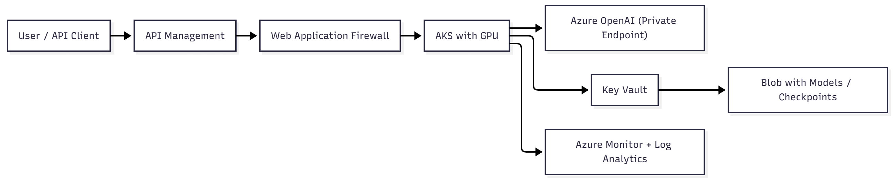

# Chapter 6 — Security and resilience in AI environments

> “Powerful models demand equally strong protections.”

## Why AI security is different

AI environments face unique risks that go beyond traditional application security:

- Leakage of sensitive data (PII, intellectual property, customer data)  
- Model misuse, such as prompt injection and jailbreaks  
- Attacks on inference APIs and quota exploitation  
- Unexpected costs from GPU abuse or token consumption  
- Dependency on critical infrastructure, where failures can halt business decisions  

AI doesn’t run in isolation. It depends on **secure, resilient, and auditable infrastructure**.  
That’s your domain as an infrastructure professional.

---

## Security fundamentals for AI environments

| Security pillar | Application in AI |
|------------------|------------------|
| **Identity and Access** | Who can access the model, data, and GPU |
| **Data Protection** | Encryption, DLP, classification, segregation |
| **API Security** | Authentication, rate limiting, WAF, monitoring |
| **Secret Management** | Keys, connections, and tokens stored securely |
| **Governance and Auditability** | Compliance, logging, traceability |

💡 Security in AI isn’t just about firewalls. It’s about **trust, traceability, and ethical use**.

---

## Identity and access control

- Use **Azure RBAC** to control access to resources (VMs, AKS, Azure ML, Storage).  
- Apply **Managed Identities (UAMI)** in pipelines and automated services.  
- Adopt **Microsoft Entra ID + Conditional Access + MFA** for human authentication.  
- Avoid static keys. Prefer **federated identities (OIDC)** and **temporary tokens**.  

```bash
az ad sp create-for-rbac --name "ai-aks-service" --role contributor   --scopes /subscriptions/{id}/resourceGroups/rg-ai
```

> **Note:** The command above creates a **Service Principal**.  
> Prefer **Managed Identity** where supported to avoid long-lived credentials and reduce secret exposure.

**Tip:** Temporary and federated identities drastically reduce credential exposure risks.

---

## Secrets and key protection

| Resource | Function | Best practice |
|-----------|-----------|----------------|
| **Azure Key Vault** | Secure storage for keys and secrets | Use RBAC and restrictive access |
| **Managed Identity** | Avoids credential exposure | Replaces static passwords in pipelines |
| **API Tokens** | Fine-grained control over usage and billing | Combine with rate limiting |
| **Azure Policy** | Governance for diagnostics and logging | Ensures active logging and compliance |

```bash
az keyvault set-policy --name kv-ai --object-id <principalId> --secret-permissions get list
```

> **Note:** Access policies are shown for illustration.  
> Prefer **RBAC-based access control** where supported.

---

## Data and model protection

| Action | Azure tool / service | Note |
|---------|----------------------|------|
| **Encryption at rest** | Storage Service Encryption (SSE) | Use customer-managed keys (CMK) |
| **Encryption in transit** | TLS 1.2+ and HTTPS | Enforce certificates on gateways |
| **Data classification** | Microsoft Purview | Identify PII and sensitive data |
| **Environment segregation** | VNets, NSGs, isolated workspaces | Separate dev, test, and prod |
| **Model backups** | Azure Backup, snapshots, Git | Include metadata and versioning |

**Never expose inference endpoints publicly without authentication.**  
Use **Private Endpoints** and **API Management** for control, logging, and throttling.

---

## Model and inference security

| Risk | Recommended mitigation |
|------|-------------------------|
| **Prompt injection / jailbreaks** | Input sanitization, filters, validation, and layered controls |
| **Model misuse** | Authentication and rate limiting |
| **Model stealing** | Limit requests per identity or token |
| **GPU access abuse** | RBAC plus taints and tolerations in AKS |
| **Data leakage** | Audit logs and anonymization of prompts and responses |

💡 Conduct **internal red teaming** to test prompt and response vulnerabilities.

---

## Network protections

| Resource | Recommended use |
|-----------|----------------|
| **Private Endpoints** | Private access to Azure OpenAI, Azure ML, and Storage |
| **NSG + UDR** | Restrict traffic in GPU subnets |
| **Azure Firewall / WAF** | Block injection and abuse patterns |
| **API Management** | Authentication, quotas, logging, centralized auditing |
| **Front Door / Application Gateway** | TLS termination, load balancing, health probes |

```bash
az ml online-endpoint update   --name my-endpoint   --resource-group rg-ai   --set public_network_access=disabled
```

Allow access **only via VNet** with **Private Link** and properly configured firewalls.

---

## Resilience. Designing for high availability

Strategies for inference workloads and critical pipelines:

- **Availability zones:** Deploy across zones and regions.  
- **Load balancing:** Use Front Door or Application Gateway.  
- **Intelligent autoscaling:** Based on GPU usage, latency, or queues.  
- **Health probes and auto-restart:** For AKS pods and critical services.  
- **Retry and fallback:** Use alternate models or cached responses.  
- **Disaster recovery:** Replicate data and models to secondary regions.  



---

## Production lessons (real cases)

❌ Pod froze after 200 requests without readiness probe → ✅ **Fix:** Add health checks and auto-restart  
❌ Key Vault token expired and blocked pipeline → ✅ **Fix:** Use Managed Identity with automatic rotation  
❌ Logs captured customer prompts → ✅ **Fix:** Mask and anonymize logs  

**Test your incidents before they happen.**  
Resilience is built *before* failure.

---

## Security and resilience checklist

| Item | Status |
|------|---------|
| Managed identities, no static keys | ✅ |
| Models and data encrypted | ✅ |
| API rate limiting and authentication | ✅ |
| Centralized logging and auditing | ✅ |
| Private VNet deployment with NSGs | ✅ |
| Prompt injection and abuse testing | ✅ |
| Model backup and versioning | ✅ |
| Disaster recovery strategy defined | ✅ |

---

## Conclusion

Security and resilience are what sustain AI in production.  
Without them, even the most advanced model can become a liability.

You don’t need to understand every layer of the model to be essential in AI.  
You must ensure it operates **securely, efficiently, and continuously**.

<!-- ### Next chapter

Discover how real-world teams are applying these principles in  
[**Chapter 7 — AI use cases for infrastructure professionals**](07-use-cases.md).
-->
