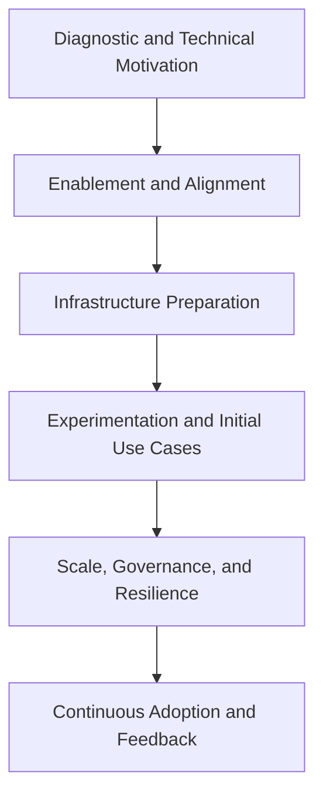

# Chapter 8 — AI Adoption Framework for Infrastructure

> “You don’t need to be a data scientist to architect AI — but you do need a plan that speaks the language of infrastructure.”

## Overview

The **AI Adoption Framework for Infrastructure** is a technical and strategic guide that helps infrastructure professionals **plan, prepare, and operate AI workloads** with security, efficiency, and governance.

Inspired by Microsoft’s **Cloud Adoption Framework**, this model translates the AI journey into the infrastructure domain — focusing on **automation, scalability, and continuous operation**.

## Framework structure

The framework consists of **6 phases**, each with clear goals, practical activities, and recommended tools.

## Phase 1: Diagnostic and technical motivation

**Goal:** Understand the *why* of AI and the role of infrastructure in the process.

| Activity | Description |
|-----------|-------------|
| Identify opportunities | Review operational pain points, bottlenecks, and automation gaps |
| Map stakeholders | Data, DevOps, security, and business teams |
| Assess maturity | Is current infra automated? Observable? GPU-ready? |
| Begin enablement | Complete AI-900 and read this eBook |

🔧 **Useful tools:**

- Technical Maturity Assessment Sheet (Infra + AI)  
- Azure OpenAI Quota Viewer  
- Technical Readiness Form  

💡 **Ask yourself:** “If I needed to run an AI model tomorrow, would my infrastructure be ready?”

## Phase 2: Enablement and technical alignment

**Goal:** Level technical understanding and create a shared knowledge foundation.

| Activity | Description |
|-----------|-------------|
| Upskill the infra team | Workshops, labs, and guided reading per chapter |
| Translate AI concepts | Inference, GPU, fine-tuning, tokens, quotas |
| Build a knowledge base | Visual glossary, cheat sheets, mini-labs |
| Promote hands-on sessions | Experimentation with scripts and templates |

🔧 **Suggested resources:**

- [Labs](../extras/labs/README.md)
- [AI-900: Azure AI Fundamentals](https://learn.microsoft.com/en-us/credentials/certifications/azure-ai-fundamentals/)
- Visual Technical Glossary  

## Phase 3: Infrastructure preparation

**Goal:** Provision the foundational building blocks for AI workloads.

| Component | Recommended actions |
|------------|----------------------|
| **Networking** | Create VNet, subnets, Private Endpoints, NSGs, internal DNS |
| **Compute** | Deploy GPU VMs, AKS GPU node pools, AML Workspaces |
| **Storage** | Blob, Data Lake, local NVMe |
| **Automation** | IaC (Terraform/Bicep), GitHub Actions |
| **Observability** | Azure Monitor, Prometheus, Application Insights |

**Templates:**

- [bicep/vm-gpu.bicep](../extras/labs/bicep-vm-gpu/) — GPU VM with NVMe  
- [terraform/aks-gpu.tf](../extras/labs/terraform-aks-gpu/) — AKS cluster with GPU pool  
- [yaml/inference-api.yaml](../extras/labs/yaml-inference-api/) — Inference API with health checks  

💬 **Reminder:** “You don’t scale AI with spreadsheets. You scale it with code.”

## Phase 4: Guided experimentation and initial use cases

**Goal:** Validate real-world scenarios and build technical confidence.

| Activity | Description |
|-----------|-------------|
| Run pilots | Intelligent logging, copilots, GPT-based alerts |
| Build inference APIs | Deploy in AKS, AML, or Azure Functions |
| Validate security | Test RBAC, prompt injection, and isolation |
| Document learnings | Capture results and best practices |

**Suggested Starter Use Cases:**

- Monitoring with LLM + Prometheus  
- AI-driven log and alert analysis  
- ChatOps (internal GPT-based copilots)  
- Inference pipeline with automated rollback  

---

## Phase 5: Scale, governance, and resilience

**Goal:** Standardize, secure, and sustain AI workloads in production.

| Area | Recommended actions |
|-------|----------------------|
| **Standardization** | Centralized IaC templates, tagging, and conventions |
| **Costs** | Azure Cost Management, budgets, GPU quotas |
| **Security** | Key Vault, RBAC, federated identity |
| **Resilience** | Availability Zones, backups, HA via Front Door |
| **Observability** | Latency, tokens, GPU usage, 429s, cost per model |

**Tools:**

- Application Insights + Log Analytics  
- Azure Policy + Defender for Cloud  
- Grafana (GPU metrics via DCGM)  
- Autoscaling templates for inference workloads  

---

## Phase 6: Continuous adoption and feedback

**Goal:** Integrate AI sustainably into the infrastructure lifecycle.

| Activity | Description |
|-----------|-------------|
| Continuous review | Post-mortems with AI and evolving dashboards |
| Learning culture | Internal wiki and “Infra + AI” Teams channels |
| Continuous improvement | A/B testing models, integrating Vector DBs |
| Impact measurement | KPIs: MTTR, avoided incidents, reduced cost |

💡 **Tip:** AI isn’t a project — it’s a process. Establish learning and feedback cadence.

## Framework summary

| Phase | Key deliverable | Core tools |
|--------|------------------|-------------|
| **Diagnostic** | Technical readiness plan | Excel, Quota Viewer |
| **Enablement** | Shared technical knowledge base | AI-900, Labs |
| **Preparation** | Secure GPU-enabled IaC environments | Terraform, Bicep |
| **Experimentation** | Use cases and inference APIs | Azure ML, AKS |
| **Scale** | Standardization, observability, and HA | Cost Mgmt, Prometheus |
| **Continuous adoption** | Governance and improvement loops | Dashboards, Feedback Loops |

## Practical applications of the framework

This framework can be used as:

- **Infrastructure Maturity Checklist** for technical teams  
- **Adoption roadmap** for Azure OpenAI, AML, and AKS  
- **Onboarding guide** for new infrastructure team members  
- **Rollout plan** for GPU and distributed inference environments  

✅ **Direct Benefit:** Transforms AI from an “experimental concept” into an **operational, scalable, and governed practice.**

## Chapter conclusion

You now have a complete technical roadmap to lead AI adoption within your organization — starting from what you already know best: **infrastructure**.

> “AI adoption isn’t just the responsibility of data teams.  
> It’s the responsibility of those who build the foundation. And that person is you.”

### ➡️ Next Chapter

Advance your understanding of Azure AI workloads in [**Chapter 9 — Azure OpenAI for Infrastructure: Understanding TPM, RPM, and PTU**](09-azure-openai-tpm-ptu.md).
