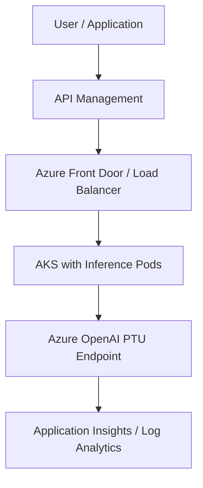
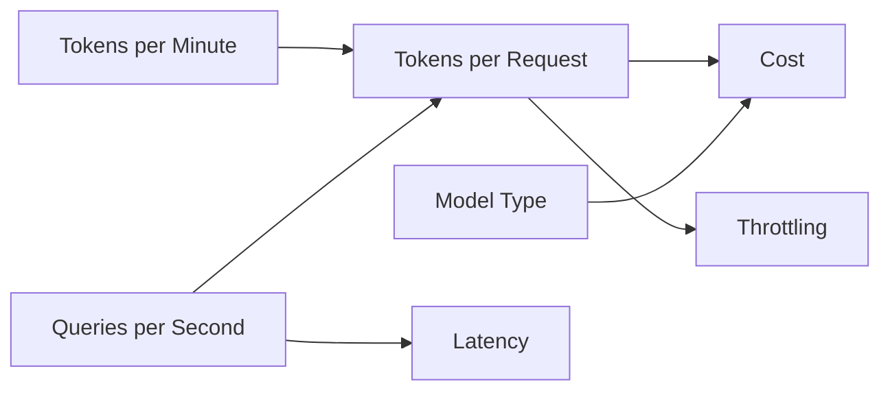

# Chapter 9 — Azure OpenAI for Infrastructure: Understanding TPM, RPM, and PTU

> “It’s not just about running the model — it’s about scaling with efficiency, predictability, and cost control.”

---

## 🎯 Why This Matters

In AI workloads — especially those using models like **GPT-4** or **GPT-4 Turbo** — resources aren’t measured in CPU or RAM, but in **tokens**.

For infrastructure architects and engineers, understanding **TPM (Tokens per Minute)**, **RPM (Requests per Minute)**, and **PTU (Provisioned Throughput Unit)** is essential to properly size throughput, cost, and latency.

---

## 🧾 Core Concepts

| Term | Definition |
|------|-------------|
| **Token** | A text fragment processed by the model. Example: “infrastructure” = 2–3 tokens. |
| **TPM (Tokens per Minute)** | Maximum number of tokens (input + output) a model can process per minute. |
| **RPM (Requests per Minute)** | Maximum number of API calls per minute. |
| **QPS (Queries per Second)** | Requests per second — equivalent to RPM ÷ 60. |
| **Context Length** | Maximum number of tokens that can be processed in a single request. |
| **PTU (Provisioned Throughput Unit)** | Dedicated throughput unit in Azure OpenAI guaranteeing capacity and predictable latency. |

---

## 🔢 Essential Calculations

📌 **Tokens are not words.**  
A word can represent 1–4 tokens.

**Example:**  
“infrastructure is important” → 4 words ≈ 5–6 tokens

---

### 📈 Practical Formulas

**Estimate tokens per request:**  
`t_tokens_per_request ≈ input_tokens + avg_output_tokens`

**Calculate total TPM consumption:**  
`TPM_estimated = tokens_per_request × RPM`

**Example:**  
500 requests/min × 800 tokens/request = **400,000 TPM**  
➡️ You need at least **400k TPM** and **500 RPM** available on your endpoint.

---

### 📊 QPS Calculation from TPM

`QPS_max = TPM ÷ (tokens_per_request × 60)`

**Example:**  
If you have **15M TPM** and each request consumes **30k tokens:**  
`QPS = 15,000,000 ÷ (30,000 × 60) ≈ 8 QPS`

You can handle approximately **8 requests per second** at that throughput.

---

## ⚙️ Consumption Models Comparison

| Characteristic | **Standard (Public Consumption)** | **PTU (Provisioned Throughput Unit)** |
|----------------|------------------------------------|--------------------------------------|
| **Allocation Type** | Shared (multi-tenant) | Dedicated (isolated and fixed) |
| **Latency** | Variable | Stable and predictable |
| **Throughput Control** | Limited to default quota | User-defined TPM and QPS |
| **Capacity Guarantee** | ❌ Not guaranteed | ✅ Guaranteed by contract |
| **Billing** | Pay per token | Pay per hour (usage-independent) |
| **Ideal For** | POCs, dev, testing | Production, copilots, critical APIs |

---

## 🧮 Calculating Required PTUs

Each PTU provides predictable capacity — for example:

**1 PTU (GPT-4 Turbo)** ≈ **5,000 TPM** and **10 QPS**

**Formula:**  
`PTUs = desired_TPM ÷ 5,000`

**Example:**  
If your app needs **20,000 TPM**, reserve **4 PTUs**.

---

## 🧱 Typical Architecture with PTU

**Recommended Components:**

- API Management with **token-based rate limiting**  
- AKS or Azure Functions for **decoupling**  
- Front Door for **routing and failover**  
- Logging and metrics via **Application Insights**  

---

## 🚨 Detecting Throttling and Bottlenecks

| Symptom | Possible Cause |
|----------|----------------|
| **HTTP 429** | Exceeded RPM or TPM |
| **Irregular latency** | Model under load |
| **Truncated responses** | Context overflow or throttling |
| **Throughput drop** | Regional capacity constraints |

**Diagnostic Tools:**

- Application Insights (requests & duration metrics)  
- Azure Monitor (custom metrics)  
- Log Analytics (`requests | summarize count()`)  

---

## 🧠 Strategies to Optimize Performance and Cost

| Strategy | Benefit |
|-----------|----------|
| Reduce prompt size | Lowers cost and latency |
| Summarize context with embeddings (RAG) | Maintains context efficiently |
| Cache responses | Avoids recomputation |
| Batch requests (multiplexing) | Increases throughput |
| Use appropriate models | GPT-3.5 or embeddings for simpler tasks |
| Intermediate queue (Event Hub, Queue) | Controls RPM and retries |
| Retries with exponential backoff | Prevents overload |

---

## 📈 Relationship Between TPM, QPS, and Cost

---

## ✅ Planning and Tuning Checklist

- [x] Calculated total TPM needed  
- [x] Estimated average tokens per request  
- [x] Sized QPS and RPM expectations  
- [x] Chose appropriate model (GPT-4, GPT-3.5, embeddings)  
- [x] Set up usage and cost alerts  
- [x] Configured Application Insights + Log Analytics  
- [x] Planned fallback and automatic retries  
- [x] Know when to migrate from **Standard → PTU**  

---

## 📘 References and Useful Resources

- [Azure OpenAI Service Quotas and Limits](https://learn.microsoft.com/azure/ai-services/openai/quotas-limits)  
- [PTU Pricing and Throughput](https://learn.microsoft.com/azure/ai-services/openai/concepts/provisioned-throughput)  
- [Azure Monitor + Application Insights for OpenAI](https://learn.microsoft.com/azure/azure-monitor/app/opentelemetry-enable)  
- [Token Cost Calculation](https://learn.microsoft.com/azure/ai-services/openai/how-to/costs)  

---

## 💡 Conclusion

Understanding TPM, RPM, and PTU is essential to make AI **predictable, scalable, and cost-efficient**.  
These metrics bridge the gap between **infrastructure** and **applied AI**, ensuring your architecture delivers consistent performance and controlled costs.

> “Infrastructure makes AI run — but understanding consumption is what makes AI scale.”

---

### ➡️ Next Chapter

Explore key AI terms and visuals that tie everything together in [**Chapter 10 — Visual Glossary: AI for Infrastructure Professionals**](10-visual-glossary.md).
