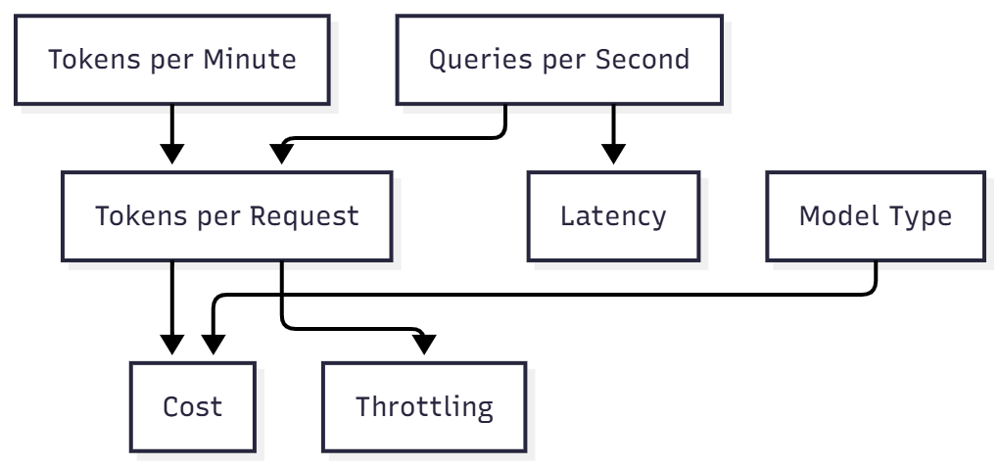

# Chapter 9 — Azure OpenAI for Infrastructure: Understanding TPM, RPM, and PTU

> “It’s not just about running the model — it’s about scaling it efficiently, predictably, and with cost control.”

---

## 🎯 Why This Matters

In AI workloads — especially when working with **LLMs like GPT-4** — the main unit of cost and limitation isn’t CPU, RAM, or runtime.  
It’s **tokens**.

Designing reliable and scalable systems for Azure OpenAI means understanding three key dimensions:

- **TPM (Tokens Per Minute)** — total tokens processed (input + output) per minute  
- **RPM (Requests Per Minute)** — number of API calls allowed per minute  
- **PTU (Provisioned Throughput Unit)** — dedicated throughput capacity purchased for guaranteed performance

---

## 🧾 Core Concepts

| Term | Definition |
|------|-------------|
| **Token** | A small text fragment (1–4 per word). Ex: “infrastructure” ≈ 2–3 tokens. |
| **TPM** | Max number of tokens (input + output) the model can process per minute. |
| **RPM** | Number of API calls per minute. Equivalent to **QPS × 60**. |
| **QPS** | Queries per second — rate of concurrent inference calls. |
| **Context Length** | Maximum number of tokens a model can handle in one request. |
| **PTU** | A fixed throughput allocation (Azure OpenAI) that ensures predictable performance and latency. |

---

## ⚙️ How to Calculate Throughput

### 1️⃣ Estimate TPM consumption

```text
TPM = (Input tokens + Output tokens) × RPM
```

Example:

If your app makes **500 requests/minute** and each request consumes **800 tokens** (input + output):

```
TPM = 500 × 800 = 400,000 tokens per minute
```

➡️ You’ll need **≥400k TPM** available in your quota (and at least 500 RPM).

---

### 2️⃣ Estimate tokens per request

```text
Tokens per request = TPM ÷ (QPS × 60)
```

Example:

If you use **15M TPM** and handle **8 QPS**:

```
Tokens per request = 15,000,000 ÷ (8 × 60) = 31,250 tokens/request
```

Each call averages 31k tokens (prompt + completion combined).

---

## 🔍 Understanding the Relationship Between TPM, QPS, and Cost

| Metric | What It Impacts |
|---------|----------------|
| **TPM** | Defines overall throughput. |
| **QPS** | Defines concurrency and responsiveness. |
| **Tokens per request** | Affects both cost and throttling risk. |
| **Model type** | Each model (GPT-4, GPT-4-Turbo, GPT-3.5) has different token pricing. |

---

## 🧱 Standard vs. PTU (Provisioned Throughput Unit)

| Feature | **Standard (Consumption)** | **PTU (Dedicated Throughput)** |
|----------|-----------------------------|--------------------------------|
| **Billing** | Pay-per-use (per token) | Fixed hourly cost per PTU |
| **Isolation** | Shared, multi-tenant | Dedicated resources |
| **Latency** | May vary with demand | Predictable, low latency |
| **Scalability** | Limited by quotas and region | Scales predictably with more PTUs |
| **Ideal For** | Prototyping, small apps | Production workloads, enterprise LLMs |

💡 **Example:**  
1 PTU for GPT-4 Turbo provides around **5,000 TPM** and **10 QPS**.  
You can combine multiple PTUs to scale linearly.

---

## 🚨 Recognizing Throttling Symptoms

If your workload exceeds limits:

- HTTP **429 (Too Many Requests)** errors  
- Inconsistent latency or partial responses  
- Timeouts or incomplete outputs  

✅ **Mitigation Strategies**

- Use **retry policies** with exponential backoff.  
- Add **message queues (Event Hub, Storage Queue)** for bursts.  
- Track real usage in **Application Insights** or **Azure API Management**.

---

## 🔄 Performance Optimization Tips

| Strategy | Benefit |
|-----------|----------|
| Shorten prompts | Reduces token cost and latency. |
| Compress conversation history | Improves performance with long sessions. |
| Cache frequent responses | Avoids redundant token use. |
| Use embeddings (RAG) | Replace context tokens with vector search. |
| Batch or multiplex requests | Maximizes throughput efficiency. |
| Choose the right model | Smaller models (like GPT-3.5) are cheaper and faster for simple tasks. |

---

## 📊 Visual — Relationship Between TPM, QPS, and Cost



---

## ✅ Checklist for Infrastructure Engineers

- [x] I know my workload’s **average tokens per request**.  
- [x] I’ve estimated total **TPM** and **RPM** needed.  
- [x] I monitor **429 errors** and **latency metrics**.  
- [x] I have retry and fallback logic implemented.  
- [x] I understand when to switch from **Standard to PTU**.  
- [x] I track cost per request and per user.  

---

## 📚 References

- [Azure OpenAI Service Quotas and Limits](https://learn.microsoft.com/en-us/azure/ai-services/openai/quotas-limits)  
- [Azure OpenAI Pricing](https://azure.microsoft.com/en-us/pricing/details/cognitive-services/openai-service/)  
- [Azure Monitor for OpenAI](https://learn.microsoft.com/en-us/azure/ai-services/openai/how-to/monitor)  

---

Next: [Chapter 10 — Visual Glossary: AI for Infrastructure Professionals](10-visual-glossary.md)

