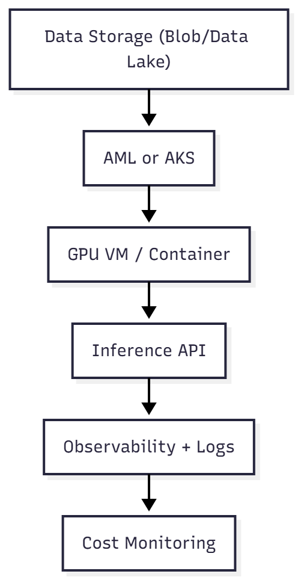

# Chapter 10 — Visual Glossary: AI for Infrastructure Professionals

> “Infrastructure and AI don’t speak different languages — they just have different dialects.”

---

## 🧠 Overview

This glossary bridges the gap between **traditional infrastructure** and **artificial intelligence** concepts.  
Each AI term comes with:
- ✅ A practical definition  
- 🔄 An analogy from infrastructure  
- 💡 A real-world application tip  

---

## 📄 AI ↔ Infrastructure Table

| AI Term | Technical Definition | Infrastructure Analogy |
|----------|----------------------|-------------------------|
| **Inference** | Running a trained model on new data | Like a `GET` request that returns a prediction |
| **Training** | Teaching a model using large datasets | Like performance benchmarking to establish a baseline |
| **Model** | A trained file representing a functional "brain" | Like a pre-configured virtual appliance ready for production |
| **Dataset** | Data used to train or validate a model | Like logs or telemetry ingested by a SIEM system |
| **GPU** | Hardware optimized for parallel computation | Like an NVMe SSD — specialized, fast, and expensive |
| **TPU** | Google’s specialized AI chip | Like a dedicated load-balancer appliance |
| **Inference Latency** | Time between sending data and receiving a prediction | Like network ping or API response time |
| **Fine-tuning** | Adjusting an existing model with new data | Like customizing an ARM/Bicep template for a new environment |
| **Embedding** | Converting text into numeric vectors for semantic comparison | Like hashing an image for similarity search |
| **Vector Database** | Stores and queries embeddings by similarity | Like DNS, but for meaning — “find something similar to this” |
| **Large Language Model (LLM)** | A model trained on billions of text parameters | Like an operating system for AI applications |
| **Prompt** | Input text guiding a model’s behavior | Like a SQL query — but for natural language |
| **Prompt Injection** | Malicious instructions hidden in text input | Like a SQL Injection attack against an API |
| **Token** | The smallest text fragment processed by a model | Like a network packet — models read in chunks, not words |
| **MLOps** | DevOps for machine learning workflows | CI/CD pipelines plus versioning for models |
| **Azure Machine Learning (AML)** | Azure-managed ML platform | Like Azure DevOps but for model lifecycle |
| **Inference Endpoint** | API endpoint for real-time model access | Like an App Service or Function endpoint |

---

## 🔄 If You Already Understand Infrastructure...

| If You Know This... | The AI Equivalent Is... |
|----------------------|-------------------------|
| Provisioning a VM with defined specs | Creating an inference endpoint with GPU and memory allocation |
| Load balancer with health probes | Autoscaling inference APIs based on latency and error rate |
| Bicep or Terraform deployment scripts | YAML templates for model deployment and versioning |
| Diagnostic logging | Observability of inference latency and accuracy |
| Database replication | Model retraining with new data |
| SNMP or telemetry | Prometheus metrics for GPU utilization and response success |
| Azure Front Door failover | Multi-model or multi-region resilience via Traffic Manager |

---

## 🧭 Visual Maps

### 🧠 Model Lifecycle

---

### ⚙️ Simplified AI Infrastructure Flow

---

## 🧩 Best Practices to Remember

- **Training** is expensive; **inference** happens continuously.  
- The **prompt** is the input, the **model** is the brain, and the **response** is the output.  
- **Idle GPUs** = wasted cost.  
- **AI logs** may contain sensitive data → always encrypt and restrict access.  
- **Tokens** affect both **cost** and **latency** → keep prompts efficient.

---

## ✅ Conclusion

This glossary removes the barrier of unfamiliar vocabulary between infrastructure and AI.  
You already master the foundation — now you speak the language too.  
Next time someone mentions **embeddings**, **vector databases**, or **fine-tuning**,  
you’ll know what they mean, what they do, and how to deploy them safely.

> “AI runs on infrastructure — and infrastructure engineers are the ones who make intelligence possible.”
