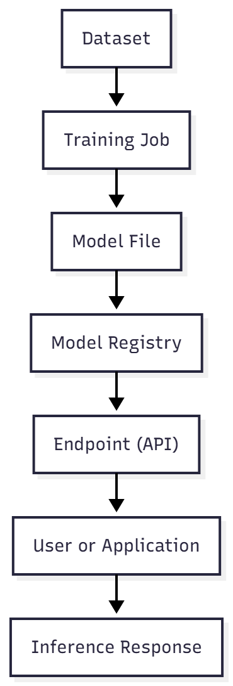

# Chapter 10 — Visual glossary: AI for infrastructure professionals

> “Infrastructure and AI don’t speak different languages — they just have distinct technical dialects.”

## Overview

This visual glossary was created for professionals who already master **infrastructure, networking, automation, and observability**, and want to understand how those concepts translate into the world of **Artificial Intelligence**.

Each term includes:

✅ A **practical definition**  
🔄 An **analogy** to the infrastructure world  
💡 A **real-world application** in technical operations

## Terms Table: Infrastructure ↔ Artificial Intelligence

| AI Term | Technical definition | Infrastructure analogy |
|----------|----------------------|------------------------|
| **Inference** | Running a trained model with new data to generate a response. | Like a GET request that returns a prediction or computation. |
| **Training** | Teaching a model using labeled examples. | Like setting a performance baseline through repeated tests. |
| **Model** | The trained file that represents the AI’s “brain.” | Like a VM image or OVA ready to deploy in production. |
| **Dataset** | The data used to train or test a model. | Like log input in a SIEM or historical metrics in monitoring. |
| **GPU** | Graphics card optimized for massive parallel computation. | Like an NVMe SSD — expensive but critical for performance. |
| **TPU** | AI-specific chip (Tensor Processing Unit). | Like a dedicated hardware appliance for acceleration. |
| **Inference Latency** | Time between model input and response. | Like ping between app and database — just as critical. |
| **Fine-tuning** | Adjusting an existing model with specific data. | Like editing an ARM template with custom parameters. |
| **Embedding** | Numeric vector representing meaning of text or image. | Like a semantic hash — searching by “idea,” not word. |
| **Vector Database** | Database that stores and retrieves embeddings (similarity). | Like a DNS, but for meanings (“find me something similar”). |
| **LLM (Large Language Model)** | Model trained on billions of natural language parameters. | Like an operating system for AI — the base for other apps. |
| **Prompt** | Text sent to the model to guide its output. | Like a SQL query — but for intelligent text. |
| **Prompt Injection** | Malicious input inserted in a prompt. | Like a SQL Injection on a model API. |
| **Token** | Fragment of text processed by the model. | Like a network packet — the model reads in chunks, not words. |
| **MLOps** | Continuous integration and versioning for AI models. | Like a CI/CD pipeline for machine learning. |
| **Azure Machine Learning (AML)** | Managed platform for AI development and deployment. | Like Azure DevOps — but for models. |
| **Inference Endpoint** | Public or private API exposing the model. | Like an App Service or Function — but for AI. |
| **RAG (Retrieval Augmented Generation)** | Combines AI with local data search. | Like checking a cache before querying a database. |

## If You Already Understand Infrastructure...

| What you already do | In AI, the equivalent is... |
|----------------------|-----------------------------|
| Provision VMs with specific specs | Create inference endpoints with allocated GPU and memory |
| Balance traffic with health probes | Scale model APIs using latency and error metrics |
| Automate deploys with Bicep/Terraform | Deploy models using YAML or CLI in Azure ML |
| Troubleshoot using logs and metrics | Observe inference with Application Insights and GPU metrics |
| Replicate databases | Retrain models with updated data |
| Use SNMP/telemetry | Monitor GPU usage via Prometheus and DCGM |
| Create failover with Front Door | Configure multi-region fallback across endpoints |

## Visual diagrams

### 1. AI model lifecycle

### 2. Simplified infrastructure architecture for AI

## Quick checklists

### AI environment readiness

- [x] Understand token, TPM, and RPM limits  
- [x] Know how to provision GPUs and AKS using IaC  
- [x] Have observability with inference metrics and logs  
- [x] Automate model updates and versioning via pipelines  
- [x] Use Key Vault and private access for endpoints  

### Performance and cost

- [x] Optimize prompts to reduce token count  
- [x] Use caching and RAG to prevent recomputation  
- [x] Monitor 429 errors and P95 latency  
- [x] Evaluate PTU vs Standard based on load  
- [x] Track cost-per-token metrics in Azure Monitor  

### Security and governance

- [x] Store tokens and secrets in Key Vault  
- [x] Anonymize inference logs  
- [x] Disable public endpoints when possible  
- [x] Enforce RBAC/ABAC access controls  
- [x] Retain logs for at least 30 days for auditing  

## Practical use cases

### Case 1: Internal Chat with Azure OpenAI (Standard)

**Scenario:** Internal chatbot using AKS + Azure OpenAI.  
**Challenge:** High latency and throttling.  
**Solution:**

- Implement local cache for repeated prompts  
- Monitor with Application Insights  
- Migrate to **PTU-C** for stable latency  

### Case 2: Data extraction on GPU VMs

**Scenario:** Automated pipeline for batch inference on PDFs.  
**Solution:**

- Automation using Azure CLI + Terraform  
- Execute during off-peak (spot VMs)  
- Centralized logging in Log Analytics  

### Case 3: Multi-region deploy with fallback

**Scenario:** Global startup using GPT-4 across East US and Sweden Central.  
**Solution:**

- Azure Front Door + health probes  
- Retry logic with API Management  
- Token quota watchdog per region  

## Best practices for infrastructure professionals

- Training is expensive - inference is constant.  
- Prompt = input; model = brain; response = output.  
- Idle GPU = wasted cost.  
- AI logs may contain sensitive data → always encrypt.  
- Tokens = cost + latency → always optimize.  

## Conclusion

This glossary was built to help infrastructure professionals feel **confident and fluent** in the applied AI vocabulary.  
You already master the essentials — now you speak the language too.

> “From VMs to inference, from logs to tokens — the future of infrastructure is cognitive.”

