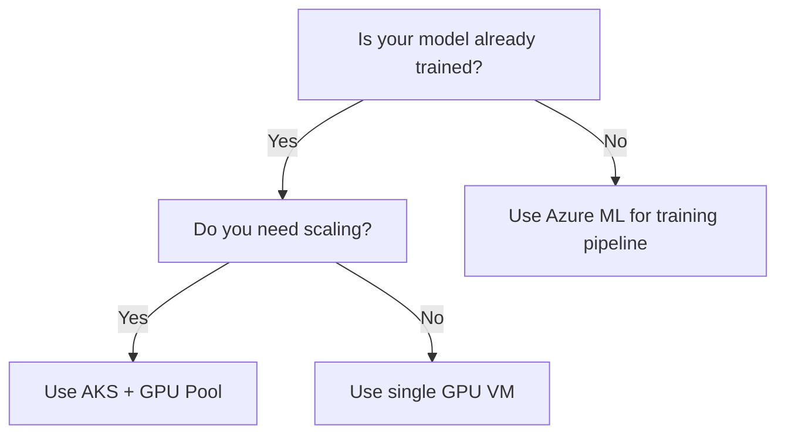

# 🧾 Cheatsheets — Quick Reference for AI Infrastructure Engineers

A condensed, at-a-glance guide to essential commands, architectures, and Azure resources for managing AI workloads efficiently.

---

## ⚙️ Azure GPU VM Comparison

| VM SKU | Ideal For | GPU Type | Inference | Training | Notes |
|--------|------------|-----------|------------|-----------|--------|
| **Standard_NC6s_v3** | General AI workloads | 1× V100 | ✅ | ✅ (light) | Balanced price/performance |
| **Standard_NCas_T4_v3** | Cost-effective inference | 1× T4 | ✅✅ | ❌ | Best option for production inference |
| **Standard_ND_A100_v4** | LLM training, deep learning | 1–8× A100 | ✅✅✅ | ✅✅✅ | High cost, top-tier performance |
| **Standard_NVads_A10** | Visualization + lightweight AI | 1× A10 | ✅ | ❌ | Ideal for dev/test workloads |

💡 *Tip:* For inference, prefer **T4 or A10 GPUs**. For large-scale training, use **A100s**.

---

## 📊 CPU vs GPU Quick Reference

| Attribute | CPU | GPU |
|------------|------|------|
| Cores | Tens | Thousands |
| Strength | General-purpose tasks | Parallel vector processing |
| Use Cases | Web apps, ETL, monitoring | Deep learning, embeddings, image processing |
| Azure Examples | Dv5, Ev4 | NCas_T4, ND_A100 |
| Cost | 💲 | 💲💲💲 |

💡 *Rule of thumb:* GPUs are specialized hardware. Use them only where parallelism matters.

---

## 🔐 Security Checklist for AI Workloads

| Control | Description | Status |
|----------|--------------|---------|
| RBAC with Managed Identities | Assign least privilege roles | ✅ |
| Private Link for all endpoints | No public exposure of APIs | ✅ |
| Key Vault for secrets | No credentials in code or YAML | ✅ |
| Diagnostic logs enabled | Send to Log Analytics workspace | ✅ |
| API rate limiting configured | Prevent misuse and abuse | ✅ |
| Prompt injection testing done | Validate model input security | 🔲 |
| Data encryption (in transit & at rest) | TLS 1.2+ and SSE enabled | ✅ |

💡 *Tip:* Treat every model as a production API — with the same level of security scrutiny.

---

## 📈 Monitoring and Observability Cheat Sheet

| Metric | Source | Tool |
|--------|---------|------|
| GPU Utilization | `nvidia-smi`, DCGM Exporter | Prometheus / Grafana |
| Latency (P95) | Application Insights | Azure Monitor |
| Errors (429s, 5xx) | API logs | Application Gateway / App Insights |
| Cost per request | Log Analytics + Billing API | Power BI / Cost Management |
| Token usage | Azure OpenAI Metrics | Application Insights |

💡 *Tip:* Always correlate **GPU utilization + latency + token throughput**.

---

## 💡 Infrastructure Quick Deploy Commands

### 🧱 Create a GPU VM
```bash
az vm create \
  --resource-group rg-ai-lab \
  --name vm-gpu \
  --image Ubuntu2204 \
  --size Standard_NC6s_v3 \
  --admin-username azureuser \
  --generate-ssh-keys
```

### 🚀 Deploy a Model Endpoint (Azure ML)
```bash
az ml online-endpoint create --name infer-demo --file endpoint.yml
```

### ☁️ Create an AKS Cluster with GPU Node Pool (Terraform)
```hcl
resource "azurerm_kubernetes_cluster_node_pool" "gpu_pool" {
  name                  = "gpu"
  vm_size               = "Standard_NC6s_v3"
  enable_auto_scaling   = true
  min_count             = 1
  max_count             = 3
  node_labels = {
    "k8s.azure.com/mode" = "User"
  }
}
```

---

## 🧠 Performance and Throughput Formulas

| Metric | Formula | Example |
|--------|----------|----------|
| **TPM (Tokens per Minute)** | `(Input + Output Tokens) × RPM` | (500 + 300) × 1000 = 800,000 TPM |
| **QPS (Queries per Second)** | `RPM ÷ 60` | 300 RPM = 5 QPS |
| **Cost Estimation (Azure OpenAI)** | `Tokens × Cost per 1K Tokens` | 100K tokens × $0.002 = $0.20 |
| **GPU Scaling Efficiency** | `Active GPU Time ÷ Total Allocated Time` | 80% = efficient utilization |

💡 *Tip:* Log and analyze TPM, RPM, and QPS to prevent throttling and overprovisioning.

---

## 🧰 Where to Run Your Model — Decision Flow



💡 *Rule:*  
- **AKS + GPU Pool:** For scalable inference and production APIs  
- **VM:** For isolated testing or proof of concept  
- **Azure ML:** For training, registry, and lifecycle management

---

## 🧭 Resource Tagging Convention for AI Workloads

| Tag | Example | Purpose |
|------|----------|----------|
| `Environment` | `dev`, `prod` | Identify lifecycle stage |
| `Team` | `AI-Infra` | Ownership |
| `CostCenter` | `12345` | Chargeback and budgeting |
| `Model` | `gpt4`, `vision-model-v2` | Correlate to API metrics |
| `Region` | `eastus`, `swedencentral` | Deployment region |

💡 *Tip:* Standardize tags for automation, budget tracking, and governance.

---

## 📘 Reference Links

- [Azure Machine Learning Documentation](https://learn.microsoft.com/en-us/azure/machine-learning/)
- [Azure OpenAI Quotas & Limits](https://learn.microsoft.com/en-us/azure/ai-services/openai/quotas-limits)
- [Azure Kubernetes Service (AKS)](https://learn.microsoft.com/en-us/azure/aks/)
- [Azure Cost Management](https://learn.microsoft.com/en-us/azure/cost-management-billing/)
- [Azure Monitor for Containers](https://learn.microsoft.com/en-us/azure/azure-monitor/containers/container-insights-overview)
