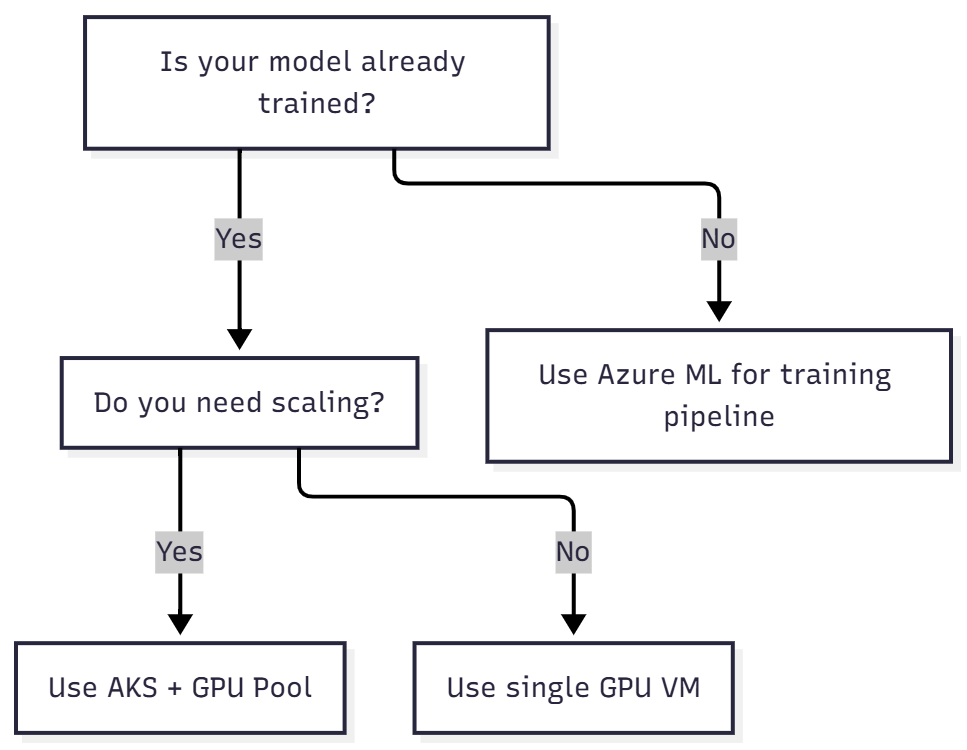

# Cheatsheets — Quick reference for AI infrastructure engineers

A condensed, at-a-glance guide to essential commands, architectures, and Azure resources for managing AI workloads efficiently.

---

## Azure GPU VM comparison

| VM SKU | Ideal for | GPU type | Inference | Training | Notes |
|--------|------------|-----------|------------|-----------|--------|
| **Standard_NC6s_v3** | General AI workloads | 1× V100 | ✅ | ⚠️ (limited) | Balanced price/performance |
| **Standard_NCas_T4_v3** | Cost-effective inference | 1× T4 | ✅✅ | ❌ | Best option for production inference |
| **Standard_ND_A100_v4** | LLM training, deep learning | 1–8× A100 | ✅✅✅ | ✅✅✅ | High cost, top-tier performance |
| **Standard_NVads_A10** | Visualization + lightweight AI | 1× A10 | ✅ | ❌ | Good for inference, dev/test, and visualization |

💡 *Tip:* For inference, prefer **T4 or A10 GPUs**. For large-scale training, use **A100s**.

---

## CPU vs GPU quick reference

| Attribute | CPU | GPU |
|------------|------|------|
| Cores | Tens | Thousands |
| Strength | Serial and mixed workloads | Massively parallel vector processing |
| Use cases | Web apps, ETL, monitoring | Deep learning, embeddings, image processing |
| Azure examples | Dv5, Ev4 | NCas_T4, ND_A100 |
| Cost | 💲 | 💲💲💲 |

💡 *Rule of thumb:* GPUs are specialized hardware. Use them only where parallelism matters.

---

## Security checklist for AI workloads

| Control | Description | Status |
|----------|--------------|---------|
| RBAC with Managed Identities | Assign least-privilege roles | ✅ |
| Private Link for all endpoints | No public exposure of APIs | ✅ |
| Key Vault for secrets | No credentials in code or YAML | ✅ |
| Diagnostic logs enabled | Send to Log Analytics workspace | ✅ |
| API rate limiting configured | Prevent misuse and abuse | ✅ |
| Prompt injection testing done | Validate model input security | ✅ |
| Data encryption (in transit & at rest) | TLS 1.2+ and SSE enabled | ✅ |
| Network egress control | Restrict outbound traffic from inference | ✅ |

💡 *Tip:* Treat every model as a production API — with the same level of security scrutiny.

---

## Monitoring and observability cheat sheet

| Metric | Source | Tool |
|--------|---------|------|
| GPU utilization | `nvidia-smi`, DCGM Exporter | Prometheus / Grafana |
| Latency (P95) | Application telemetry | Azure Monitor / Application Insights |
| Errors (429s, 5xx) | API logs | Application Gateway / App Insights |
| Cost per request | Logs + billing data | Cost Management / Power BI |
| Token usage (TPM/RPM) | Azure OpenAI metrics and logs | Azure Monitor / Log Analytics |

💡 *Tip:* Always correlate **GPU utilization**, **latency**, and **token throughput**.

---

## Infrastructure quick deploy commands

### Create a GPU VM

```bash
az vm create   --resource-group rg-ai-lab   --name vm-gpu   --image Ubuntu2204   --size Standard_NC6s_v3   --admin-username azureuser   --generate-ssh-keys
```

> ⚠️ Ensure GPU quota is approved in the target region before deployment.

---

### Deploy a model endpoint (Azure ML)

```bash
az ml online-endpoint create   --name infer-demo   --file endpoint.yml
```

---

### Create an AKS cluster with GPU node pool (Terraform)

```hcl
resource "azurerm_kubernetes_cluster_node_pool" "gpu_pool" {
  name                = "gpu"
  vm_size             = "Standard_NC6s_v3"
  enable_auto_scaling = true
  min_count           = 1
  max_count           = 3

  node_labels = {
    "k8s.azure.com/mode" = "User"
  }

  taints = [
    {
      key    = "nvidia.com/gpu"
      value  = "true"
      effect = "NoSchedule"
    }
  ]
}
```

---

## Performance and throughput formulas

| Metric | Formula | Example |
|--------|----------|----------|
| **TPM (Tokens per Minute)** | `(Input + Output Tokens) × RPM` | (500 + 300) × 1000 = 800,000 TPM |
| **QPS (Queries per Second)** | `RPM ÷ 60` | 300 RPM = 5 QPS |
| **Cost estimation (Azure OpenAI)** | `Tokens × Cost per 1K Tokens` | Pricing varies by model |
| **GPU scaling efficiency** | `Active GPU Time ÷ Total Allocated Time` | 80% = efficient utilization |

💡 *Tip:* Log and analyze TPM, RPM, and QPS to prevent throttling and overprovisioning.

---

## Where to run your model — Decision flow



💡 *Rule:*
- **AKS + GPU Pool:** Scalable inference and production APIs  
- **VM:** Isolated testing or proof of concept  
- **Azure ML:** Training, registry, and lifecycle management  
- **Azure Functions:** Bursty, low-QPS inference with scale-to-zero  

---

## Resource tagging convention for AI workloads

| Tag | Example | Purpose |
|------|----------|----------|
| `Environment` | `dev`, `prod` | Identify lifecycle stage |
| `Team` | `AI-Infra` | Ownership |
| `CostCenter` | `12345` | Chargeback and budgeting |
| `Model` | `gpt4`, `vision-v2` | Correlate to inference and token metrics |
| `Region` | `eastus`, `swedencentral` | Deployment region |

💡 *Tip:* Standardize tags for automation, budget tracking, and governance.

---

## Reference links

- https://learn.microsoft.com/azure/machine-learning/
- https://learn.microsoft.com/azure/ai-services/openai/quotas-limits
- https://learn.microsoft.com/azure/aks/
- https://learn.microsoft.com/azure/cost-management-billing/
- https://learn.microsoft.com/azure/azure-monitor/containers/container-insights-overview
