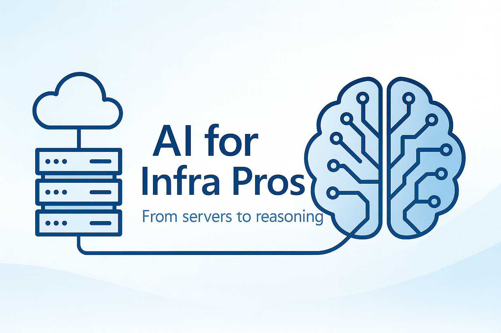

---
hide:
  - navigation
  - toc
---

# AI for Infra Pros

The Practical Handbook for Infrastructure Engineers Entering the AI Era

> *"You don't need to be a data scientist to work with AI — but you do need to understand how it runs, scales, breaks, and costs money."*

{ loading=lazy }

[Get the Full Book :fontawesome-solid-book:](https://leanpub.com/ai-for-infra-pros){ .cta-primary }
[Read Free Chapters :fontawesome-solid-glasses:](#free-chapters){ .cta-secondary }

---

15
Chapters in 5 Parts

61K+
Words

220+
Pages

3
Hands-On Labs

10
Troubleshooting Scenarios

55+
AI Terms in Glossary

---

## About This Book

Every AI model that reaches production sits on top of infrastructure someone had to build, scale, secure, and keep running. **That someone is you.**

This handbook was born from years of bridging the gap between systems engineering and machine learning. It translates AI concepts into the language infrastructure, cloud, and DevOps engineers already speak — and gives you the practical depth to architect, deploy, monitor, and operate AI workloads at production scale.

**This is not an AI/ML textbook.** It's a practitioner's handbook. Every chapter includes production-grade examples, decision matrices, hands-on labs, and the kind of hard-won lessons that only come from running AI infrastructure in the real world.

---

## What's Inside

:fontawesome-solid-microchip:
**GPU & Compute**
VM families, CUDA vs Tensor Cores, nvidia-smi, and the memory math behind OOM errors

:fontawesome-solid-database:
**Data Pipelines**
Storage architecture, BlobFuse2, NVMe staging, and why I/O is the hidden bottleneck

:fontawesome-solid-code:
**Infrastructure as Code**
Production-ready Terraform and Bicep for GPU clusters, AKS node pools, and CI/CD

:fontawesome-solid-gears:
**MLOps**
Model registries, CI/CD for models, A/B testing infrastructure, and supply chain security

:fontawesome-solid-chart-line:
**Monitoring & Observability**
DCGM, Managed Prometheus, KQL queries, and the six dimensions of AI observability

:fontawesome-solid-shield-halved:
**Security**
Prompt injection defense, private endpoints, managed identities, and content safety

:fontawesome-solid-money-bill-trend-up:
**Cost Engineering**
GPU cost modeling, spot VMs for training, PTU economics, and FinOps practices

:fontawesome-solid-server:
**Platform Ops at Scale**
Multi-tenancy, GPU scheduling (Kueue, Volcano), SLA design, and fleet management

:fontawesome-solid-wrench:
**Troubleshooting**
10 real-world failure scenarios with step-by-step diagnosis and resolution

:fontawesome-solid-road:
**Career Paths**
AI Infra Engineer, MLOps Engineer, AI Platform Engineer, and a 30-day plan

---

## Get the Book { #get-the-book }

**AI for Infra Pros — Full Book**

$19+
Suggested price: $29 · Minimum: $19

<ul class="pricing-includes">
<li>All 15 chapters (220+ pages)</li>
<li>3 hands-on labs with IaC templates</li>
<li>10 production troubleshooting scenarios</li>
<li>Case studies, cheatsheets, and technical FAQ</li>
<li>PDF, ePub, and MOBI formats</li>
<li>Free lifetime updates</li>
</ul>

[Get it on Leanpub :fontawesome-solid-arrow-up-right-from-square:](https://leanpub.com/ai-for-infra-pros){ .cta-primary }

---

## Read Free Chapters { #free-chapters }

Start reading now — these chapters are available for free right here on the site:

:fontawesome-solid-rocket:
**Chapter 1**
[Why AI Needs You](chapters/01-introduction.md)
The infrastructure engineer's case for entering the AI world

:fontawesome-solid-microchip:
**Chapter 4**
[The GPU Deep Dive](chapters/04-gpu-deep-dive.md)
CUDA, memory hierarchy, multi-GPU strategies, and debugging

:fontawesome-solid-book-open:
**Chapter 15**
[Visual Glossary](chapters/15-visual-glossary.md)
55+ AI terms explained through infrastructure analogies

:fontawesome-solid-flask:
**Hands-On Labs**
[All 3 Labs](extras/labs/index.md)
GPU VM with Bicep, AKS with Terraform, Inference API with Azure ML

---

## Who This Book Is For

This handbook is written for professionals with **5+ years of infrastructure experience** who are new to AI but technically sharp:

- **Infrastructure and Cloud Engineers** (Azure, AWS, GCP)
- **DevOps and Site Reliability Engineers**
- **Solutions and Cloud Architects**
- **Platform Engineers**
- **Security and Governance Professionals**
- **Data Engineers** who want to understand the infrastructure side of AI

No prior AI/ML knowledge is required. Every concept is explained through infrastructure analogies you already know.

---

## What Readers Are Saying

"Replace this with a real testimonial from a reader or reviewer."
— Name, Title @ Company

"Replace this with a real testimonial from a reader or reviewer."
— Name, Title @ Company

"Replace this with a real testimonial from a reader or reviewer."
— Name, Title @ Company

---

## About the Author

Created by **Ricardo Martins**

:fontawesome-solid-briefcase: Principal Solutions Engineer @ Microsoft
:fontawesome-solid-book: Author of [*Azure Governance Made Simple*](https://book.azgovernance.com/) and [*Linux Hackathon*](https://linuxhackathon.com/)
:fontawesome-solid-globe: [rmmartins.com](https://rmmartins.com)

---

> *"AI needs infrastructure. And infrastructure needs engineers who understand AI. This book is the bridge."*

[Get the Full Book :fontawesome-solid-book:](https://leanpub.com/ai-for-infra-pros){ .cta-primary }

---

**Disclaimer:** This is an independent, personal project — not an official Microsoft publication. The views and content are solely the author's own. While many examples use Azure, the concepts, architectures, and operational practices in this book apply to **any cloud platform** — AWS, GCP, or on-premises. If you manage infrastructure, this book was written for you, regardless of your cloud provider. All trademarks and product names belong to their respective owners.

